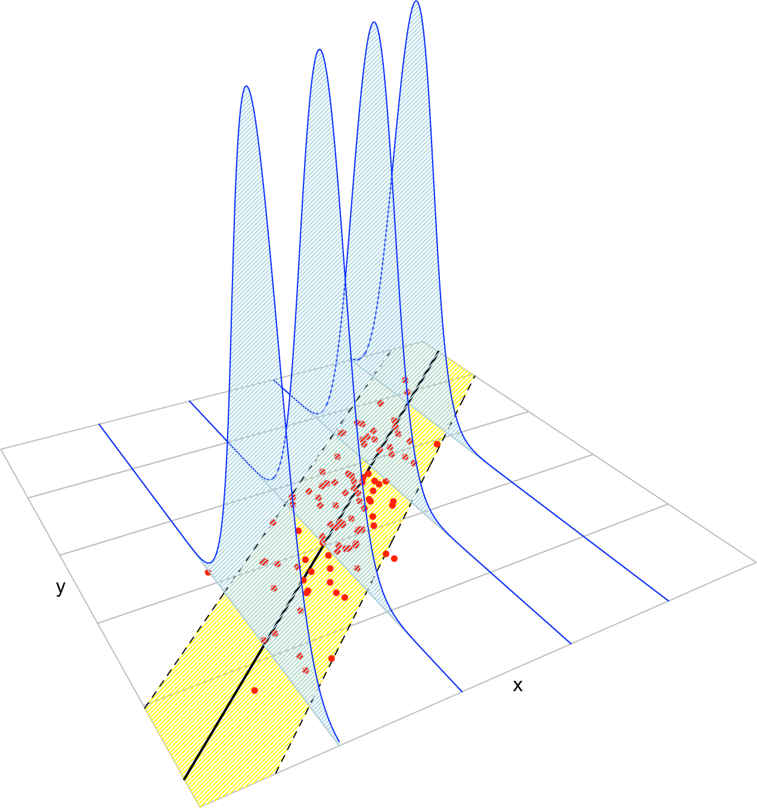
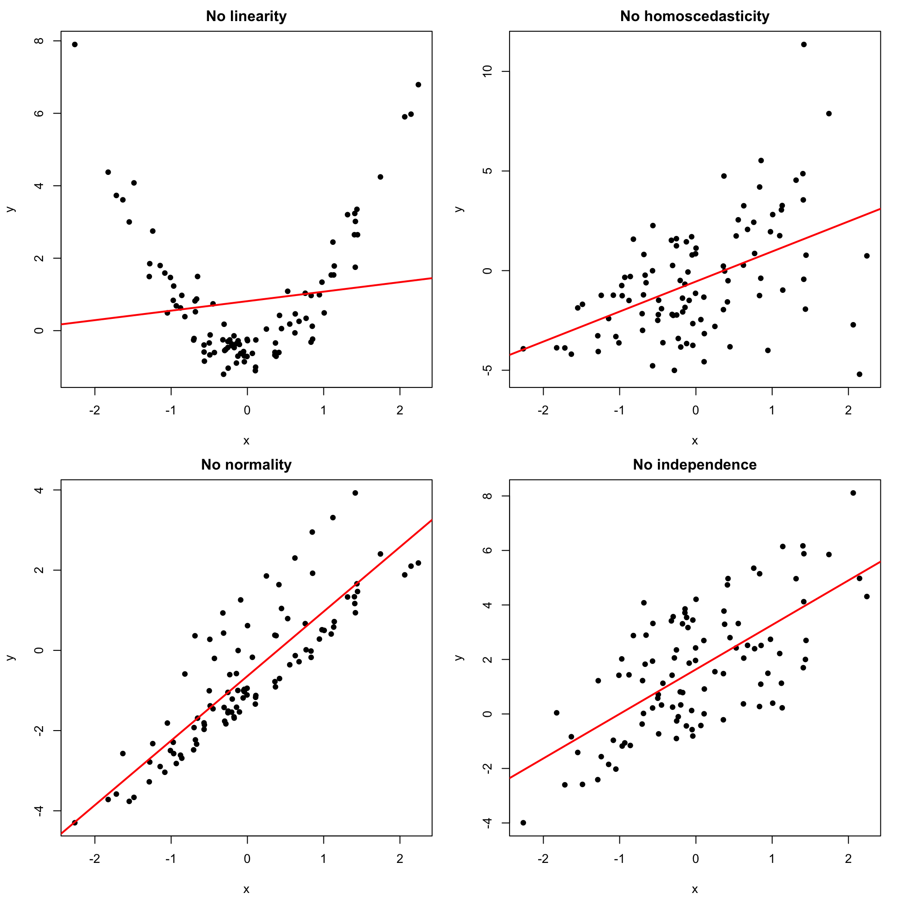
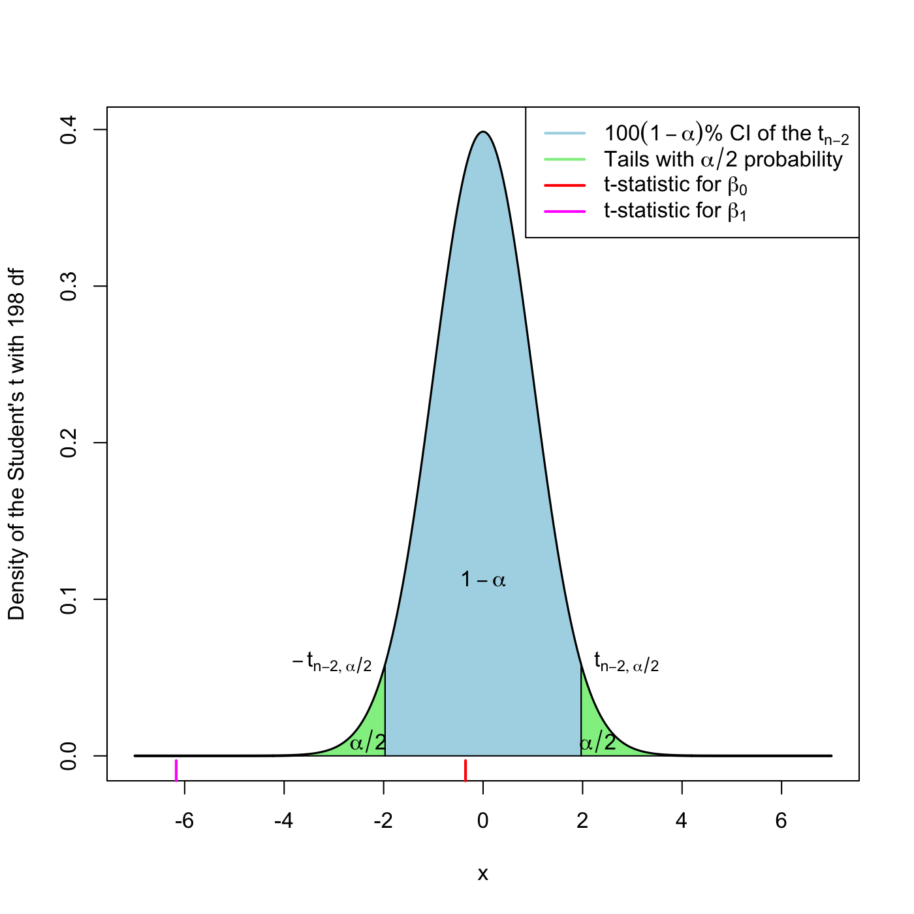
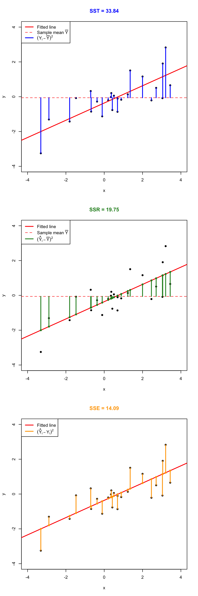
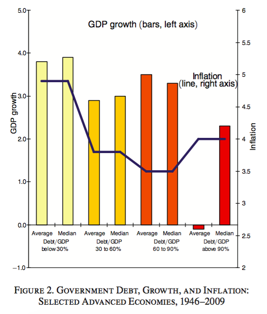

# Simple linear regression {#simp}

The simple linear regression is a *simple* but useful statistical model. In short, it allows to analyse the (assumed) linear relation between two variables, $X$ and $Y$ in a proper way. It does it by considering the model
\[
Y=\beta_0+\beta_1X+\varepsilon
\]
which in Chapter \@ref(mult) will be extended to multiple linear regression.

To convince you why simple linear regression is useful, let's begin by seeing what it can do in real-case scenarios!

## Examples and applications

### Case study I: PISA scores and GDPp {#pisa}

The Programme for International Student Assessment (PISA) is a study carried out by the Organisation for Economic Co-operation and Development (OECD) in 65 countries with the purpose of evaluating the performance of 15-year-old pupils on mathematics, science, and reading. A phenomena observed over years is that *wealthy countries tend to achieve larger average scores*. The purpose of this case study, motivated by the @PISA inform, is to answer two questions related with the previous statement:

- Q1. *Is the educational level of a country influenced by its economic wealth?*
- Q2. *If so, up to what precise extent?*

The `pisa.csv` file ([download](https://raw.githubusercontent.com/egarpor/SSS2-UC3M/master/datasets/pisa.csv)) contains 65 rows corresponding to the countries that took part on the PISA study. The data was obtained merging the [statlink](http://dx.doi.org/10.1787/888932937035) in @PISA2012 with @WB data. Each row has the following variables: `Country`; `MathMean`, `ReadingMean` and `ScienceMean` (the average performance of the students in mathematics, reading and science); `MathShareLow` and `MathShareTop` (percentages of students with a low and top performance in mathematics); `GDPp` and `logGDPp` (the Gross Domestic Product per capita and its logarithm); `HighIncome` (whether the country has a GDPp larger than 20000\$ or not). The GDPp of a country is a measure of how many economic resources are available per citizen. The `logGDPp` is the logarithm of the GDPp, taken in order to avoid scale distortions. A small subset of the data is shown in Table \@ref(tab:pisatable). 

```{r, pisatable, echo = FALSE, out.width = '90%', fig.align = 'center'}
pisa <- read.csv(file = "datasets/pisa.csv", header = TRUE)
knitr::kable(
  head(pisa[, c(1, 2, 5, 6, 8, 9)], 10),
  booktabs = TRUE,
  longtable = TRUE,
  caption = 'First 10 rows of the `pisa` dataset for a selection of variables. Note the `NA` (*Not Available*) in Chinese Taipei (or Taiwan).'
)
```

We definitely need a way of **summarizing this ammount of information**!

We are going to do the following. First, import the data into `R Commander` and do a basic manipulation of it. Second, fit a linear model and interpret its output. Finally, visualize the fitted line and the data.

1. **Import the data into `R Commander`**.

    * Go to `'Data' -> 'Import data' -> 'from text file, clipboard, or URL...'`. A window like Figure \@ref(fig:read) will pop-up. Select the appropiate formatting options of the data file: whether the first row contains the name of the variables, what is the indicator for missing data, what is the field separator, and what is the decimal point character. Then click `'OK'`. 
      
        ```{block, type = 'rmdtip'}
        Inspecting the data file in a text editor will give you the right formatting choices for importing the data.
        ```
      
        ```{r, read, echo = FALSE, out.width = '45%', fig.align = 'center', fig.cap = 'Data importation options.'}
        row.names(pisa) <- as.character(pisa$Country)
        pisa$Country <- NULL
        knitr::include_graphics("images/screenshots/read.png")
        ```

    * Click on `'View data set'` to check that the importation was fine. If the data looks weird, then recheck the structure of the data file and restart from the above point. 
    
    * Since each row corresponds to a different country, we are going to name the rows as the value of the variable `Country`. To that end, go to `'Data' -> 'Active data set' -> 'Set case names...'` and select the variable `Country` and click `'OK'`. The dataset should look like Figure \@ref(fig:view).

        ```{r, view, echo = FALSE, out.width = '90%', fig.align = 'center', fig.cap = 'Correct importation of the `pisa` dataset.'}
        knitr::include_graphics("images/screenshots/view.png")
        ```
    
        ```{block, type = 'rmdcaution'}
        In UC3M computers, **altering the location of a downloaded file may cause errors** in its importation to `R Commander`!
        
        Example:
        
        - Default download path: `'C:/Users/g15s4021/Downloads/pisa.csv'`. Importation from that path works fine.
        - If you **move the file another location** (e.g. to `'C:/Users/g15s4021/Desktop/pisa.csv'`). Importation generates an **error**.
        ```

2. **Fit a simple linear regression**.

    * Go to `'Statistics' -> 'Fit models' -> 'Linear regression...'`. A window like Figure \@ref(fig:lm) will pop-up. 
    
        ```{r, lm, echo = FALSE, out.width = '70%', fig.align = 'center', fig.cap = 'Window for performing simple linear regression.'}
        knitr::include_graphics("images/screenshots/lm.png")
        ```
        
        Select the *response variable*. This is the variable denoted by $Y$ that we want to predict/explain. Then select the *explanatory variable* (also known as the *predictor*). It is denoted by $X$ and is the variable used to predict/explain $Y$. Recall the form of the linear model:
        \begin{align*}
        Y=\beta_0+\beta_1X+\varepsilon
        \end{align*}
        
        In our case $Y=$`MathMean` and  $X=$`logGDPp`, so select them and click `'OK'`^[In principle, you could pick more than one explanatory variables using the `'Control'` or `'Shift'` keys, but that corresponds to the *multiple linear regression* (covered in Chapter \@ref(mult)).]. 
    
        ```{block, type = 'rmdtip'}
        If you want to deselect an option in an `R Commander` menu, use `'Control' + 'Mouse click'`.
        ```
        
        ```{block, type = 'rmdtip'}
        Four buttons are common in the menus of `R Commander`:
        
        - `'OK'`: executes the selected action, then closes the window.
        - `'Apply'`: executes the selected action but leaves the window open. Useful if you are experimenting with different options.
        - `'Reset'`: resets the fields and boxes of the window to their defaults.
        - `'Cancel'`: exits the window without performing any action.
        ```
    
    * The window in Figure \@ref(fig:lm) generates this code and output:
    
        ```{r}
        pisaLinearModel <- lm(MathMean ~ logGDPp, data = pisa)
        summary(pisaLinearModel)
        ```
    
        This is the linear model of `MathMean` regressed on `logGDPp` (first line) and its summary (second line). The summary gives the coefficients of the line and the $R^2$ (`'Multiple R-squared'`), which -- as we will see in Section \@ref(fit) -- it can be regarded as an *indicator of the strength of the linear relation between the variables*. ($R^2=1$ is a perfect linear fit -- all the points lay in a line -- and $R^2=0$ is the poorest fit.)
        
        The fitted regression line is `MathMean` $= 185.16 + 28.79\,\times$ `logGDPp`. The slope coefficient is positive, which indicates that there is a positive correlation between the wealth of a country and its performance in the PISA Mathematics test (this answers Q1). Hence, the evidence that *wealthy countries tend to achieve larger average scores* is indeed true (at least for the Mathematics test). We can be more precise on the effect of the wealth of a country. According to the fitted linear model, an increase of 1 unit in the `logGDPp` of a country is associated with achieving, on average, 28.79 additional points in the test (Q2).
    
3. **Visualize the fitted regression line**.

    * Go to `'Graphs' -> 'Scatterplot...'`. A window with two panels will pop-up (Figures \@ref(fig:scatter1) and \@ref(fig:scatter2)).
    
        ```{r, scatter1, echo = FALSE, out.width = '70%', fig.align = 'center', fig.cap = 'Scatterplot window, `\'Data\'` panel.'}
        knitr::include_graphics("images/screenshots/scatterplot1.png")
        ```
        ```{r, scatter2, echo = FALSE, out.width = '70%', fig.align = 'center', fig.cap = 'Scatterplot window, `\'Options\'` panel. Remember to tick the `\'Least-squares line\'` box in order to display the fitted regression line.'}
        knitr::include_graphics("images/screenshots/scatterplot2.png")
        ```
    
        On the `'Data'` panel, select the $X$ and $Y$ variables to be displayed in the scatterplot. On the `'Options'` panel, check the `'Least-squares line'` box and choose to identify `'3'` points `'Automatically'`^[The decision of which points are the most *different* from the rest is done automatically by a method known as the *Mahalanobis depth*.]. This will identify what are the three^[The default GUI option is set to identify `'2'` points. However, we know after a preliminary plot that there are three very different points in the dataset, hence this particular choice.] most different observations of the data.

    * The following `R` code will be generated. It produces a scatterplot of `MathMean` vs `logGDPp`, with its scorresponding regression line.
        ```{r, echo = FALSE, warning = FALSE}
        library(splines)
        library(car)
        library(sandwich)
        ```
        ```{r, out.width = '90%', fig.asp = 1, fig.align = 'center'}
        scatterplot(MathMean ~ logGDPp, reg.line = lm, smooth = FALSE, spread = FALSE,
                    id.method = 'mahal', id.n = 3, boxplots = FALSE, span = 0.5,
                    ellipse = FALSE, levels = c(.5, .9), 
                    main = "Average Math score vs. logGDPp", pch = c(16), data = pisa)
        ```
        
        There are three clear *outliers*^[The outliers have a considerable impact on the regression line, as we will see later.]: Vietnam, Shanghai-China and Qatar. The first two are non high-income economies that perform exceptionally well in the test (although Shanghai-China is a cherry-picked region of China). On the other hand, Qatar is a high-income economy that has really poor scores.
    
        We can identify countries that are above and below the linear trend in the plot. This is particularly interesting: we can assess whether a country is performing better or worse with respect to its *expected PISA score according to its economic status* (this adds more insight into Q2). To do so, we want to display the text labels in the points of the scatterplot. We can take a shortcut: copy and run in the input panel the next piece of code. It is a slightly modified version of the previous code (what are the differences?).
    
        ```{r, out.width = '90%', fig.asp = 1, fig.align = 'center', results = 'hide'}
        scatterplot(MathMean ~ logGDPp, reg.line = lm, smooth = FALSE, spread = FALSE, 
                    id.method = 'mahal', id.n = 65, id.cex = 0.75, boxplots = FALSE, 
                    span = 0.5, ellipse = FALSE, levels = c(.5, .9), 
                    main = "Average Math score vs. logGDPp", pch = c(16), cex = 0.75,
                    data = pisa)
        ```
    
If you understood the previous analysis, then you should be able to perform the next ones on your own.

```{block, type = 'rmdexercise'}
Repeat the regression analysis (steps 2--3) for:

- `ReadingMean` regressed on `logGDPp`. Are the results similar to `MathMean` on `logGDPp`?
- `MathMean` regressed on `ReadingMean`. Compare it with `MathMean` on `ScienceMean`. Which pair of variables has the highest linear relation? Is that something expected?

Save the new models with different names to avoid overwriting the previous models!
```

### Case study II: Apportionment in the EU and US {#euus}

> Apportionment is the process by which seats in a legislative body are distributed among administrative divisions entitled to representation.
>
> --- Wikipedia article on [Apportionment (politics)](https://en.wikipedia.org/wiki/Apportionment_(politics))

The *European Parliament* and the *US House of Representatives* are two of the most important macro legislative bodies in the world. The distribution of seats in both cameras is designed to represent the different states that conform the federation (US) or union (EU). Both chambers were created under very different historical and political circumstances, which is reflected in the kinds of apportionment that they present. More specifically:

- In the **US**, the apportionment is neatly *fixed by the US Constitution*. Each of the 50 states is apportioned a number of seats that corresponds to its share of the total population of the 50 states, according to the most recent decennial census. Every state is guaranteed *at least 1 seat*. There are 435 seats.

- Until now, the apportionment in the **EU** was set by *treaties* (Nice, Lisbon), in which *negotiations* between countries took place. The [last accepted composition](http://eur-lex.europa.eu/legal-content/EN/TXT/?uri=CELEX:32013D0312) gives an allocation of seats based on the principle of "degressive proportionality"^[Less populated states are given more weight than its corresponding proportional share.] and somehow vague guidelines. It concludes with a commitment to establish a system to "allocate the seats between Member States in an objective, fair, durable and transparent way, translating the principle of degressive proportionality". The Cambridge Compromise [@CamCom] was a proposal in that direction that was not effectively implemented. Currently, every state is guaranteed a *minimum of 6 seats* and a *maximum of 96* for a grand total of 750 seats.

We know that there exist qualitative dissimilarities between both chambers, but we can not be more specific with the description at hand. The purpose of this case study is to quantify and visualize what are the differences between the apportionments of the two chambers, and how the simple linear regression can add insights on what is actually going on with the EU apportionment. The questions we want to answer are:

- Q1. *Can we quantify which chamber is more proportional?*
- Q2. *What are the over-represented and under-represented states in both chambers?*
- Q3. *How can we quantify the 'degressive proportionality' in the EU approportionment system? Was the Cambridge Compromise proposing a fairer representation?*

Let's begin by reading the data:

1. The `US_apportionment.xlsx` file ([download](https://raw.githubusercontent.com/egarpor/SSS2-UC3M/master/datasets/US_apportionment.xlsx)) contains the 50 US states entitled to representation. The variables are `State`, `Population2010` (from the last census) and `Seats2013–2023`. This is an Excel file that we can read using `'Data' -> 'Import data' -> 'from Excel file...'`. A window will pop-up, asking for the right options. We set them as in Figure \@ref(fig:excel), since we want the variable `State` to be the case names. After clicking in `'View dataset'`, the data should look like Figure \@ref(fig:US).

    ```{r, excel, echo = FALSE, out.width = '45%', fig.align = 'center', fig.cap = 'Importation of an Excel file.'}
    knitr::include_graphics("images/screenshots/excel.png")
    ```

    ```{r, US, echo = FALSE, out.width = '45%', fig.align = 'center', fig.cap = 'Correct importation of the `US` dataset.'}
    knitr::include_graphics("images/screenshots/US.png")
    ```

2. The `EU_apportionment.txt` file ([download](https://raw.githubusercontent.com/egarpor/SSS2-UC3M/master/datasets/EU_apportionment.txt)) contains 28 rows with the member states of the EU (`Country`), the number of seats assigned under different years (`Seats2011`, `Seats2014`), the Cambridge Compromise apportionment (`CamCom2011`), and the countries population^[According to [EuroStat](http://ec.europa.eu/eurostat/tgm/table.do?tab=table&init=1&language=en&pcode=tps00001) and the population stated in the Cambridge Compromise report.] (`Population2010`,`Population2013`). 

    ```{block, type = 'rmdexercise'}
    For this file, you should know how to:
    
    1. Inspect the file in a text editor and determine its formatting.
    2. Decide the right importation options and load it with the name `EU`.
    3. Set the case names as the variable `Country`.
    ```
    
    ```{r, EU, echo = FALSE}
    US <- RcmdrMisc::readXL("datasets/US_apportionment.xlsx", rownames = TRUE, header = TRUE, na = "", sheet = "Hoja1", stringsAsFactors = TRUE)
    EU <- read.table("datasets/EU_apportionment.txt", header = TRUE, na = "-", sep = "\t")
    row.names(EU) <- EU$Country
    EU$Country <- NULL
    knitr::kable(
      EU,
      booktabs = TRUE,
      longtable = TRUE,
      caption = 'The `EU` dataset with `Country` set as the case names.'
    )
    ```

We start by analyzing the `US` dataset. If there is indeed a direct proportionality in the apportionment, we would expect a direct, 1:1, relation between the *ratios of seats* and the *population per state*. Let's start by constructing these variables:

1. Switch the active dataset to `US`. An alternative way to do so is by `'Data' -> 'Active data set' -> 'Select active data set...'`.
2. Go to `'Data' -> 'Manage variables in active dataset...' -> 'Compute new variable...'`. 
3. Create the the variable `RatioSeats2013.2023` as shown in Figure \@ref(fig:newvar). Be **careful to not overwrite** the variable `Seats2013.2023`.

    ```{r, newvar, echo = FALSE, out.width = '70%', fig.align = 'center', fig.cap = 'Creation of the new variable `RatioSeats2013.2023`. The expression to compute is `Seats2013.2023/sum(Seats2013.2023)`.'}
    knitr::include_graphics("images/screenshots/newvar.png")
    ```

4. `'View dataset'` to check that the new variable is available.

```{block, type = 'rmdexercise'}
Repeat steps 1--3, conveniently adapted, to create the new variable `RatioPopulation2010`.
```
```{r, echo = FALSE}
US$RatioSeats2013.2023 <- US$Seats2013.2023 / sum(US$Seats2013.2023)
US$RatioPopulation2010 <- US$Population2010 / sum(US$Population2010)
```

Let's fit a regression line to the `US` data, with `RatioSeats2013.2023` as the response and `RatioPopulation2010` as the explanatory variable. If we name the model as `appUS`, you should get the following code and output:
```{r}
appUS <- lm(RatioSeats2013.2023 ~ RatioPopulation2010, data = US)
summary(appUS)
```
The fitted regression line is `RatioSeats2013.2023`$=0.000+1.005\,\times$`RatioPopulation2010` and has an $R^2=0.9991$ (`'Multiple R-squared'`), which means that the data is almost perfectly linearly distributed. Furthermore, the *intercept coefficient is not significant for the regression*. This is seen in the column `'Pr(>|t|)'`, which gives the $p$-values for the null hypotheses $H_0:\beta_0=0$ and $H_0:\beta_1=0$, respectively. The null hypothesis $H_0:\beta_0=0$ is *not rejected* ($p\text{-value}=0.407$; non-significant) whereas $H_0:\beta_1=0$ is rejected ($p\text{-value}=0$; significant)^[We will be able to say more about how these test are performed after Section \@ref(inference).]. Hence, we can conclude that the appropriation of seats in the US House of Representatives is indeed directly proportional to the population of each state (partially answers Q1).

If we make the scatterplot for the `US` dataset, we can see the almost perfect (up to integer rounding) 1:1 relation between the ratios "state seats"/"total seats" and "state population"/"aggregated population". We can set the scatterplot to automatically label the `'25'` most different points (select the numeric box with the mouse and type `'25'` -- the arrow buttons are limited to `'10'`) with their case names. As it is seen in Figure \@ref(fig:ratios), there is no state clearly over- or under-represented (Q2).

```{r, ratios, echo = FALSE, out.width = '90%', fig.asp = 1, results = 'hide', fig.align = 'center', fig.cap = 'The apportionment in the US House of Representatives compared with a linear fit.'}
scatterplot(RatioSeats2013.2023 ~ RatioPopulation2010, reg.line = lm, smooth = FALSE, 
            spread = FALSE, id.method = 'mahal', id.n = 25, id.cex = 0.75, 
            boxplots = FALSE, span = 0.5, ellipse = FALSE, levels = c(.5, .9), 
            main = "Approportionment in the US House of Representatives", pch = c(16), 
            cex = 0.75, data = US)
```

Let's switch to the `EU` dataset, for which we will focus on the 2011 variables. A quick way of visualizing this dataset and, in general, of **visualizing multivariate data** (up to a moderate number of dimensions) is to use a *matrix scatterplot*. Essentially, it displays the scatterplots between all the pairs of variables. To do it, go to `'Graphs' -> 'Scatterplot matrix...'` and select the number of variables to be displayed. If you select them as in Figures \@ref(fig:mscatter1a) and \@ref(fig:mscatter1b), you should get an output like Figure \@ref(fig:mscatter2). 

```{r, mscatter1a, echo = FALSE, out.width = '70%', fig.align = 'center', fig.cap = 'Scatterplot matrix window, `\'Data\'` panel.'}
knitr::include_graphics("images/screenshots/mscatter1a.png")
```
```{r, mscatter1b, echo = FALSE, out.width = '70%', fig.align = 'center', fig.cap = 'Scatterplot matrix window, `\'Options\'` panel. Be sure to tick the `\'Least-squares line\'` box in order to display the fitted regression line.'}
knitr::include_graphics("images/screenshots/mscatter1b.png")
```
```{r, mscatter2, echo = FALSE, out.width = '90%', fig.align = 'center', fig.cap = 'Scatterplot matrix for the variables `CamCom2011`, `Population2010` and `Seats2011` of `EU` dataset with boxplots in the central panels.'}
knitr::include_graphics("images/screenshots/mscatter2.png")
```

```{block, type = 'rmdexercise'}
The scatterplot matrix has a central panel displaying one-variable summary plots: histogram, density estimate, boxplot and QQ-plot. Experiment and understand them.
```

The most interesting panels in Figure \@ref(fig:mscatter2) for our study are `CamCom2011` vs `Population2010` -- panel (1,2) -- and `Seats2011` vs `Population2010` -- panel (3,2). At first sight, it seems that the Cambridge Compromise was favoring a fairer allocation of seats than what it was actually being used in the EU parliament in 2011 (recall the step-wise patterns in (3,2)). Let's explore in depth the scatterplot `Seats2011` vs `Population2010`.

```{r, echo = FALSE, results = 'hide', out.width = '90%', fig.asp = 1, fig.align = 'center', fig.cap = '`Seats2011` vs `Population2010` in the `EU` dataset.'}
scatterplot(Seats2011 ~ Population2010, reg.line = lm, smooth = FALSE, spread = FALSE, 
            id.method = 'mahal', id.n = 25, id.cex = 0.75, boxplots = FALSE, span = 0.5, 
            ellipse = FALSE, levels = c(.5, .9), 
            main = "Approportionment in the EU parliament in 2011", pch = c(16), 
            cex = 0.75, data = EU)
```

There are some countries clearly detrimented and benefited by this apportionment. For example, France and Spain are under-represented and, on the other hand, Germany, Hungary and Czech Republic are over-represented (Q2). 

Let's compute the regression line of `Seats2011` on `Population2010`, which we save in the model `appEU2011`.

```{r}
appEU2011 <- lm(Seats2011 ~ Population2010, data = EU)
summary(appEU2011)
```

The fitted line is `Seats2011`$=7.91+1.078\,\times10^{-6}\,\times$`Population2010`. The intercept is not zero and, indeed, the fitted intercept is significantly different from zero. Therefore, **there is no proportionality** in the apportionment. Recall that the fitted slope, despite being very small (why?), is also significantly different from zero. The $R^2$ is slightly smaller than in the `US` dataset, but definitely very high. Two conclusions stem from this analysis:

- The US House of Representatives is a proportional chamber whereas the EU parliament is definitely not, but is close to perfect linearity (completes Q1). 

- The principle of **digressive proportionality**, in practice, means an almost **linear allocation** of seats with respect to population (Q3). The main point is the presence of a **non-zero intercept** -- that is, a minimum number of seats corresponding to a country -- in order to over-represent smaller countries with respect to its corresponding proportional share.

The question that remains to be answered is whether the Cambridge Compromise was favoring a fairer allocation of seats than the 2011 official agreement. In Figure \@ref(fig:mscatter2) we can see that indeed it seems like that, but there is an outlier outside the linear pattern: Germany. There is an explanation for that: the EU commission imposed a cap to the maximum number of seats per country, 96, to the development of the Cambridge Compromise. With this rule, Germany is notably under-represented.

In order to avoid this distortion, we will exclude Germany from our comparison. To do so, we specify in the `'Subset expression'` field, of either `'Linear regression...'` or `'Scatterplot...'`, a `'-1'`. This tells `R` to exclude the first row of `EU` dataset, corresponding to Germany. Then, we compare the linear models for the official allocation, `appEUNoGer2011`, and the Cambridge Compromise, `appCamComNoGer2011`. The outputs are the following.

```{r}
appEUNoGer2011 <- lm(Seats2011 ~ Population2010, data = EU, subset = -1)
summary(appEUNoGer2011)
```
```{r}
appCamComNoGer2011 <- lm(CamCom2011 ~ Population2010, data = EU, subset = -1)
summary(appCamComNoGer2011)
```

We see that the Cambridge Compromise has a larger $R^2$ and a lower intercept than the official allocation of seats. This means that it favors a more proportional allocation, which is fairer in the sense that the deviations from the linear trend are smaller (Q3). We conclude the case study by illustrating both fits.

```{r, echo = FALSE, results = 'hide', out.width = '90%', fig.asp = 1, fig.align = 'center', fig.cap = '`Seats2011` vs `Population2010` in the `EU` dataset, Germany excluded.'}
scatterplot(Seats2011 ~ Population2010, reg.line = lm, smooth = FALSE, spread = FALSE, 
            id.method = 'mahal', id.n = 25, id.cex = 0.75, boxplots = FALSE, span = 0.5,
            ellipse = FALSE, levels = c(.5, .9), 
            main = "Approportionment in the EU parliament (Germany excl.)", 
            pch = c(16), cex = 0.75, data = EU, subset = -1)
```

```{r, echo = FALSE, results = 'hide', out.width = '90%', fig.asp = 1, fig.align = 'center', fig.cap = '`CamCom2011` vs `Population2010` in the `EU` dataset, Germany excluded.'}
scatterplot(CamCom2011 ~ Population2010, reg.line = lm, smooth = FALSE, spread = FALSE, 
            id.method = 'mahal', id.n = 25, id.cex = 0.75, boxplots = FALSE, span = 0.5, 
            ellipse = FALSE, levels = c(.5, .9), 
            main = "Proposal for approportionment in the EU parliament (Germany excl.)",
            pch = c(16), cex = 0.75, data = EU, subset = -1)
```

```{block, type = 'rmdexercise'}
In 2014 it was negotiated a new EU apportionment, collected in `Seats2014`, according to the population of 2013, `Population2013`, and due to the inclusion of Croatia in the EU. Answer these questions:

- Which countries were the most favored and unfavored by such apportionment?
- Was the apportionment proportional?
- Was the degree of linearity higher or lower than the 2011 apportionment? (Exclude Germany.)
- Was the degree of linearity higher or lower than the Cambridge Compromise for 2011? (Exclude Germany.)

```

***

We have performed a decent number of operations in `R Commander`. If we have to exit the session, we can save the data and models in an `.RData` file, which contains all the objects we have computed so far (but **not** the code -- this has to be saved differently). 

```{block, type = 'rmdtip'}
To exit `R Commander`, save all your progress and reload it later, do:

1. Save `.RData` file. Go to `'File' -> 'Save R workspace as...'`.
2. Save `.R` file. Go to `'File' -> 'Save script as...'`.
3. Exit `R Commander` + `R`. Go to `'File' -> 'Exit' -> 'From Commander and R'`. Choose to not save any file.
4. Start `R Commander` and load your files:

    - `.RData` file in `'Data' -> 'Load data set...'`,
    - `.R` file in `'File' -> 'Open script file...'`.

```

```{block, type = 'rmdtip'}
If you just want to save a dataset, you have two options:

- `'Data' -> 'Active data set' -> 'Save active data set...'`: it will be saved as an `.RData` file. The easiest way of importing it back to `R`.
- `'Data' -> 'Active data set' -> 'Export active data set...'`: it will be saved as a text file with the format that you choose. Useful for exporting data to other programs.

```

## Some `R` basics

By this time you probably had realized that some pieces of `R` code are repeated over and over, and that it is simpler to just modify them than to navigate the menus. For example, the codes `lm` and `scatterplot` always appear related with linear models and scatterplots. It is important to know some of the `R` basics in order to understand what are these pieces of text actually doing. Do not worry, the menus will always be there to generate the proper code for you -- but you need to have a *general idea* of the code.

In the following sections, **type** -- not copy and paste systematically -- the code in the `'R Script'` panel and send it to the output panel (on the selected expression, either with the `'Submit'` button or with `'Control' + 'R'`). 

We begin with the `lm` function, since it is the one you are more used to. In the following, you should get the same outputs (which are preceded by `## [1]`).

### The `lm` function

We are going to employ the `EU` dataset from Section \@ref(euus), with the case names set as the `Country`. In case you do not have it loaded, you can download it [here](https://raw.githubusercontent.com/egarpor/SSS2-UC3M/master/datasets/EU.RData) as an `.RData` file.

```{r, collapse = TRUE, error = TRUE}
# First of all, this is a comment. Its purpose is to explain what the code is doing
# Comments are preceeded by a #

# lm has the syntax: lm(formula = response ~ explanatory, data = data)
# For example (you need to load first the EU dataset)
mod <- lm(formula = Seats2011 ~ Population2010, data = EU)

# We have saved the linear model into mod, which now contains all the output of lm
# You can see it by typing
mod

# mod is indeed a list of objects whose names are
names(mod)

# We can access these elements by $
# For example
mod$coefficients

# The residuals
mod$residuals

# The fitted values
mod$fitted.values

# Summary of the model
sumMod <- summary(mod)
sumMod
```


The following table contains a handy cheat sheet of equivalences between `R` code and some of the statistical concepts associated to linear regression.

|              `R`                       |        Statistical concept          |
|:---------------------------------------|:------------------------------------|
| `x` | Predictor $X_1,\ldots,X_n$    | 
| `y` | Response $Y_1,\ldots,Y_n$    |
| `data <- data.frame(x = x, y = y)` | Sample $(X_1,Y_1),\ldots,(X_n,Y_n)$    | 
| `model <- lm(y ~ x, data = data)` | Fitted linear model |
| `model$coefficients` | Fitted coefficients $\hat\beta_0,\hat\beta_1$ |
| `model$residuals` | Fitted residuals $\hat\varepsilon_1,\ldots,\hat\varepsilon_n$ |
| `model$fitted.values` | Fitted values $\hat Y_1,\ldots,\hat Y_n$ |
| `model$df.residual` | Degrees of freedom $n-2$ |
| `summaryModel <- summary(model)` | Summary of the fitted linear model |
| `summaryModel$sigma` | Fitted residual standard deviation $\hat\sigma$ |
| `summaryModel$r.squared` | Coefficient of determination $R^2$ |
| `summaryModel$fstatistic` | $F$-test |
| `anova(model)` | ANOVA table |

```{block, type = 'rmdexercise'}
Do the following:

- Compute the regression of `CamCom2011` into `Population2010`. Save that model as the variable `myModel`.
- Access the objects `residuals` and `coefficients` of `myModel`.
- Compute the summary of `myModel` and store it as the variable `summaryMyModel`.
- Access the object `sigma` of `myModel`.
- Repeat the previous steps changing the names of `myModel` and `summaryMyModel` to `otherMod` and `infoOtherMod`, respectively.
```

Now you know how to fit and summarize a linear model with a few keystrokes. Let's see more of the basics of `R` -- it will be useful for the next sections.

### Simple computations

```{r, echo = TRUE, error = TRUE, collapse = TRUE}
# These are some simple operations
# The console can act as a simple calculator
1.0 + 1.1
2 * 2
3/2
2^3
1/0
0/0

# Use ; for performing several operations in the same line
(1 + 3) * 2 - 1; 1 + 3 * 2 - 1

# Mathematical functions
sqrt(2); 2^0.5
sqrt(-1)
exp(1)
log(10); log10(10); log2(10)
sin(pi); cos(0); asin(0)
```

```{r, echo = TRUE, error = TRUE, collapse = TRUE}
# Remember to complete the expressions
1 + 
(1 + 3
```

### Variables and assignment

```{r, echo = TRUE, error = TRUE, collapse = TRUE}
# Any operation that you perform in R can be stored in a variable (or object)
# with the assignment operator "<-"
a <- 1

# To see the value of a variable, we simply type it
a

# A variable can be overwritten
a <- 1 + 1

# Now the value of a is 2 and not 1, as before
a 

# Careful with capitalization
A

# Different
A <- 3
a; A

# The variables are stored in your workspace (.RData file)
# A handy tip to see what variables are in the workspace
ls()
# Now you know which variables can be accessed!

# Remove variables
rm(a)
a
```

```{block, type = 'rmdexercise'}
Do the following:

- Store $-123$ in the variable `b`.
- Get the log of the square of `b`. (Answer: `9.624369`)
- Remove variable `b`.
```

### Vectors

```{r, echo = TRUE, collapse = TRUE, error = TRUE}

# These are vectors - arrays of numbers
# We combine numbers with the function c
c(1, 3)
c(1.5, 0, 5, -3.4)

# A handy way of creating sequences is the operator :
# Sequence from 1 to 5
1:5 

# Storing some vectors
myData <- c(1, 2)
myData2 <- c(-4.12, 0, 1.1, 1, 3, 4)
myData
myData2

# Entry-wise operations
myData + 1 
myData^2

# If you want to access a position of a vector, use [position]
myData[1]
myData2[6]

# You also can change elements
myData[1] <- 0
myData

# Think on what you want to access...
myData2[7]
myData2[0]

# If you want to access all the elements except a position, use [-position]
myData2[-1]
myData2[-2]

# Also with vectors as indexes
myData2[1:2]
myData2[myData]

# And also
myData2[-c(1, 2)]

# But do not mix positive and negative indexes!
myData2[c(-1, 2)]
```

```{block, type = 'rmdexercise'}
Do the following:

- Create the vector $x=(1, 7, 3, 4)$. 
- Create the vector $y=(100, 99, 98, ..., 2, 1)$.
- Compute $x_2+y_4$ and $\cos(x_3) + \sin(x_2) e^{-y_2}$. (Answers: `104`, `-0.9899925`)
- Set $x_{2}=0$ and $y_{2}=-1$. Recompute the previous expressions. (Answers: `97`, `2.785875`)
- Index $y$ by $x+1$ and store it as `z`. What is the output? (Answer: `z` is `c(-1, 100, 97, 96)`)

```

### Functions

```{r, echo = TRUE, collapse = TRUE, error = TRUE}
# Functions take arguments between parenthesis and transform them into an output
sum(myData)
prod(myData)

# Summary of an object
summary(myData)

# Length of the vector
length(myData)

# Mean, standard deviation, variance, covariance, correlation
mean(myData)
var(myData)
cov(myData, myData^2)
cor(myData, myData * 2)
quantile(myData)

# Maximum and minimum of vectors
min(myData)
which.min(myData)

# Usually the functions have several arguments, which are set by "argument = value"
# In this case, the second argument is a logical flag to indicate the kind of sorting
sort(myData) # If nothing is specified, decreasing = FALSE is assumed
sort(myData, decreasing = TRUE)

# Don't know what are the arguments of a function? Use args and help!
args(sort)
?sort
```

```{block, type = 'rmdexercise'}
Do the following:

- Compute the mean, median and variance of $y$. (Answers: `49.5`, `49.5`, `843.6869`)
- Do the same for $y+1$. What are the differences?
- What is the maximum of $y$? Where is it placed?
- Sort $y$ increasingly and obtain the 5th and 76th positions. (Answer: `c(4,75)`)
- Compute the covariance between $y$ and $y$. Compute the variance of $y$. Why do you get the same result?
```

### Matrices, data frames and lists

```{r, collapse = TRUE, error = TRUE}
# A matrix is an array of vectors
A <- matrix(1:4, nrow = 2, ncol = 2)
A

# Another matrix
B <- matrix(1, nrow = 2, ncol = 2, byrow = TRUE)
B

# Binding by rows or columns
rbind(1:3, 4:6)
cbind(1:3, 4:6)

# Entry-wise operations
A + 1
A * B

# Accessing elements
A[2, 1] # Element (2, 1)
A[1, ] # First row
A[, 2] # First column

# A data frame is a matrix with column names
# Useful when you have multiple variables
myDf <- data.frame(var1 = 1:2, var2 = 3:4)
myDf

# You can change names
names(myDf) <- c("newname1", "newname2")
myDf

# The nice thing is that you can access variables by its name with the $ operator
myDf$newname1

# And create new variables also (it has to be of the same 
# length as the rest of variables)
myDf$myNewVariable <- c(0, 1)
myDf
  
# A list is a collection of arbitrary variables
myList <- list(myData = myData, A = A, myDf = myDf) 

# Access elements by names
myList$myData
myList$A
myList$myDf

# Reveal the structure of an object
str(myList)
str(myDf)

# A less lengthy output
names(myList)
```

```{block, type = 'rmdexercise'}
Do the following:

- Create a matrix called `M` with rows given by `y[3:5]`, `y[3:5]^2` and `log(y[3:5])`.
- Create a data frame called `myDataFrame` with column names "y", "y2" and "logy" containing the vectors `y[3:5]`, `y[3:5]^2` and `log(y[3:5])`, respectively.
- Create a list, called `l`, with entries for `x` and `M`. Access the elements by their names.
- Compute the squares of `myDataFrame` and save the result as `myDataFrame2`.
- Compute the log of the sum of `myDataFrame` and `myDataFrame2`. Answer:

          ##         y       y2     logy
          ## 1 9.180087 18.33997 3.242862
          ## 2 9.159678 18.29895 3.238784
          ## 3 9.139059 18.25750 3.234656

```

## Model formulation and estimation by least squares {#modelsimp}

The simple linear model is a statistical tool for describing the relation between two random variables, $X$ and $Y$. For example, in the `pisa` dataset, $X$ could be `ReadingMean` and $Y=$ `MathMean`. The simple linear model is *constructed by assuming* that the linear relation
\begin{align}
Y = \beta_0 + \beta_1 X + \varepsilon (\#eq:1)
\end{align}
holds between $X$ and $Y$. In \@ref(eq:1), $\beta_0$ and $\beta_1$ are known as the *intercept* and *slope*, respectively. $\varepsilon$ is a random variable with mean zero and independent from $X$. It describes the *error* around the mean, or the effect of other variables that we do not model. Another way of looking at \@ref(eq:1) is
\begin{align}
\mathbb{E}[Y|X=x]=\beta_0+\beta_1x, (\#eq:2)
\end{align}
since $\mathbb{E}[\varepsilon|X=x]=0$. 

The Left Hand Side (LHS) of \@ref(eq:2) is the *conditional expectation* of $Y$ given $X$. It represents how the mean of the random variable $Y$ is changing according to a particular value, denoted by $x$, of the random variable $X$. With the RHS, what we are saying is that the mean of $Y$ is changing in a *linear* fashion with respect to the value of $X$. Hence the interpretation of the coefficients:

- $\beta_0$: is the mean of $Y$ when $X=0$.
- $\beta_1$: is the increment in mean of $Y$ for an increment of one unit in $X=x$.

If we have a sample $(X_1,Y_1),\ldots,(X_n,Y_n)$ for our random variables $X$ and $Y$, we can estimate the unknown coefficients $\beta_0$ and $\beta_1$. In the `pisa` dataset, the sample are the observations for `ReadingMean` and `MathMean`. A possible way of estimating $(\beta_0,\beta_1)$ is by minimizing the *Residual Sum of Squares* (RSS):
\begin{align*}
\text{RSS}(\beta_0,\beta_1)=\sum_{i=1}^n(Y_i-\beta_0-\beta_1X_i)^2.
\end{align*}
In other words, we look for the estimators $(\hat\beta_0,\hat\beta_1)$ such that
\begin{align*}
(\hat\beta_0,\hat\beta_1)=\arg\min_{(\beta_0,\beta_1)\in\mathbb{R}^2} \text{RSS}(\beta_0,\beta_1).
\end{align*}

It can be seen that *the minimizers of the RSS*^[They are unique and always exist. They can be obtained by solving $\frac{\partial}{\partial \beta_0}\text{RSS}(\beta_0,\beta_1)=0$ and $\frac{\partial}{\partial \beta_1}\text{RSS}(\beta_0,\beta_1)=0$.] are
\begin{align}
\hat\beta_0=\bar{Y}-\hat\beta_1\bar{X},\quad \hat\beta_1=\frac{s_{xy}}{s_x^2},(\#eq:3)
\end{align}
where:

- $\bar{X}=\frac{1}{n}\sum_{i=1}^nX_i$ is the *sample mean*.
- $s_x^2=\frac{1}{n}\sum_{i=1}^n(X_i-\bar{X})^2$ is the *sample variance*. The sample standard deviation is $s_x=\sqrt{s_x^2}$.
- $s_{xy}=\frac{1}{n}\sum_{i=1}^n(X_i-\bar{X})(Y_i-\bar{Y})$ is the *sample covariance*. It measures the degree of linear association between $X_1,\ldots,X_n$ and $Y_1,\ldots,Y_n$. Once scaled by $s_xs_y$, it gives the *sample correlation coefficient*, $r_{xy}=\frac{s_{xy}}{s_xs_y}$.

There are some important points hidden behind the election of RSS as the error criterion for obtaining $(\hat\beta_0,\hat\beta_1)$:

- *Why the vertical distances and not horizontal or perpendicular?* Because we want to minimize the error in the *prediction* of $Y$! Note that the treatment of the variables is *not symmetrical*^[In Chapter 5 we will consider perpendicular distances.].
- *Why the squares in the distances and not the absolute value?* Due to mathematical convenience. Squares are nice to differentiate and are closely related with the Normal distribution.

Figure \@ref(fig:leastsquares) illustrates the influence of the distance employed in the sum of squares. Try to minimize the sum of squares for the different datasets. Is the best choice of intercept and slope independent of the type of distance?  

```{r, leastsquares, echo = FALSE, fig.cap = 'The effect of the kind of distance in the error criterion. The choices of intercept and slope that minimize the sum of squared distances for a kind of distance are not the optimal for a different kind of distance.', screenshot.opts = list(delay = 10), dev = 'png', cache = TRUE, fig.align = 'center', out.width = '90%'}
knitr::include_app('https://egarpor.shinyapps.io/least-squares/', height = '900px')
```

The data of the figure has been generated with the following code:
```{r}
# Generates 50 points from a N(0, 1): predictor and error
set.seed(34567) # Fixes the seed for the random generator
x <- rnorm(n = 50) 
eps <- rnorm(n = 50) 

# Responses
yLin <- -0.5 + 1.5 * x + eps
yQua <- -0.5 + 1.5 * x^2 + eps
yExp <- -0.5 + 1.5 * 2^x + eps

# Data
leastSquares <- data.frame(x = x, yLin = yLin, yQua = yQua, yExp = yExp)
```

```{block, type = 'rmdexercise'}
The minimizers of the error in the above illustration are indeed the coefficients given by the `lm` function. Check this for the three types of responses: `yLin`, `yQua` and `yExp`.
```

```{block, type = 'rmdinsight'}
The *population regression coefficients*, $(\beta_0,\beta_1)$, **are not the same** as the *estimated regression coefficients*, $(\hat\beta_0,\hat\beta_1)$:

- $(\beta_0,\beta_1)$ are the theoretical and **always** unknown quantities (except under controlled scenarios).
- $(\hat\beta_0,\hat\beta_1)$ are the estimates computed from the data. In particular, they are the output of `lm`. They are *random variables*, since they are computed from the random sample $(X_1,Y_1),\ldots,(X_n,Y_n)$.

In an abuse of notation, the term *regression line* is often used to denote both the *theoretical* ($y=\beta_0+\beta_1x$) and the *estimated* ($y=\hat\beta_0+\hat\beta_1x$) regression lines.
```

Once we have the least squares estimates $(\hat\beta_0,\hat\beta_1)$, we can define the next two concepts:

- The *fitted values* $\hat Y_1,\ldots,\hat Y_n$, where 
\begin{align*}
\hat Y_i=\hat\beta_0+\hat\beta_1X_i,\quad i=1,\ldots,n.
\end{align*}
They are the vertical projections of $Y_1,\ldots,Y_n$ into the fitted line (see Figure \@ref(fig:leastsquares)).

- The *estimated residuals* $\hat \varepsilon_1,\ldots,\hat \varepsilon_n$, where 
\begin{align*}
\hat\varepsilon_i=Y_i-\hat Y_i,\quad i=1,\ldots,n.
\end{align*}
They are the vertical distances between actual data and fitted data. Hence, another way of writing the minimum RSS is $\sum_{i=1}^n(Y_i-\hat\beta_0-\hat\beta_1X_i)^2=\sum_{i=1}^n\hat\varepsilon_i^2$.

To conclude this section, we check that the regression coefficients given by `lm` are indeed the ones given in \@ref(eq:3).

```{r, echo = TRUE, collapse = TRUE}
# Covariance
Sxy <- cov(x, yLin)

# Variance
Sx2 <- var(x)

# Coefficients
beta1 <- Sxy / Sx2
beta0 <- mean(yLin) - beta1 * mean(x) 
c(beta0, beta1)

# Output from lm
mod <- lm(yLin ~ x, data = leastSquares)
mod$coefficients
```

```{block, type = 'rmdexercise'}
Adapt the code conveniently for doing the same checking with

- $X=$`ReadingMean` and $Y=$`MathMean` from the `pisa` dataset. 
- $X=$`logGDPp` and $Y=$`MathMean`.
- $X=$`Population2010` and $Y=$`Seats2013.2023` from the `US` dataset.
- $X=$`Population2010` and $Y=$`Seats2011` from the `EU` dataset. 
```

## Assumptions of the model {#assumptions}

Why do we need assumptions? To make **inference** on the model parameters. In other words, to infer properties about the *unknown* population coefficients $\beta_0$ and $\beta_1$ from the sample $(X_1,Y_1),\ldots,(X_n,Y_n)$.

```{r, linearmodel, echo = FALSE, out.width = '90%', fig.align = 'center', fig.cap = 'The key concepts of the simple linear model. The yellow band denotes where the 95% of the data is, according to the model.'}

```

The assumptions of the linear model are:

i. **Linearity**: $\mathbb{E}[Y|X=x]=\beta_0+\beta_1x$.
ii. **Homocedasticity**: $\mathbb{V}\text{ar}(\varepsilon_i)=\sigma^2$, with $\sigma^2$ constant for $i=1,\ldots,n$.
iii. **Normality**: $\varepsilon_i\sim\mathcal{N}(0,\sigma^2)$ for $i=1,\ldots,n$.
iv. **Independence of the errors**: $\varepsilon_1,\ldots,\varepsilon_n$ are independent (or uncorrelated, $\mathbb{E}[\varepsilon_i\varepsilon_j]=0$, $i\neq j$, since they are assumed to be Normal).

A good one-line summary of the linear model is (independence is assumed)
\begin{align*}
Y|X=x\sim \mathcal{N}(\beta_0+\beta_1x,\sigma^2)
\end{align*}

```{block, type = 'rmdinsight'}
Recall:

- Nothing is said about the distribution of $X$. Indeed, $X$ could be deterministic (called *fixed design*) or random (*random design*). 

- The linear model **assumes that $Y$ is continuous** due to the normality of the errors. However, **$X$ can be discrete**!
```

Figures \@ref(fig:linearmodelgood) and \@ref(fig:linearmodelbad) represent situations where the assumptions of the model are respected and violated, respectively. For the moment, we will focus on building the intuition for checking the assumptions visually. In Chapter \@ref(mult) we will see more sophisticated methods for checking the assumptions. We will see also what are the possible fixes to the failure of assumptions.

```{r, linearmodelgood, echo = FALSE, out.width = '90%', fig.align = 'center', fig.cap = 'Perfectly valid simple linear models (all the assumptions are verified).'}

```

```{r, linearmodelbad, echo = FALSE, out.width = '90%', fig.align = 'center', fig.cap = 'Problematic simple linear models (a single assumption does not hold).'}

```

```{block, type = 'rmdexercise'}
The dataset `assumptions.RData` ([download](https://raw.githubusercontent.com/egarpor/SSS2-UC3M/master/datasets/assumptions.RData)) contains the variables `x1`, ..., `x9` and `y1`, ..., `y9`. For each regression `y1 ~ x1`, ..., `y9 ~ x9`:

- Check whether the assumptions of the linear model are being satisfied (make a scatterplot with a regression line). 
- State which assumption(s) are violated and justify your answer.
```

## Inference for the model coefficients {#inference}

The assumptions introduced in the previous section allow to specify what is the distribution of the *random variables* $\hat\beta_0$ and $\hat\beta_1$. As we will see, this is a key point for making inference on $\beta_0$ and $\beta_1$.

The distributions are derived conditionally on the sample predictors $X_1,\ldots,X_n$. In other words, we assume that the randomness of $Y_i=\beta_0+\beta_1X_i+\varepsilon_i$, $i=1,\ldots,n$, comes only from the error terms and not from the predictors. To denote this, we employ lowercase for the sample predictors $x_1,\ldots,x_n$.

### Distributions of the fitted coefficients

The distributions of $\hat\beta_0$ and $\hat\beta_1$ are:
\begin{align}
\hat\beta_0\sim\mathcal{N}\left(\beta_0,\mathrm{SE}(\hat\beta_0)^2\right),\quad\hat\beta_1\sim\mathcal{N}\left(\beta_1,\mathrm{SE}(\hat\beta_1)^2\right)(\#eq:norm1)
\end{align}
where
\begin{align}
\mathrm{SE}(\hat\beta_0)^2=\frac{\sigma^2}{n}\left[1+\frac{\bar X^2}{s_x^2}\right],\quad \mathrm{SE}(\hat\beta_1)^2=\frac{\sigma^2}{ns_x^2}.(\#eq:se1)
\end{align}
Recall that an equivalent form for \@ref(eq:norm1) is (why?)
\begin{align*}
\frac{\hat\beta_0-\beta_0}{\mathrm{SE}(\hat\beta_0)}\sim\mathcal{N}(0,1),\quad\frac{\hat\beta_1-\beta_1}{\mathrm{SE}(\hat\beta_1)}\sim\mathcal{N}(0,1).
\end{align*}

Some important remarks on \@ref(eq:norm1) and \@ref(eq:se1) are

- **Bias**. Both estimates are unbiased. That means that their expectations are the true coefficients.
- **Variance**. The variances $\mathrm{SE}(\hat\beta_0)^2$ and $\mathrm{SE}(\hat\beta_1)^2$ have an interesting interpretation in terms of its components:

    - *Sample size $n$*. As the sample size grows, the precision of the estimators increases, since both variances decrease.
    - *Error variance $\sigma^2$*. The more disperse the error is, the less precise the estimates are, since the more vertical variability is present.
    - *Predictor variance $s_x^2$*. If the predictor is spread out (large $s_x^2$), then it is easier to fit a regression line: we have information about the data trend over a long interval. If $s_x^2$ is small, then all the data is concentrated on a narrow vertical band, so we have a much more limited view of the trend. 
    
    - *Mean $\bar X$*. It has influence only on the precision of $\hat\beta_0$. The larger $\bar X$ is, the less precise $\hat\beta_0$ is.


```{r, randomcoefs, echo = FALSE, fig.cap = 'Illustration of the randomness of the fitted coefficients $(\\hat\\beta_0,\\hat\\beta_1)$ and the influence of $n$, $\\sigma^2$ and  $s_x^2$. The sample predictors $x_1,\\ldots,x_n$ are fixed and new responses $Y_1,\\ldots,Y_n$ are generated each time from a linear model $Y=\\beta_0+\\beta_1X+\\varepsilon$.', screenshot.opts = list(delay = 10), dev = 'png', cache = TRUE, fig.align = 'center', out.width = '90%'}
knitr::include_app('https://egarpor.shinyapps.io/lm-random/', height = '1000px')
```

The problem with \@ref(eq:norm1) and \@ref(eq:se1) is that *$\sigma^2$ is unknown* in practice, so we need to estimate $\sigma^2$ from the data. We do so by computing the *sample variance of the fitted residuals* $\hat\varepsilon_1,\ldots,\hat\varepsilon_n$. First note that *the fitted residuals have zero mean*. This can be easily seen by replacing $\hat\beta_0=\bar Y-\hat\beta_1\bar X$:
\begin{align}
\bar\varepsilon =\frac{1}{n}\sum_{i=1}^n(Y_i-\hat\beta_0-\hat\beta_1X_i)=\frac{1}{n}\sum_{i=1}^n(Y_i-\bar Y+\hat\beta_1\bar X-\hat\beta_1X_i)=0.
\end{align}
Due to this, we can and we can do it by computing a *rescaled* sample variance of the fitted residuals:
\begin{align*}
\hat\sigma^2=\frac{\sum_{i=1}^n\hat\varepsilon_i^2}{n-2}.
\end{align*}
Note the $n-2$ in the denominator, instead of $n$! $n-2$ are the *degrees of freedom* and is the number of data points minus the number of already fitted parameters. The interpretation is that "we have consumed $2$ degrees of freedom of the sample on fitting $\hat\beta_0$ and $\hat\beta_1$".

If we use the estimate $\hat\sigma^2$ instead of $\sigma^2$, we get different -- and more useful -- distributions for $\beta_0$ and $\beta_1$:
\begin{align}
\frac{\hat\beta_0-\beta_0}{\hat{\mathrm{SE}}(\hat\beta_0)}\sim t_{n-2},\quad\frac{\hat\beta_1-\beta_1}{\hat{\mathrm{SE}}(\hat\beta_1)}\sim t_{n-2}(\#eq:norm3)
\end{align}
where $t_{n-2}$ represents the *Student's $t$ distribution*^[The Student's $t$ distribution has *heavier tails* than the normal, which means that large observations in absolute value are more likely. $t_n$ converges to a $\mathcal{N}(0,1)$ when $n$ is large. For example, with $n$ larger than $30$, the normal is a good approximation.] with $n-2$ degrees of freedom and
\begin{align}
\hat{\mathrm{SE}}(\hat\beta_0)^2=\frac{\hat\sigma^2}{n}\left[1+\frac{\bar X^2}{s_x^2}\right],\quad \hat{\mathrm{SE}}(\hat\beta_1)^2=\frac{\hat\sigma^2}{ns_x^2}(\#eq:se2)
\end{align}
are the estimates of $\mathrm{SE}(\hat\beta_0)^2$ and $\mathrm{SE}(\hat\beta_1)^2$. The LHSs of \@ref(eq:norm3) are called *$t$-statistics* because of their distribution. The interpretation of \@ref(eq:se2) is analogous to the one of \@ref(eq:se1).

### Confidence intervals for the coefficients

Due to \@ref(eq:norm3) and \@ref(eq:se2), we can have the $100(1-\alpha)\%$ Confidence Intervals (CI) for the coefficients:
\begin{align}
\left(\hat\beta_j\pm\hat{\mathrm{SE}}(\hat\beta_j)t_{n-2;\alpha/2}\right),\quad j=0,1,(\#eq:ci)
\end{align}
where $t_{n-2;\alpha/2}$ is the *$\alpha/2$-upper quantile of the distribution $t_{n-2}$* (see Figure \@ref(fig:ttest)). Usually, $\alpha=0.10,0.05,0.01$ are considered.

```{r, ttest, echo = FALSE, out.width = '90%', fig.align = 'center', fig.cap = 'The Student\'s $t$ distribution for the $t$-statistics associated to null intercept and slope, for the `y1 ~ x1` regression of the `assumptions` dataset.'}

```

```{block, type = 'rmdtip'}
Do you need to remember the above equations? **No, althought you need to fully understand them.** `R` + `R Commander` will compute everything for you through the functions `lm`, `summary` and `confint`.
```

This *random* CI *contains the unknown coefficient $\beta_j$ with a probability of $1-\alpha$*. Note also that the CI is symmetric around $\hat\beta_j$. A simple way of understanding this concept is as follows. Suppose you have 100 samples generated according to a linear model. If you compute the CI for a coefficient, then in approximately $100(1-\alpha)$ of the samples the true coefficient would be actually inside the random CI. This is illustrated in Figure \@ref(fig:ci).

```{r, ci, echo = FALSE, fig.cap = 'Illustration of the randomness of the CI for $\\beta_0$ at $100(1-\\alpha)\\%$ confidence. The plot shows 100 random CIs for $\\beta_0$, computed from 100 random datasets generated by the same linear model, with intercept $\\beta_0$. The illustration for $\\beta_1$ is completely analogous.', screenshot.opts = list(delay = 10), dev = 'png', cache = TRUE, fig.align = 'center', out.width = '90%'}
knitr::include_app('https://egarpor.shinyapps.io/ci-random/', height = '900px')
```

Let's see how we can compute the CIs for $\beta_0$ and $\beta_1$ in practice. We do it in the first regression of the `assumptions` dataset. Assuming you have loaded the dataset, in `R` we can simply type:
```{r, echo = FALSE}
load("datasets/assumptions.RData")
```
```{r, collapse = TRUE}
mod1 <- lm(y1 ~ x1, data = assumptions)
confint(mod1)
```
In this example, the 95% confidence interval for $\beta_0$ is $(-0.2257, 0.1572)$. For $\beta_1$ is $(-0.5587, -0.2881)$. Therefore, we can say that **with a 95% confidence `x1` has a negative effect on `y1`**. If the CI for $\beta_1$ was $(-0.2256901, 0.1572392)$, we could not arrive to the same conclusion, since the CI contains both positive and negative numbers.

By default, the confidence interval is computed for $\alpha=0.05$. You can change this on the `level` argument, for example:
```{r, collapse = TRUE}
confint(mod1, level = 0.90) # alpha = 0.10
confint(mod1, level = 0.95) # alpha = 0.05
confint(mod1, level = 0.99) # alpha = 0.01
```

```{block, type = 'rmdinsight'}
Note that the larger the confidence of the interval, the longer -- thus less useful -- it is. For example, the interval $(-\infty,\infty)$ contains any coefficient with a 100% confidence, but is completely useless.
```

If you want to make the CIs through the help of `R Commander` (assuming the dataset has been loaded and is the active one), then do the following:

1. Fit the linear model (`'Statistics' -> 'Fit models' -> 'Linear regression...'`).
2. Go to `'Models' -> 'Confidence intervals...'` and then input the `'Condifence Level'`.

```{block, type = 'rmdexercise'}
Compute the CIs (95%) for the coefficients of the regressions:

- `y2 ~ x2`
- `y6 ~ x6` 
- `y7 ~ x7`

Do you think all of them are meaningful? Which ones are and why? (Recall: inference on the model makes sense if assumptions of the model are verified)
```

```{block, type = 'rmdexercise'}
Compute the CIs for the coefficients of the following regressions:

- `MathMean ~ ScienceMean` (`pisa`)
- `MathMean ~ ReadingMean` (`pisa`)
- `Seats2013.2023 ~ Population2010` (`US`)
- `CamCom2011 ~ Population2010` (`EU`)

For the above regressions, can we conclude with a 95% confidence that the effect of the predictor is positive in the response?
```

A CI for $\sigma^2$ can be also computed, but is less important in practice. The formula is:
\begin{align*}
\left(\frac{n-2}{\chi^2_{n-2;\alpha/2}}\hat\sigma^2,\frac{n-2}{\chi^2_{n-2;1-\alpha/2}}\hat\sigma^2\right)
\end{align*}
where $\chi^2_{n-2;q}$ is the $q$-upper quantile of the *$\chi^2$ distribution*^[$\chi_n^2$ is the distribution of the sum of the squares of $n$ random variables $\mathcal{N}(0,1)$.] with $n-2$ degrees of freedom, $\chi^2_{n-2}$. Note that the CI is *not symmetric* around $\hat\sigma^2$.

```{block, type = 'rmdexercise'}
Compute the CI for $\sigma^2$ for the regression of `MathMean` on `logGDPp` in the `pisa` dataset. Do it for $\alpha=0.10,0.05,0.01$. 

- To compute $\chi^2_{n-2;q}$, you can do:

  - In `R` by `qchisq(p = q, df = n - 2, lower.tail = FALSE)`.
  - In `R Commander`, go to `'Distributions' -> 'Continuous distributions' -> 'Chi-squared distribution' -> 'Chi-squared quantiles'` and then select `'Upper tail'`. Input $q$ as the `'Probabilities'` and $n-2$ as the `'Degrees of freedom'`.

- To compute $\hat\sigma^2$, use `summary(lm(MathMean ~ logGDPp, data = pisa))$sigma^2`. Remember that there are 65 countries in the study.

Answers: `c(1720.669, 3104.512)`, `c(1635.441, 3306.257)` and `c(1484.639, 3752.946)`.
```

### Testing on the coefficients

The distributions in \@ref(eq:norm3) also allow to conduct a formal *hypothesis test* on the coefficients $\beta_j$, $j=0,1$. For example the test for *significance* (shortcut for *significantly difference from zero*) is specially important, that is, the test of the hypotheses
\begin{align*}
H_0:\beta_j=0
\end{align*}
for $j=0,1$. The test of $H_0:\beta_1=0$ is specially interesting, since it allows to answer whether *the variable $X$ has a significant linear effect on $Y$*. The statistic used for testing for significance is the $t$-statistic
\begin{align*}
\frac{\hat\beta_j-0}{\hat{\mathrm{SE}}(\hat\beta_j)},
\end{align*}
which is distributed as a $t_{n-2}$ *under the (veracity of) the null hypothesis*. 

```{block, type = 'rmdinsight'}
Remember the analogy of hypothesis testing vs a trial, as given in the table below.
```

|         Hypothesis testing       |                      Trial                        |
|:---------------------------------|:--------------------------------------------------|
| Null hypothesis $H_0$ | **Accused of comitting a crime**. It has the "presumption of innocence", which means that it is *not guilty* until there is enough evidence to supporting its guilt |
| Sample $X_1,\ldots,X_n$ | Collection of small **evidences supporting innocence and guilt**  |
| Statistic $T_n$ | **Summary of the evicences presented** by the prosecutor and defense lawyer   |
| Distribution of $T_n$ under $H_0$ | The **judge** conducting the trial. Evaluates the evidence presented by both sides and presents a verdict for $H_0$  | 
| Significance level $\alpha$ | $1-\alpha$ is the **strength of evidences required by the judge for condemning $H_0$**. The judge allows evidences that on average condemn $100\alpha\%$ of the innocents! $\alpha=0.05$ is considered a reasonable level |
| $p$-value | **Decision** of the judge. If $p\text{-value}<\alpha$, $H_0$ is declared guilty. Otherwise, is declared not guilty |
| $H_0$ is rejected | $H_0$ is declared guilty: there are **strong evidences supporting its guilt** |
| $H_0$ is not rejected | $H_0$ is declared not guilty: either is **innocent or there are no enough evidences supporting its guilt** |

More formally, the $p$-value is defined as:

> The $p$-value is the probability of obtaining a statistic more unfavourable to $H_0$ than the observed, assuming that $H_0$ is true.

Therefore, **if the $p$-value is small** (smaller than the chosen level $\alpha$), **it is unlikely that the evidence against $H_0$ is due to randomness. As a consequence, $H_0$ is rejected**. If the $p$-value is large (larger than $\alpha$), then it is more possible that the evidences against $H_0$ are merely due to the randomness of the data. In this case, we do not reject $H_0$.

The null hypothesis $H_0$ is tested *against* the *alternative hypothesis*, $H_1$. If $H_0$ is rejected, it is *rejected in favor* of $H_1$. The alternative hypothesis can be *bilateral*, such as 
\begin{align*}
H_0:\beta_j= 0\quad\text{vs}\quad H_1:\beta_j\neq 0
\end{align*}
or *unilateral*, such as
\begin{align*}
H_0:\beta_j\geq (\leq)0\quad\text{vs}\quad H_1:\beta_j<(>)0
\end{align*}
For the moment, we will focus only on the bilateral case.

```{block, type = 'rmdinsight'}
The connection of a $t$-test for $H_0:\beta_j=0$ and the CI for $\beta_j$, both at level $\alpha$, is the following.

**Is $0$ inside the CI for $\beta_j$?**

- **Yes $\rightarrow$ do not reject $H_0$**. 
- **No $\rightarrow$ reject $H_0$**.
```

The tests for significance are built-in in the `summary` function, as we glimpsed in Section \@ref(euus). For `mod1`, we have:
```{r, collapse = TRUE}
summary(mod1)
```
The `Coefficients` block of the output of `summary` contains the next elements regarding the test $H_0:\beta_j=0$ vs $H_1:\beta_j\neq0$:

- `Estimate`: least squares estimate $\hat\beta_j$.
- `Std. Error`: estimated standard error $\hat{\mathrm{SE}}(\hat\beta_j)$.
- `t value`: $t$-statistic $\frac{\hat\beta_j}{\hat{\mathrm{SE}}(\hat\beta_j)}$.
- `Pr(>|t|)`: $p$-value of the $t$-test.
- `Signif. codes:  0 '***' 0.001 '**' 0.01 '*' 0.05 '.' 0.1 ' ' 1`: codes indicating the size of the $p$-value. The more stars, the more evidence supporting that $H_0$ does not hold.

In the above output for `summary(mod1)`, $H_0:\beta_0=0$ is not rejected at any reasonable level for $\alpha$ (that is, $0.10$,$0.05$ and $0.01$). Hence $\hat\beta_0$ is not significantly different from zero and $\beta_0$ is not significant for the regression. On the other hand, $H_0:\beta_1=0$ is rejected at any level $\alpha$ larger than the $p$-value, `3.77e-09`. Therefore, $\beta_1$ is significant for the regression (and $\hat\beta_1$ is not significantly different from zero).

```{block, type = 'rmdexercise'}
For the `assumptions` dataset, do the next:

- Regression `y7 ~ x7`. Check that: 
    - The intercept of  is not significant for the regression at any reasonable level $\alpha$.
    - The slope is significant for any $\alpha>10^{-7}$.
  
- Regression `y6 ~ x6`. Assume the linear model assumptions are verified. 
    - Check that $\hat\beta_0$ is significantly different from zero at any level
$\alpha$. 
    - For which $\alpha=0.10,0.05,0.01$ is $\hat\beta_1$ significantly different from zero?
```  

```{block, type = 'rmdexercise'}
Re-analyse the significance of the coefficients in `Seats2013.2023 ~ Population2010` and `Seats2011 ~ Population2010` for the `US` and `EU` datasets, respectively.
```

## Prediction {#prediction}

The forecast of $Y$ from $X=x$ in the linear model is approached by two different ways:

1. Inference on the **conditional mean** of $Y$ given $X=x$, $\mathbb{E}[Y|X=x]$. This is a deterministic quantity, which equals $\beta_0+\beta_1x$ in the linear model.
2. Prediction of the **conditional response** $Y|X=x$. This is a random variable, which in the linear model is distributed as $\mathcal{N}(\beta_0+\beta_1x,\sigma^2)$.

Let's study first the inference on the conditional mean. $\beta_0+\beta_1x$ is estimated by $\hat y=\hat\beta_0+\hat\beta_1x$. Then, is a *deterministic quantity estimated by a random variable*. Moreover, it can be shown that the $100(1-\alpha)\%$ CI for $\beta_0+\beta_1x$ is
\begin{align}
\left(\hat y \pm t_{n-2:\alpha/2}\sqrt{\frac{\hat\sigma^2}{n}\left(1+\frac{(x-\bar x)^2}{s_x^2}\right)}\right).(\#eq:ci1)
\end{align}
Some important remarks on \@ref(eq:ci1) are:

- **Bias**. The CI is centered around $\hat y=\hat\beta_0+\hat\beta_1x$, which obviously depends on $x$.

- **Variance**. The variance that determines the length of the CI is $\frac{\hat\sigma^2}{n}\left(1+\frac{(x-\bar x)^2}{s_x^2}\right)$. Its interpretation is very similar to the one given for $\hat\beta_0$ and $\hat\beta_1$ in Section \@ref(inference):

    - *Sample size $n$*. As the sample size grows, the length of the CI decreases, since theestimates $\hat\beta_0$ and $\hat\beta_1$ become more precise.
    - *Error variance $\sigma^2$*. The more disperse $Y$ is, the less precise $\hat\beta_0$ and $\hat\beta_1$ are, hence the more variance on estimating $\beta_0+\beta_1x$.
    - *Predictor variance $s_x^2$*. If the predictor is spread out (large $s_x^2$), then it is easier to "anchor" the regression line. This helps on reducing the variance, but up to a **certain limit**: there is a variance component purely dependent on the error!
    - *Centrality $(x-\bar x)^2$*. The more extreme $x$ is, the wider the CI becomes. This is due to the "leverage" of the slope estimate $\hat\beta_1$: a small deviation from the true $\beta_1$ is magnified when $x$ is far away from $\bar x$, hence the more variability in these points. The minimum is achieved with $x=\bar x$, but it does not correspond to zero variance.

Figure \@ref(fig:cipred) helps visualizing these concepts interactively.

```{r, cipred, echo = FALSE, fig.cap = 'Illustration of the CIs for the conditional mean and response. Note how the length of the CIs is influenced by $x$, specially for the conditional mean.', screenshot.opts = list(delay = 10), dev = 'png', cache = TRUE, fig.align = 'center', out.width = '90%'}
knitr::include_app('https://egarpor.shinyapps.io/ci-prediction/', height = '1000px')
```

The prediction and computation of CIs can be done with the `R` function `predict`. The objects required for `predict` are: first, the output of `lm`; second, a `data.frame` containing the locations $x$ where we want to predict $\beta_0+\beta_1x$. To illustrate the use of `predict`, we are going to use the `pisa` dataset. In case you do not have it loaded, you can download it [here](https://raw.githubusercontent.com/egarpor/SSS2-UC3M/master/datasets/pisa.RData) as an `.RData` file.

```{r, echo = FALSE, warning = FALSE}
pisa <- read.csv(file = "datasets/pisa.csv", header = TRUE)
library(car)
```

```{r, collapse = TRUE}
# Plot the data and the regression line (alternatively, using R Commander)
scatterplot(MathMean ~ ReadingMean, data = pisa, smooth = FALSE)

# Fit a linear model (alternatively, using R Commander)
model <- lm(MathMean ~ ReadingMean, data = pisa)
summary(model)

# Data for which we want a prediction for the mean
# Important! You have to name the column with the predictor name!
newData <- data.frame(ReadingMean = 400)

# Prediction 
predict(model, newdata = newData)

# Prediction with 95% confidence interval (the default)
# CI: (lwr, upr)
predict(model, newdata = newData, interval = "confidence")
predict(model, newdata = newData, interval = "confidence", level = 0.95)

# Other levels
predict(model, newdata = newData, interval = "confidence", level = 0.90)
predict(model, newdata = newData, interval = "confidence", level = 0.99)

# Predictions for several values
summary(pisa$ReadingMean)
newData2 <- data.frame(ReadingMean = c(400, 450, 500, 550))
predict(model, newdata = newData2, interval = "confidence")
```

```{block, type = 'rmdexercise'}
For the `pisa` dataset, do the following:

- Regress `MathMean` on `logGDPp` excluding Shanghai-China, Vietnam and Qatar (use `subset = -c(1, 16, 62)`). Name the fitted model `modExercise`.
- Show the scatterplot with regression line (use `subset = -c(1, 16, 62)`).
- Compute the estimate for the conditional mean of `MathMean` for a `logGDPp` of $10.263$ (Spain's). What is the CI at $\alpha=0.05$?
- Do the same with the `logGDPp` of Sweden, Denmark, Italy and United States.
- Check that `modExercise\$fitted.values` is the same as `predict(modExercise, newdata = data.frame(logGDPp = pisa$logGDPp))` (except for the three countries omitted). Why is so?
```

Let's study now the prediction of the conditional response $Y|X$. $Y|X$ is predicted by $\hat y=\hat\beta_0+\hat\beta_1x$ (the estimated conditional mean). So we estimate the unknown response $Y|X$ simply by its conditional mean. This is clearly a different situation: now we **estimate a random variable by another random variable**. As a consequence, there is a price to pay in terms of extra variability, and this is reflected in the $100(1-\alpha)\%$ CI for $Y|X$:
\begin{align}
\left(\hat y \pm t_{n-2:\alpha/2}\sqrt{\hat\sigma^2+\frac{\hat\sigma^2}{n}\left(1+\frac{(x-\bar x)^2}{s_x^2}\right)}\right)(\#eq:ci2)
\end{align}
The CI \@ref(eq:ci2) is very similar to \@ref(eq:ci1), but there is a key difference: it is always longer due to the extra term $\hat\sigma^2$. In Figure \@ref(fig:cipred) you can visualize the differences between both CIs.

```{block, type = 'rmdinsight'}
Similarities and differences in the prediction of the conditional mean $\mathbb{E}[Y|X=x]$ and conditional response $Y|X=x$:

- *Similarities*. The estimate is the same, $\hat y=\hat\beta_0+\hat\beta_1x$. Both CI are centered in $\hat y$ and share the term $\frac{\hat\sigma^2}{n}\left(1+\frac{(x-\bar x)^2}{s_x^2}\right)$ in the variance.
- *Differences*. $\mathbb{E}[Y|X=x]$ is deterministic and $Y|X=x$ is random. Therefore, the variance is larger for the prediction of $Y|X=x$: there is an extra $\hat\sigma^2$ term in the variance of its prediction.
```

The prediction and computation of CIs can be done with the `R` function predict. The objects required for predict are: first, the output of `lm`; second, a `data.frame` containing the locations $x$ where we want to predict $\beta_0+\beta_1 x$. To illustrate the use of predict, we are going to use the `pisa` dataset. In case you do not have it loaded, you can download it [here](https://raw.githubusercontent.com/egarpor/SSS2-UC3M/master/datasets/pisa.RData) as an `.RData` file.

The prediction of a new observation can be done via the function `predict`, which also provides confidence intervals. 
```{r, collapse = TRUE}
# Prediction with 95% confidence interval (the default) CI: (lwr, upr)
predict(model, newdata = newData, interval = "prediction")

# Other levels
predict(model, newdata = newData, interval = "prediction", level = 0.90)
predict(model, newdata = newData, interval = "prediction", level = 0.99)

# Predictions for several values
predict(model, newdata = newData2, interval = "prediction")

# Comparison with the mean CI
predict(model, newdata = newData2, interval = "confidence")
predict(model, newdata = newData2, interval = "prediction")
```

```{block, type = 'rmdexercise'}
Redo the third and fourth points of the previous exercise with CIs for the conditional response. In addition, check if the `MathMean` scores of Sweden, Denmark, Vietnam and Qatar are inside or outside the prediction CIs.
```

## ANOVA and model fit {#fit}

As we have seen in Sections \@ref(inference) and \@ref(prediction), the variance of the error, $\sigma^2$, plays a fundamental role in the inference for the model coefficients and prediction. In this section we will see how the variance of $Y$ is decomposed into a part twat corresponds to the regression and another that corresponds to the error. This decomposition is called the *ANalysis Of VAriance* (ANOVA). 

Before explaining ANOVA, it is important to recall an interesting result: *the mean of the fitted values $\hat Y_1,\ldots,\hat Y_n$ is the mean of $Y_1,\ldots, Y_n$*. This is easily seen if we plug-in the expression of $\hat\beta_0$:
\begin{align*}
\frac{1}{n}\sum_{i=1}^n \hat Y_i=\frac{1}{n}\sum_{i=1}^n \left(\hat \beta_0+\hat\beta_1X_i\right)=\hat \beta_0+\hat\beta_1\bar X=\left(\bar Y - \hat\beta_1\bar X \right) + \hat\beta_1\bar X=\bar Y.
\end{align*}
The ANOVA decomposition considers the following measures of variation related with the response:

- $\text{SST}=\sum_{i=1}^n\left(Y_i-\bar Y\right)^2$, the **total sum of squares**. This is the *total variation* of $Y_1,\ldots,Y_n$, since $\text{SST}=ns_y^2$, where $s_y^2$ is the sample variance of $Y_1,\ldots,Y_n$.
- $\text{SSR}=\sum_{i=1}^n\left(\hat Y_i-\bar Y\right)^2$, the **regression sum of squares**^[Recall that SSR is different from RSS (Residual Sum of Squares, Section \@ref(modelsimp)).]. This is the variation explained by the regression line, that is, *the variation from $\bar Y$ that is explained by the conditional mean $\hat Y_i=\hat\beta_0+\hat\beta_1X_i$*. $\text{SSR}=ns_{\hat y}^2$, where $s_{\hat y}^2$ is the sample variance of $\hat Y_1,\ldots,\hat Y_n$.
- $\text{SSE}=\sum_{i=1}^n\left(Y_i-\hat Y_i\right)^2$, the **sum of squared errors**^[Recall that SSE and RSS (for $(\hat \beta_0,\hat \beta_1)$) are just different names for referring to the same quantity: $\text{SSE}=\sum_{i=1}^n\left(Y_i-\hat Y_i\right)^2=\sum_{i=1}^n\left(Y_i-\hat \beta_0-\hat \beta_1X_i\right)^2=\mathrm{RSS}\left(\hat \beta_0,\hat \beta_1\right)$.]. Is the variation around the conditional mean. Recall that $\text{SSE}=\sum_{i=1}^n \hat\varepsilon_i^2=(n-2)\hat\sigma^2$, where $\hat\sigma^2$ is the sample variance of $\hat \varepsilon_1,\ldots,\hat \varepsilon_n$. 

The ANOVA decomposition is
\begin{align}
\underbrace{\text{SST}}_{\text{Variation of }Y_i's} = \underbrace{\text{SSR}}_{\text{Variation of }\hat Y_i's} + \underbrace{\text{SSE}}_{\text{Variation of }\hat \epsilon_i's} (\#eq:anova)
\end{align}
or, equivalently (dividing by $n$ in \@ref(eq:anova)),
\begin{align*}
\underbrace{s_y^2}_{\text{Variance of $Y_i$'s}} = \underbrace{s_{\hat y}^2}_{\text{Variance of $\hat Y_i$'s}} + \underbrace{(n-2)/n\hat\sigma^2}_{\text{Variance of $\hat\varepsilon_i$'s}}.
\end{align*}
The graphical interpretation of \@ref(eq:anova) is shown in Figures \@ref(fig:anova) and \@ref(fig:anovaillus).

```{r, anova, echo = FALSE, out.width = '70%', fig.align = 'center', fig.cap = 'Visualization of the ANOVA decomposition. SST measures the variation of $Y_1,\\ldots,Y_n$ with respect to $\\bar Y$. SST measures the variation with respect to the conditional means, $\\hat \\beta_0+\\hat\\beta_1X_i$. SSE collects the variation of the residuals.', fig.show = 'hold'}

```

```{r, anovaillus, echo = FALSE, fig.cap = 'Illustration of the ANOVA decomposition and its dependence on $\\sigma^2$ and $\\hat\\sigma^2$.', screenshot.opts = list(delay = 10), dev = 'png', cache = TRUE, fig.align = 'center', out.width = '90%'}
knitr::include_app('https://egarpor.shinyapps.io/anova/', height = '800px')
```

The ANOVA table summarizes the decomposition of the variance. Here is given in the layout employed by `R`.

|  | Degrees of freedom | Sum Squares | Mean Squares | $F$-value | $p$-value |
|--|------------|--------|---------|----------------|----------------|
| Predictor | $1$ | SSR | $\frac{\text{SSR}}{1}$ | $\frac{\text{SSR}/1}{\text{SSE}/(n-2)}$ | $p$ |
| Residuals | $n - 2$ | SSE | $\frac{\text{SSE}}{n-2}$ | | |

The `anova` function in `R` takes a model as an input and returns the ANOVA table. In `R Commander`, the ANOVA table can be computed by going to `'Models' -> 'Hypothesis tests' -> 'ANOVA table...'`. In the `'Type of Tests'` option, select `'Sequential ("Type I")'`. (This types `anova()` for you...)

```{r, collapse = TRUE}
# Fit a linear model (alternatively, using R Commander)
model <- lm(MathMean ~ ReadingMean, data = pisa)
summary(model)

# ANOVA table
anova(model)
```

The "$F$-value" of the ANOVA table represents the value of the $F$-statistic $\frac{\text{SSR}/1}{\text{SSE}/(n-2)}$. This statistic is employed to test 
\begin{align*}
H_0:\beta_1=0\quad\text{vs.}\quad H_1:\beta_1\neq 0,
\end{align*}
that is, the hypothesis of no linear dependence of $Y$ on $X$. The result of this test is completely equivalent to the $t$-test for $\beta_1$ that we saw in Section \@ref(inference) (this is something *specific for simple linear regression* -- the $F$-test will not be equivalent to the $t$-test for $\beta_1$ in Chapter \@ref(mult)). Under $H_0$,
\begin{align*}
F=\frac{\text{SSR}/1}{\text{SSE}/(n-2)}\stackrel{H_0}{\sim} F_{1,n-2}
\end{align*}
where $F_{1,n-2}$ is the *Snedecor's $F$ distribution*^[The $F_{n,m}$ distribution arises as the quotient of two independent random variables $\chi^2_n$ and $\chi^2_m$, $\frac{\chi^2_n/n}{\chi^2_m/m}$.] with $1$ and $n-2$ degrees of freedom. If $H_0$ is true, then $F$ is expected to be *small* since SSR will be close to zero. The $p$-value of this test is the same as the $p$-value of the $t$-test for $H_0:\beta_1=0$.

Recall that the $F$-statistic, its $p$-value and the degrees of freedom are also given in the output of `summary`.

```{block, type = 'rmdexercise'}
For the `y6 ~ x6` and `y7 ~ x7` in the `assumptions` dataset, compute their ANOVA tables. Check that the $p$-values of the $t$-test for $\beta_1$ and the $F$-test are the same.
```

The *coefficient of determination* $R^2$ is closely related with the ANOVA decomposition. $R^2$ is defined as
\begin{align*}
R^2=\frac{\text{SSR}}{\text{SST}}=\frac{\text{SSR}}{\text{SSR}+\text{SSE}}=\frac{\text{SSR}}{\text{SSR}+(n-2)\hat\sigma^2}
\end{align*}
$R^2$ measures the **proportion of variation** of the response variable $Y$ that is **explained** by the predictor $X$ through the regression. The proportion of total variation of $Y$ that is not explained is $1-R^2=\frac{\text{SSE}}{\text{SST}}$. Intuitively, $R^2$ measures the **tightness of the data cloud around the regression line**, since is related directly with $\hat\sigma^2$. Check in Figure \@ref(fig:anovaillus) how changing the value of $\sigma^2$ (not $\hat\sigma^2$, but $\hat\sigma^2$ this is obviously dependent on $\sigma^2$) affects the $R^2$.

```{block, type = 'rmdinsight'}
The ANOVA decomposition gives another interpretation of the least-squares estimates: **$(\hat\beta_0,\hat\beta_1)$ are the estimated coefficients that maximize the $R^2$** (among all the possible estimates we could think about). Recall that
\[
R^2=\frac{\text{SSR}}{\text{SST}}=\frac{\text{SST} - \text{SSE}}{\text{SST}}=\frac{\text{SST} - \text{RSS}(\hat\beta_0,\hat\beta_1)}{\text{SST}},
\]
so if $\text{RSS}(\hat\beta_0,\hat\beta_1)=\min_{\beta_0,\beta_1}\text{RSS}(\beta_0,\beta_1)$, then $R^2$ is maximal for $(\hat\beta_0,\hat\beta_1)$.
```

The $R^2$ is related with the sample *correlation coefficient*
\begin{align*}
r_{xy}=\frac{s_{xy}}{s_xs_y}=\frac{\sum_{i=1}^n \left(X_i-\bar X \right)\left(Y_i-\bar Y \right)}{\sqrt{\sum_{i=1}^n \left(X_i-\bar X \right)^2}\sqrt{\sum_{i=1}^n \left(Y_i-\bar Y \right)^2}}
\end{align*}
and it can be seen that $R^2=r_{xy}^2$. Interestingly, it also holds that $R^2=r^2_{y\hat y}$, that is, *the square of the sample correlation coefficient between $Y_1,\ldots,Y_n$ and $\hat Y_1,\ldots,\hat Y_n$ is $R^2$*, a fact that is not immediately evident. This can be easily by first noting that
\begin{align}
\hat Y_i=\hat\beta_0+\hat\beta_1X_i=(\bar Y-\hat\beta_1X_i)+\hat\beta_1X_i=\bar Y+\hat\beta_1(X_i-\bar X) (\#eq:yhat)
\end{align}
and then replacing \@ref(eq:yhat) into
\begin{align*}
r^2_{y\hat y}=\frac{s_{y\hat y}^2}{s_y^2s_{\hat y}^2}=\frac{\left(\sum_{i=1}^n \left(Y_i-\bar Y \right)\left(\hat Y_i-\bar Y \right)\right)^2}{\sum_{i=1}^n \left(Y_i-\bar Y \right)^2\sum_{i=1}^n \left(\hat Y_i-\bar Y \right)^2}=\frac{\left(\sum_{i=1}^n \left(Y_i-\bar Y \right)\left(\bar Y+\hat\beta_1(X_i-\bar X)-\bar Y \right)\right)^2}{\sum_{i=1}^n \left(Y_i-\bar Y \right)^2\sum_{i=1}^n \left(\bar Y+\hat\beta_1(X_i-\bar X)-\bar Y \right)^2}=r^2_{xy}.
\end{align*}

```{block, type = 'rmdinsight'}
The equality $R^2=r^2_{y \hat y}$ is still true for the **multiple** linear regression, e.g. $Y=\beta_0+\beta_1X_1+\beta_2X_2+\varepsilon$. On the contrary, there is no coefficient of correlation between three or more variables, so $r_{x_1x_2y}$ does not exist. Hence, $R^2=r^2_{x y}$ is a specific fact for **simple** linear regression.
```

The result $R^2=r^2_{xy}=r^2_{y\hat y}$ can be checked numerically and graphically with the next code.
```{r, fig.show = 'hold', collapse = TRUE}
# Responses generated following a linear model
set.seed(343567) # Fixes seed, allows to generate the same random data
x <- rnorm(50)
eps <- rnorm(50)
y <- -1 + 2 * x + eps

# Regression model
reg <- lm(y ~ x)
yHat <- reg$fitted.values

# Sumamry
summary(reg)

# Square of the correlation coefficient
cor(y, x)^2
cor(y, yHat)^2

# Plots
scatterplot(y ~ x, smooth = FALSE)
scatterplot(y ~ yHat, smooth = FALSE)
```

We conclude this section by pointing out two common sins regarding the use of $R^2$. First, recall two important concepts regarding the application of *any* regression model in practice, in particular the linear model:

1. **Correctness**. The linear model is built on certain assumptions, such as the ones we saw in Section \@ref(assumptions). **All the inferential results are based on these assumptions being true!**^[If the assumptions are not satisfied (mismatch between what is assumed to happen in theory and what the data is), then the inference results may be misleading.]. A model is formally *correct* whenever the assumptions on which is based are not violated in the data.

2. **Usefulness**. The usefulness of the model is a more subjective concept, but is usually measured by the accuracy on the prediction and explanation of the response $Y$ by the predictor $X$. For example, $Y=0X+\varepsilon$ is a valid linear model, but is completely useless for predicting $Y$ from $X$.

Figure \@ref(fig:anovaillus) show a fitted regression line to a small dataset, for various levels of $\sigma^2$. All the linear models are *correct* by construction, but the ones with a larger $R^2$ are more *useful* for predicting/explaining $Y$ from $X$, since this is done in a more precise way.

```{block, type = 'rmdinsight'}
$R^2$ does not measure the correctness of a linear model but its **usefulness** (for prediction, for *explaining the variance* of $Y$), assuming the model is correct.
```

Trusting blindly the $R^2$ can lead to catastrophic conclusions, since the model may not be correct. Here is a counterexample of a linear regression performed in a data that clearly does not satisfy the assumptions discussed in Section \@ref(assumptions), but despite so it has a large $R^2$. Recall how biased will be the predictions for $x=0.35$ and $x=0.65$!

```{r, collapse = TRUE}
# Create data that: 
# 1) does not follow a linear model
# 2) the error is heteroskedastic
x <- seq(0.15, 1, l = 100)
set.seed(123456)
eps3 <- rnorm(n = 100, sd = 0.25 * x^2)
y3 <- 1 - 2 * x * (1 + 0.25 * sin(4 * pi * x)) + eps3

# Great R^2!?
reg3 <- lm(y3 ~ x)
summary(reg3)

# But prediction is obviously problematic
scatterplot(y3 ~ x, smooth = FALSE)
```

So remember:
```{block, type = 'rmdinsight'}
A large $R^2$ means *nothing* if the **assumptions of the model do not hold**. $R^2$ is the proportion of variance of $Y$ explained by $X$, but, of course, *only when the linear model is correct*.
```

## Nonlinear relationships {#nonlin}

The linear model is termed *linear* not because the regression curve is a line, but because **the effects of the parameters $\beta_0$ and $\beta_1$ are linear**. Indeed, the predictor $X$ may exhibit a nonlinear effect on the response $Y$ and still be a linear model! For example, the following models can be transformed into simple linear models:

  1. $Y=\beta_0+\beta_1X^2+\varepsilon$
  2. $Y=\beta_0+\beta_1\log(X)+\varepsilon$
  3. $Y=\beta_0+\beta_1(X^3-\log(|X|) + 2^X)+\varepsilon$

The trick is to work with the transformed predictor ($X^2$, $\log(X)$, ...), instead of with the original variable $X$. Then, rather than working with the sample $(X_1,Y_1),\ldots,(X_n,Y_n)$, we consider the transformed sample $(\tilde X_1,Y_1),\ldots,(\tilde X_n,Y_n)$ with (for the above examples):

  1. $\tilde X_i=X_i^2$, $i=1,\ldots,n$.
  2. $\tilde X_i=\log(X_i)$, $i=1,\ldots,n$.
  3. $\tilde X_i=X_i^3-\log(|X_i|) + 2^{X_i}$, $i=1,\ldots,n$.

```{r, nonlineartransf, echo = FALSE, warning = FALSE, results = 'hide', out.width = '45%', fig.show = 'hold', fig.asp = 1, fig.align = 'center', fig.cap = 'Some common nonlinear transformations and their negative counterparts. Recall the domain of definition of each transformation.'}
x <- seq(-2, 5, l = 200)
plot(x, x, xlab = "x", ylab = "y", type = "l", col = 1, lwd = 2)
lines(x, x^2, col = 2, lwd = 2)
lines(x, x^3, col = 3, lwd = 2)
lines(x, sqrt(x), col = 4, lwd = 2)
lines(x, exp(x), col = 5, lwd = 2)
lines(x, exp(-x), col = 6, lwd = 2)
lines(x, log(x), col = 7, lwd = 2)
legend("bottomright", legend = expression(y == x, y == x^2, y == x^3, y == sqrt(x), y == exp(x), y == exp(-x), y == log(x)), lwd = 2, col = 1:7)
plot(x, -x, xlab = "x", ylab = "y", type = "l", col = 1, lwd = 2)
lines(x, -x^2, col = 2, lwd = 2)
lines(x, -x^3, col = 3, lwd = 2)
lines(x, -sqrt(x), col = 4, lwd = 2)
lines(x, -exp(x), col = 5, lwd = 2)
lines(x, -exp(-x), col = 6, lwd = 2)
lines(x, -log(x), col = 7, lwd = 2)
legend("topright", legend = expression(y == -x, y == -x^2, y == -x^3, y == -sqrt(x), y == -exp(-x), y == -exp(x), y == -log(x)), lwd = 2, col = 1:7)
```

An example of this simple but powerful trick is given as follows. The left panel of Figure \@ref(fig:quadratic) shows the scatterplot for some data `y` and  `x`, together with its fitted regression line. Clearly, the data does not follow a linear pattern, but a nonlinear one. In order to identify which one might be, we compare it against the set of mathematical functions displayed in Figure \@ref(fig:nonlineartransf). We see that the shape of the point cloud is similar to $y=x^2$. Hence, `y` might be better explained by the *square* of `x`, `x^2`, rather than by `x`. Indeed, if we plot `y` against `x^2` in the right panel of Figure \@ref(fig:quadratic), we can see that the fit of the regression line is much better.

In conclusion, with a simple trick we have increased drastically the explanation of the response. However, there is a catch: knowing which transformation is required in order to linearise the relation between response and the predictor is a kind of art which requires some good eye. This is partially alleviated by the extension of this technique to deal with *polynomials* rather than *monomials*, as we will see in Chapter \@ref(mult). For the moment, we will consider only the transformations displayed in Figure \@ref(fig:nonlineartransf). Figure \@ref(fig:transf) shows different transformations linearising nonlinear data patterns.

```{r, quadratic, echo = FALSE, out.width = '45%', fig.show = 'hold', fig.asp = 1, fig.align = 'center', fig.cap = 'Left: quadratic pattern when plotting $Y$ against $X$. Right: linearized pattern when plotting $Y$ against $X^2$.'}
set.seed(345607)
x <- round(seq(-2, 5, l = 50), 1)
y <- round(0.5 * x^2 + rnorm(50), 1)
mod1 <- lm(y ~ x)
plot(x, y, pch = 16)
abline(mod1$coefficients, col = 2, lwd = 2)
mod2 <- lm(y ~ I(x^2))
plot(x^2, y, xlab = "x^2", pch = 16)
abline(mod2$coefficients, col = 2, lwd = 2)
```

```{block2, type = 'rmdinsight'}
If you apply a nonlinear transformation, namely $f$, and fit the linear model $Y=\beta_0+\beta_1 f(X)+\varepsilon$, then there is no point in fit also the model resulting from the negative transformation $-f$. The model with $-f$ is exactly the same as the one with $f$ but with the sign of $\beta_1$ flipped! 

As a rule of thumb, use Figure \@ref(fig:nonlineartransf) with the transformations to compare it with the data pattern, then choose the most similar curve, and finally apply the corresponding function with **positive sign**.
```

```{r, transf, echo = FALSE, fig.cap = 'Illustration of the choice of the nonlinear transformation.', screenshot.opts = list(delay = 10), dev = 'png', cache = TRUE, fig.align = 'center', out.width = '90%'}
knitr::include_app('https://egarpor.shinyapps.io/non-linear/', height = '550px')
```

```{block2, type = 'rmdinsight'}
As you might have realized, applying nonlinear transformations to the predictors is a **simple trick that extends enormously the functionality of the linear model**. This is particular useful in real applications, where linearity is hardly verified (For example, in the PISA case study of Section \@ref(pisa), we employed
`logGDPp` instead of `GDPp` due to its higher linearity with `MathMean`.)
```

Let's see how we can compute transformations of our predictors and perform a linear regression with them. The data for the above example is the following:
```{r}
# Data
x <- c(-2, -1.9, -1.7, -1.6, -1.4, -1.3, -1.1, -1, -0.9, -0.7, -0.6, 
       -0.4, -0.3, -0.1, 0, 0.1, 0.3, 0.4, 0.6, 0.7, 0.9, 1, 1.1, 1.3, 
       1.4, 1.6, 1.7, 1.9, 2, 2.1, 2.3, 2.4, 2.6, 2.7, 2.9, 3, 3.1, 
       3.3, 3.4, 3.6, 3.7, 3.9, 4, 4.1, 4.3, 4.4, 4.6, 4.7, 4.9, 5)
y <- c(1.4, 0.4, 2.4, 1.7, 2.4, 0, 0.3, -1, 1.3, 0.2, -0.7, 1.2, -0.1,
       -1.2, -0.1, 1, -1.1, -0.9, 0.1, 0.8, 0, 1.7, 0.3, 0.8, 1.2, 1.1,
       2.5, 1.5, 2, 3.8, 2.4, 2.9, 2.7, 4.2, 5.8, 4.7, 5.3, 4.9, 5.1, 
       6.3, 8.6, 8.1, 7.1, 7.9, 8.4, 9.2, 12, 10.5, 8.7, 13.5)

# Data frame (a matrix with column names)
nonLinear <- data.frame(x = x, y = y)
```
In order to perform a simple linear regression in `x^2`, and not in `x`, we need to compute a new variable in our dataset that contains the square of `x`. We can do it in two equivalent ways:

1. Through `R Commander`. In Section \@ref(euus) we saw how to create a new variable in our active dataset (remember Figure \@ref(fig:newvar)). Go to `'Data' -> 'Manage variables in active dataset...' -> 'Compute new variable...'`. Set the `'New variable name'` to `x2` and the `'Expression to compute'` to `x^2`.

2. Through `R`. Just type:

    ```{r, collapse = TRUE}
    # We create a new column inside nonLinear, called x2, that contains 
    # nonLinear$x^2
    nonLinear$x2 <- nonLinear$x^2
    
    # Check the variables
    names(nonLinear)
    ```

With either the two previous points you will have a new variable called `x2`. If you wish to remove it, you can do it by either typing
```{r, eval = FALSE}
# Empties the column named x2
nonLinear$x2 <- NULL
```
or, in `R Commander`, by going to `'Data' -> 'Manage variables in active data set' -> 'Delete variables from data set...'` and select to remove  `x2`.

Now we are ready to perform the regression. If you do it directly through `R`, you will obtain:
```{r, collapse = TRUE}
mod1 <- lm(y ~ x, data = nonLinear)
summary(mod1)
mod2 <- lm(y ~ x2, data = nonLinear)
summary(mod2)
```

```{block, type = 'rmdtip'}
A fast way of performing and summarizing the quadratic fit is 

    summary(lm(y ~ I(x^2), data = nonLinear))

Some remarks about this expression:

  - The `I()` function wrapping `x^2` is fundamental when applying arithmetic operations in the predictor. The symbols `+`, `\*`, `^`, ... have **different meaning** when inputted in a formula, so is required to use `I()` to indicate that they must be interpreted in their arithmetic meaning and that the result of the expression denotes a new predictor variable. For example, use `I((x - 1)^3 - log(3 \* x))` if you want to apply the transformation `(x - 1)^3 - log(3 * x)`.
  
  - We are computing the `summary` of `lm` directly, without using an intermediate variable for storing the output of `lm`. This is perfectly valid and very handy, but note that you will not be able to access the information outputted by `lm`, only the one from `summary`.

```

```{block2, type = 'rmdexercise'}
Load the dataset `assumptions.RData`. We are going to work with the regressions `y2 ~ x2`, `y3 ~ x3`, `y8 ~ x8` and `y9 ~ x9`, in order to identify which transformation of Figure \@ref(fig:nonlineartransf) gives the best fit. (For the purpose of illustration, we do not care if the assumptions are respected.) For these, do the following:

- Find the transformation that yields the largest $R^2$.
- Compare the original and the transformed linear models.

Some hints:

- `y2 ~ x2` has a negative dependence, so look at the right panel of the transformations figure.
- `y3 ~ x3` seems to have just a subtle nonlinearity... Will it be worth to attempt a transformation?
- For `y9 ~ x9`, try with also with `exp(-abs(x9))`, `log(abs(x9))` and `2^abs(x9)`. (`abs` computes the absolute value.)

```

## Exercises and case studies

### Data importation

```{block, type = 'rmdexercise'}
Import the following datasets into `R Commander` indicating the right formatting options:

- [`iris.txt`](https://raw.githubusercontent.com/egarpor/SSS2-UC3M/master/datasets/iris.txt)
- [`ads.csv`](https://raw.githubusercontent.com/egarpor/SSS2-UC3M/master/datasets/ads.csv)
- [`auto.txt`](https://raw.githubusercontent.com/egarpor/SSS2-UC3M/master/datasets/auto.txt)
- [`Boston.xlsx`](https://raw.githubusercontent.com/egarpor/SSS2-UC3M/master/datasets/Boston.xlsx)
- [`anscombe.RData`](https://raw.githubusercontent.com/egarpor/SSS2-UC3M/master/datasets/anscombe.RData)
- [`airquality.txt`](https://raw.githubusercontent.com/egarpor/SSS2-UC3M/master/datasets/airquality.txt)
- [`wine.csv`](https://raw.githubusercontent.com/egarpor/SSS2-UC3M/master/datasets/wine.csv)
- [`world-population.RData`](https://raw.githubusercontent.com/egarpor/SSS2-UC3M/master/datasets/world-population.RData)
- [`la-liga-2015-2016.xlsx`](https://raw.githubusercontent.com/egarpor/SSS2-UC3M/master/datasets/la-liga-2015-2016.xlsx)
- [`wdi-countries.txt`](https://raw.githubusercontent.com/egarpor/SSS2-UC3M/master/datasets/wdi-countries.txt)

Create the file `datasets.RData` for saving all the datasets together.
```

```{block, type = 'rmdtip'}
There are a good number of datasets directly available in `R`:

- To **inspect them**, go to `'Data' -> 'Data in packages' -> 'List datasets in packages'` and you will get a long list of the available datasets, the package where they are stored and a small description about them. Or, in `R`, simply type `data()`.

- To **load a dataset**, go to `'Data' -> 'Data in packages' -> 'Read dataset from an attached package...'` and select the package and dataset. Or, in `R`, simply type `data(nameDataset, package = "namePackage")`.

- To **get help** on the dataset, go to `'Help' -> 'Help on active dataset (if available)'` or simply type `help(nameDataset)`.

As you can see, this is a handy way of accessing a good number of datasets directly from `R`.
```

```{block, type = 'rmdexercise'}
Import the datasets `Titanic` (`datasets` package), `PublicSchools` (`sandwich` package) and `USArrests` (`datasets` package). Describe briefly the characteristics of each dataset (dimensions, variables, context).
```


### Simple data management

```{block, type = 'rmdexercise'}
Perform the following data management operations. Remember to select the adequate dataset as the active one:

- Load `datasets.RData`.
- Establish the case names in `la-liga-2015-2016` as the variable `Team` (if they were not set).
- Establish the case names in `wdi-countries` as the variable `Country`.
- In `la-liga-2015-2016`, create a new variable named `Goals.wrt.mean`, defined as `Goals - mean(Goals)`.
- In `wdi-countries`, create a new variable that standardizes^[The standardization of $X_1,\ldots,X_n$ is $Z_1,\ldots,Z_n$, with $Z_i=\frac{X_i-\bar X}{s_x}$, where $s_x$ is the standard deviation of $X_1,\ldots,X_n$] the `GDP.growth`. Call it `GDP.growth`.
- Delete the variable `Species` from `iris`.
- For `la-liga-2015-2016`, go to `'Edit dataset'` and change the `Points` of `Getafe` to `40`. To do so, click on the cell, change the content and **click OK** or select a new cell to **save changes**. Do not hit `'Enter`' or you will add a new column!. 
- Explore the menu options of `'Edit dataset'`for adding and removing rows/columns. Is a useful feature for simple edits.
- Create a `newDatasets.RData` file saving all the modified datasets.
- Restart `R Commander` and then load `newDatasets.RData` (ignore the error `'ERROR: There is more than one object in the file...'` and check that all the datasets are indeed available).
```


### Computing simple linear regressions

```{block, type = 'rmdexercise'}
Import the `iris` dataset, either from [`iris.txt`](https://raw.githubusercontent.com/egarpor/SSS2-UC3M/master/datasets/iris.txt) or `datasets.RData`. This dataset contains measurements for 150 iris flowers. The purpose of this exercise is to do the following analyses through `R Commander` *while inspecting and understanding the outputed code* to identify what parts are changing, how and why. 

- Fit the regression line for `Petal.Width` (response) on `Petal.Length` (predictor) and summarize it.
- Make the scatterplot of `Petal.Width` (y) vs `Petal.Length` (x) with a regression line.
- Set the `'Graph title'` to "iris dataset: petal width vs petal length", the `'x-axis label'` to "petal length" and `'y-axis label'` to "sepal length".
- Identify the 5 most outlier points `'Automatically'`.
- Redo the linear regression and scatterplot excluding the points labelled as outliers (exclude them in `'Subset expression'` with a `-c(...)`).
- Check that the summary for the fitted line and the scatterplot displayed are coherent.
- Make the matrix scatterplot for the four variables and including `'Least-squares lines'`.
- Set the `'On Diagonal'` plots to `'Histograms'` and `'Boxplots'`.
- Set the `'Graph title'` to "iris matrix scatterplot".
- Identify the 5 most outlier points `'Automatically'`.
- Modify the *code* to identify 15 points.
- Compute the regression line for the plot in the third row and the fourth column and create the scatterplot for it.
- Redo the scatterplot by selecting the option `'Plot by groups...'` and then selecting `'Species'`.
```

```{block, type = 'rmdinsight'}
The last scatterplots are an illustration of the **Simpson's paradox**. The paradox surges when there are two or more well-defined groups in the data, they all have *positive (negative) correlation*, but taken as a *whole dataset*, the **correlation is the opposite**.
```

### `R` basics

```{block, type = 'rmdexercise'}
Answer briefly in your own words:

- What is the operator `<-` doing? What does it mean, for example, that `a <- 1:5`?
- What is the difference between a matrix and a data frame? Why is the latter useful?
- What are the differences between a vector and a matrix?
- What is `c` employed for?
- Consider the expression `lm(a ~ b, data = myData)`.
    - What is `lm` standing for?
    - What does it mean `a ~ b`? What are the roles of `a` and `b`?
    - Is `myData` a matrix or a data frame?
    - What must be the relation between `myData` and `a` and `b`?
    - Explain the differences with `lm(b ~ a, data = myData)`.
- What are the differences between running `a <- 1; a`, `a <- 1` and `1`.
- What are the differences between a list and a data frame? What are their common parts?
- Why is `\$` employed? How can you know in which variables you can use `$`?
- If you have a vector `x`, what are `x^2` and `x + 1` doing to its elements?
```

```{block2, type = 'rmdexercise'}
Do the following:

- Create the vectors $x = (1.17, 0.41, 0.34, 1.11, 1.02, 0.22, -0.24, -0.27, -0.40, -1.38)$ and $y = (3.63, 1.69, 0.27, 5.83, 2.64, 1.33, 1.22 -0.62, 1.29, -0.43)$. 
- Set the positions 3, 4 and 8 of $x$ to 0. Set the positions 1, 4, 9 of $y$ to 0.5, -0.75 and 0.3, respectively.
- Create a new vector $z$ containing $\log(x^2) - y^3\sqrt{\exp(x)}$.
- Create the vector $t=(1, 4, 9, 16, 25, \ldots, 100)$.
- Access all the elements of $t$ except the third and fifth.
- Create the matrix $A=\begin{pmatrix}1 & -3\\0 & 2\end{pmatrix}$. Hint: use `rbind` or `cbind`.
- Using $A$, what is a short way (less amount of code) of computing $B=\begin{pmatrix}1+\sqrt{2}\sin(3) & -3+\sqrt{2}\sin(3)\\0+\sqrt{2}\sin(3) & 2+\sqrt{2}\sin(3)\end{pmatrix}$?
- Compute `A*B`. Check that it makes sense with the results of `A[1, 1] * B[1, 1]`, `A[1, 2] * B[1, 2]`, `A[2, 1] * B[2, 1]` and `A[2, 2] * B[2, 2]`. Why?
- Create a data frame named `worldPopulation` such that:
    - the first variable is called `Year` and contains the values `c(1915, 1925, 1935, 1945, 1955, 1965, 1975, 1985, 1995, 2005, 2015)`.
    - the second variable is called `Population` and contains the values `c(1798.0, 1952.3, 2197.3, 2366.6, 2758.3, 3322.5, 4061.4, 4852.5, 5735.1, 6519.6, 7349.5)`.
- Write `names(worldPopulation)`. Access to the two variables.
- Create a new variable in `worldPopulation` called `logPopulation` that contains `log(Population)`.
- Compute the standard deviation, mean and median of the variables in  `worldPopulation`.
- Regress `logPopulation` into `Year`. Save the result as `mod`.
- Compute the summary of the model and save it as `sumMod`.
- Do a `str` on `A`, `worldPopulation`, `mod` and `sumMod`.
- Access the $R^2$ and $\hat\sigma$ in `sumMod`.
- Check that $R^2$ is the same as the squared correlation between predictor and response, and also the squared correlation between response and `mod$fitted.values`.

```

### Model formulation and estimation

```{block, type = 'rmdexercise'}
Answer the following conceptual questions in your own words:

- What is the difference between $(\beta_0,\beta_1)$ and $(\hat\beta_0,\hat\beta_1)$.
- Is $\hat\beta_0$ a random variable? What about $\hat\beta_1$? Justify your answer.
- What function are the least squares estimates minimizing? Is important the choice of the kind distances (horizontal, vertical, perpendicular)?
- What is the justification for the use of a vertical distance in the RSS?
- Is $\sigma^2$ affecting the $R^2$ (indirectly or directly)? Why?
- What are the estimated residuals? What is their interpretation?
- What are the fitted values? What is their interpretation?
- What is the relation of $\hat \beta_1$ with $r_{xy}$?

Finally, check that the regression line goes through $(\bar X, \bar Y)$, in other words, that $\bar Y=\hat\beta_0+\hat\beta_1\bar X$.
```

### Assumptions of the linear model

```{block, type = 'rmdexercise'}
The dataset `moreAssumptions.RData` ([download](https://raw.githubusercontent.com/egarpor/SSS2-UC3M/master/datasets/moreAssumptions.RData)) contains the variables `x1`, ..., `x9` and `y1`, ..., `y9`. For each regression `y1 ~ x1`, ..., `y9 ~ x9` describe whether the assumptions of the linear model are being satisfied or not. Justify your answer and state which assumption(s) you think are violated. 
```

### Inference

```{block, type = 'rmdexercise'}
TBA
```

### Prediction

```{block, type = 'rmdexercise'}
TBA
```

### ANOVA and model fit

```{block, type = 'rmdexercise'}
TBA
```

### Nonlinear relations

```{block2, type = 'rmdexercise'}
Load `moreAssumptions`. For the regressions `y1 ~ x1`, `y2 ~ x2`, `y6 ~ x6` and `y9 ~ x9`, identify which nonlinear transformation yields the largest $R^2$. For that transformation, check wether the assumptions are verified.

Hints: use the transformations in Figure \@ref(fig:nonlineartransf) for the three first regressions. For `y9 ~ x9`, try with `(5 - x9)^2`, `abs(x9 - 5)` and `abs(x9 - 5)^3`.
```

### Case study: *Moore's law*

*Moore's law* [@Moore1965] is an empirical law that states that the power of a computer doubles approximately every two years. More precisely:

> Moore's law is the observation that the number of transistors in a dense integrated circuit [e.g. a CPU] doubles approximately every two years. 
>
> --- Wikipedia article on [Moore's law](https://en.wikipedia.org/wiki/Moore%27s_law)

Translated into a mathematical formula, Moore's law is
\begin{align*}
\text{transistors}\approx 2^{\text{years}/2}.
\end{align*}
Applying logarithms to both sides gives (why?)
\begin{align*}
\log(\text{transistors})\approx \frac{\log(2)}{2}\text{years}.
\end{align*}
We can write the above formula more generally
\begin{align*}
\log(\text{transistors})=\beta_0+\beta_1 \text{years}+\varepsilon,
\end{align*}
where $\varepsilon$ is a random error. This is a linear model!
```{block, type = 'rmdexercise'}
The dataset `cpus.txt` ([download](https://raw.githubusercontent.com/egarpor/SSS2-UC3M/master/datasets/cpus.txt)) contains the transistor counts for the CPUs appeared in the time range 1971--2015. For this data, do the following:

- Import conveniently the data and name it as `cpus`.
- Show a scatterplot of `Transistor.count` vs `Date.of.introduction` with a linear regression.
- Are the assumptions verified in `Transistor.count ~ Date.of.introduction`? Which ones are which are more "problematic"?
- Create a new variable, named `Log.Transistor.count`, containing the logarithm of `Transistor.count`.
- Show a scatterplot of `Log.Transistor.count` vs `Date.of.introduction`  with a linear regression.
- Are the assumptions verified in `Log.Transistor.count ~ Date.of.introduction`? Which ones are which are more "problematic"?
- Regress `Log.Transistor.count ~ Date.of.introduction`.
- Summarize the fit. What are the estimates $\hat\beta_0$ and $\hat\beta_1$? Is $\hat\beta_1$ close to $\frac{\log(2)}{2}$? 
- Compute the CI for $\beta_1$ at $\alpha=0.05$. Is $\frac{\log(2)}{2}$ inside it? What happens at levels $\alpha=0.10,0.01$?
- We want to forecast the average log-number of transistors for the CPUs to be released in 2017. Compute the adequate prediction and CI.
- A new CPU design is expected for 2017. What is the range of log-number of transistors expected for it, at a 95% level of confidence?
- Compute the ANOVA table for `Log.Transistor.count ~ Date.of.introduction`. Is $\beta_1$ significative?
```

```{block, type = 'rmdexercise'}
The dataset `gpus.txt` ([download](https://raw.githubusercontent.com/egarpor/SSS2-UC3M/master/datasets/gpus.txt)) contains the transistor counts for the GPUs appeared in the period 1997--2016. Repeat the previous analysis for this dataset.
```

### Case study: *Growth in a time of debt*

In the aftermath of the 2007-2008 financial crisis, the paper *Growth in a time of debt* [@Reinhart2010a], from Carmen M. Reinhart and Kenneth Rogoff (both at Harvard), provided an important economical support for pro-austerity policies. The paper claimed that for levels of external debt in excess of 90% of the GDP, the GDP growth of a country was dramatically different than for lower levels of external debt. Therefore, it concludes the existence of a *magical threshold* -- 90% -- for which the level of external debt must be kept below in order to have a growing economy. Figure \@ref(fig:reinhart), extracted from @Reinhart2010a, illustrates the main finding.

```{r, reinhart, echo = FALSE, out.width = '70%', fig.align = 'center', fig.cap = 'The *magical threshold* of $90\\%$ external debt.'}

```

@Herndon2013 replicated the analysis of @Reinhart2010a and found that "selective exclusion of available data, coding errors and inappropriate weighting of summary statistics lead to serious miscalculations that inaccurately represent the relationship between public debt and GDP growth among 20 advanced economies". The authors concluded that "both mean and median GDP growth when public debt levels exceed 90% of GDP are not dramatically different from when the public debt/GDP ratios are lower". As a consequence, @Reinhart2010a led to an unjustified support for the adoption of austerity policies for countries with various levels of public debt.

You can read the full story at [BBC](http://www.bbc.com/news/magazine-22223190),
[The New York Times](http://www.nytimes.com/2013/04/19/opinion/krugman-the-excel-depression.html) and 
[The Economist](http://www.economist.com/news/finance-and-economics/21576362-seminal-analysis-relationship-between-debt-and-growth-comes-under). Also, the video in Figure \@ref(fig:video) contains a quick summary of the story by Nobel Prize laureate Paul Krugman.

```{r, video, echo = FALSE, fig.align = 'center', fig.cap = 'CNN interview to Paul Krugman (key point from 1:16 to 1:40), broadcasted in 2013.', screenshot.opts = list(delay = 10), dev = 'png', cache = TRUE}
knitr::include_url("https://www.youtube.com/embed/3xj338ACri8")
```

@Herndon2013 made the data of the study publicly available. You can download it [here](http://www.peri.umass.edu/236/hash/31e2ff374b6377b2ddec04deaa6388b1/publication/566/).

```{block, type = 'rmdexercise'}
The dataset `hap.txt` ([download](https://raw.githubusercontent.com/egarpor/SSS2-UC3M/master/datasets/hap.txt)) contains data for 20 advanced economies in the time period 1946–2009, and is the data source for the papers aforementioned. The variable `dRGDP` represents the real GDP growth (as a percentage) and `debtgdp` represents the percentage of public debt with respect to the GDP. 

- Import the data and save it as `hap`.
- Set the case names of `hap` as `Country.Year`.
- Summarize `dRGDP` and `debtgdp`. What are their minimum and maximum values?
- What is the correlation between `dRGDP` and `debtgdp`? What is the standard deviation of each variable?
- Show the scatterplot of `dRGDP` vs `debtgdp` with the regression line. Is this coherent with what was stated in the video at 1:30?
- Do you see any gap on the data around 90%? Is there any substantial change for `dRGDP` around there? 
- Compute the linear regression of `dRGDP` on `debtgdp` and summarize the fit.
- What are the fitted coefficients? What are their standard errors? What is the $R^2$? 
- Compute the ANOVA table. How many degrees of freedom are? What is the SSR? What is SSE? What is the $p$-value for $H_0:\beta_1=0$?
- Is SSR larger than SSE? Is this coherent with the resulting $R^2$?
- Are $\beta_0$ and $\beta_1$ significant for the regression at level $\alpha=0.05$? And at level $\alpha=0.10,0.01$?
- Compute the CIs for the coefficients. Can we conclude that the effect of `debtgdp` on `dRGDP` is positive at $\alpha=0.05$? And negative? 
- Predict the average growth for levels of debt of 60%, 70%, 80%, 90%, 100% and 110%. Compute the 95% CIs for all of them.
- Predict the growth for the previous levels of debt. Compute also the CI for them. Is there a marked difference on the CIs for debt levels below and above 90%?
- Which assumptions of the linear model you think are satisfied? Should we trust blindly the inferential results obtained assuming that the assumptions were satisfied?
```


