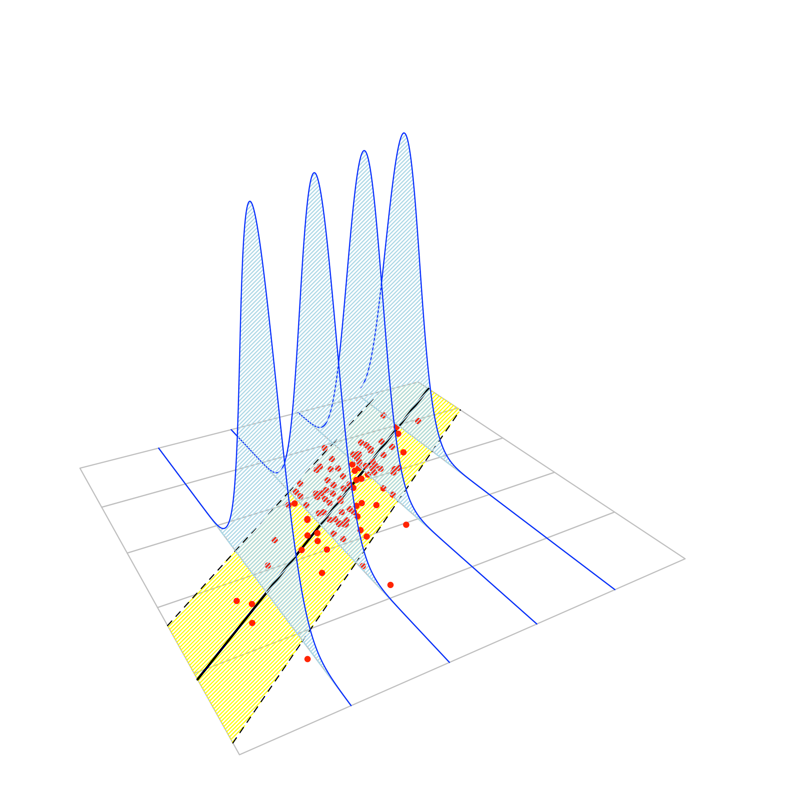
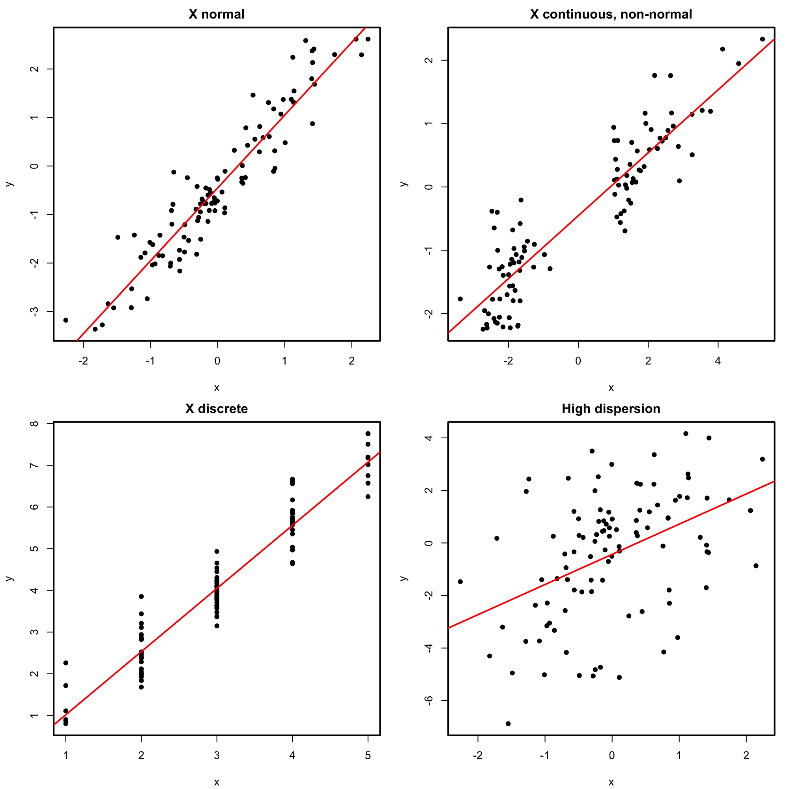
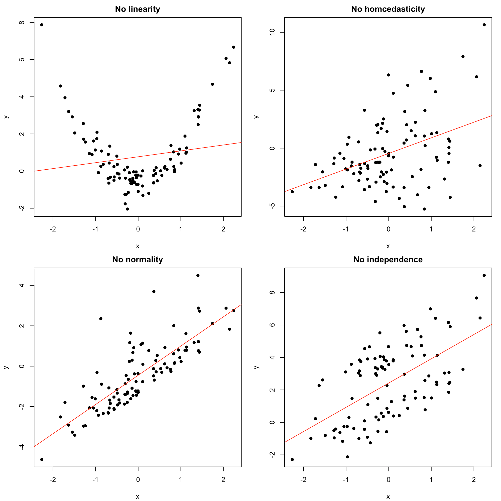
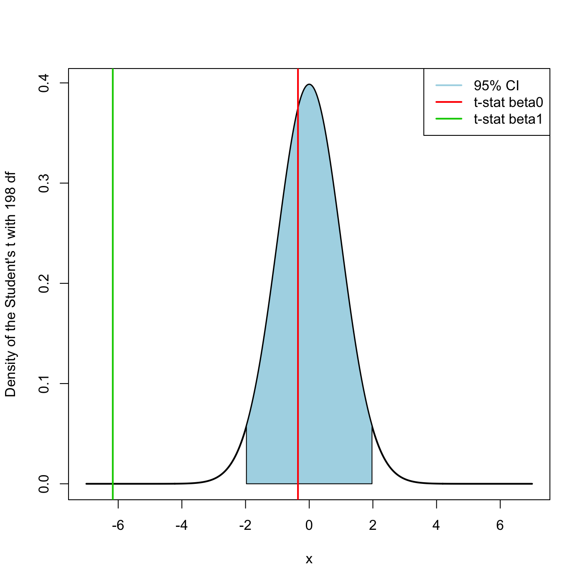

# Simple linear regression {#simp}

The simple linear regression is a *simple* but useful statistical model. In short, it allows to analyse the (assumed) linear relation between two variables in a proper way. To convince you why is useful, let's see what it can do in real-case scenarios!

## Case study I: PISA scores and GDPp {#pisa}

The Programme for International Student Assessment (PISA) is a study carried out by the Organisation for Economic Co-operation and Development (OECD) in 65 countries with the purpose of evaluating the performance of 15-year-old pupils on mathematics, science, and reading. A phenomena observed over years is that *wealthy countries tend to achieve larger average scores*. The purpose of this case study, motivated by the @PISA inform, is to answer two questions related with the previous statement:

- Q1. *Is the educational level of a country influenced by its economic wealth?*
- Q2. *If so, up to what precise extent?*

The `pisa.csv` file ([download](https://raw.githubusercontent.com/egarpor/SSS2-UC3M/master/datasets/pisa.csv)) contains 65 rows corresponding to the countries that took part on the PISA study. The data was obtained merging the [statlink](http://dx.doi.org/10.1787/888932937035) in @PISA2012 with @WB data. Each row has the following variables: `Country`; `MathMean`, `ReadingMean` and `ScienceMean` (the average performance of the students in mathematics, reading and science); `MathShareLow` and `MathShareTop` (percentages of students with a low and top performance in mathematics); `GDPp` and `logGDPp` (the Gross Domestic Product per capita and its logarithm); `HighIncome` (whether the country has a GDPp larger than 20000\$ or not). The GDPp of a country is a measure of how many economic resources are available per citizen. The `logGDPp` is the logarithm of the GDPp, taken in order to avoid scale distortions. A small subset of the data is shown in Table \@ref(tab:pisatable). 

```{r, pisatable, echo = FALSE, out.width = '90%', fig.align = 'center'}
pisa <- read.csv(file = "datasets/pisa.csv", header = TRUE)
knitr::kable(
  head(pisa[, c(1, 2, 5, 6, 8, 9)], 10),
  booktabs = TRUE,
  longtable = TRUE,
  caption = 'First 10 rows of the `pisa` dataset for a selection of variables. Note the `NA` (*Not Available*) in Chinese Taipei (or Taiwan).'
)
```

We definitely need a way of **summarizing this ammount of information**!

We are going to do the following. First, import the data into `R Commander` and do a basic manipulation of it. Second, fit a linear model and interpret its output. Finally, visualize the fitted line and the data.

1. **Import the data into `R Commander`**.

    * Go to `'Data' -> 'Import data' -> 'from text file, clipboard, or URL...'`. A window like Figure \@ref(fig:read) will pop-up. Select the appropiate formatting options of the data file: whether the first row contains the name of the variables, what is the indicator for missing data, what is the field separator, and what is the decimal point character. Then click `'OK'`. 
      
        ```{block, type = 'rmdtip'}
        Inspecting the data file in a text editor will give you the right formatting choices for importing the data.
        ```
      
        ```{r, read, echo = FALSE, out.width = '45%', fig.align = 'center', fig.cap = 'Data importation options.'}
        row.names(pisa) <- as.character(pisa$Country)
        pisa$Country <- NULL
        knitr::include_graphics("images/screenshots/read.png")
        ```

    * Click on `'View data set'` to check that the importation was fine. If the data looks weird, then recheck the structure of the data file and restart from the above point. 
    
    * Since each row corresponds to a different country, we are going to name the rows as the value of the variable `Country`. To that end, go to `'Data' -> 'Active data set' -> 'Set case names...'` and select the variable `Country` and click `'OK'`. The dataset should look like Figure \@ref(fig:view).

        ```{r, view, echo = FALSE, out.width = '90%', fig.align = 'center', fig.cap = 'Correct importation of the `pisa` dataset.'}
        knitr::include_graphics("images/screenshots/view.png")
        ```
    
        ```{block, type = 'rmdcaution'}
        In UC3M computers, **altering the location of a downloaded file may cause errors** in its importation to `R Commander`!
        
        Example:
        
        - Default download path: `'C:/Users/g15s4021/Downloads/pisa.csv'`. Importation from that path works fine.
        - If you **move the file another location** (e.g. to `'C:/Users/g15s4021/Desktop/pisa.csv'`). Importation generates an **error**.
        ```

2. **Fit a simple linear regression**.

    * Go to `'Statistics' -> 'Fit models' -> 'Linear regression...'`. A window like Figure \@ref(fig:lm) will pop-up. 
    
        ```{r, lm, echo = FALSE, out.width = '70%', fig.align = 'center', fig.cap = 'Window for performing linear regression.'}
        knitr::include_graphics("images/screenshots/lm.png")
        ```
        
        Select the *response variable*. This is the variable denoted by $Y$ that we want to predict/explain. Then select the *explanatory variable* (also known as the *predictor*). It is denoted by $X$ and is the variable used to predict/explain $Y$. Recall the form of the linear model:
        $$
        Y=\beta_0+\beta_1X+\varepsilon
        $$
        
        In our case $Y=$`MathMean` and  $X=$`logGDPp`, so select them and click `'OK'`^[In principle, you could pick more than one explanatory variables using the `'Control'` or `'Shift'` keys, but that corresponds to the *multiple linear regression* (covered in Chapter 3).]. 
    
        ```{block, type = 'rmdtip'}
        If you want to deselect an option in an `R Commander` menu, use `'Control' + 'Mouse click'`.
        ```
        
        ```{block, type = 'rmdtip'}
        Four buttons are common in the menus of `R Commander`:
        
        - `'OK'`: executes the selected action, then closes the window.
        - `'Apply'`: executes the selected action but leaves the window open. Useful if you are experimenting with different options.
        - `'Reset'`: resets the fields and boxes of the window to their defaults.
        - `'Cancel'`: exits the window without performing any action.
        ```
    
    * The window in Figure \@ref(fig:lm) generates this code and output:
    
        ```{r}
        pisaLinearModel <- lm(MathMean ~ logGDPp, data = pisa)
        summary(pisaLinearModel)
        ```
    
        This is the linear model of `MathMean` regressed on `logGDPp` (first line) and its summary (second line). The summary gives the coefficients of the line and the $R^2$ (`'Multiple R-squared'`), which -- as we will see in Section \@ref(fit) -- it can be regarded as an *indicator of the strength of the linear relation between the variables*. ($R^2=1$ is a perfect linear fit -- all the points lay in a line -- and $R^2=0$ is the poorest fit.)
        
        The fitted regression line is `MathMean` $= 185.16 + 28.79\,\times$ `logGDPp`. The slope coefficient is positive, which indicates that there is a positive correlation between the wealth of a country and its performance in the PISA Mathematics test (this answers Q1). Hence, the evidence that *wealthy countries tend to achieve larger average scores* is indeed true (at least for the Mathematics test). We can be more precise on the effect of the wealth of a country. According to the fitted linear model, an increase of 1 unit in the `logGDPp` of a country is associated with achieving, on average, 28.79 additional points in the test (Q2).
    
3. **Visualize the fitted regression line**.

    * Go to `'Graphs' -> 'Scatterplot...'`. A window with two panels will pop-up (Figures \@ref(fig:scatter1) and \@ref(fig:scatter2)).
    
        ```{r, scatter1, echo = FALSE, out.width = '70%', fig.align = 'center', fig.cap = 'Scatterplot window, `\'Data\'` panel.'}
        knitr::include_graphics("images/screenshots/scatterplot1.png")
        ```
        ```{r, scatter2, echo = FALSE, out.width = '70%', fig.align = 'center', fig.cap = 'Scatterplot window, `\'Options\'` panel. Remember to tick the `\'Least-squares line\'` box in order to display the fitted regression line.'}
        knitr::include_graphics("images/screenshots/scatterplot2.png")
        ```
    
        On the `'Data'` panel, select the $X$ and $Y$ variables to be displayed in the scatterplot. On the `'Options'` panel, check the `'Least-squares line'` box and choose to identify `'3'` points `'Automatically'`^[The decision of which points are the most *different* from the rest is done automatically by a method known as the *Mahalanobis depth*.]. This will identify what are the three^[The default GUI option is set to identify `'2'` points. However, we know after a preliminary plot that there are three very different points in the dataset, hence this particular choice.] most different observations of the data.

    * The following `R` code will be generated. It produces a scatterplot of `MathMean` vs `logGDPp`, with its scorresponding regression line.
        ```{r, echo = FALSE, warning = FALSE}
        library(splines)
        library(car)
        library(sandwich)
        ```
        ```{r, out.width = '90%', fig.asp = 1, fig.align = 'center'}
        scatterplot(MathMean ~ logGDPp, reg.line = lm, smooth = FALSE, spread = FALSE, id.method = 'mahal', 
                    id.n = 3, boxplots = FALSE, span = 0.5, ellipse = FALSE, levels = c(.5, .9),
                    main = "Average Math score vs. logGDPp", pch = c(16), data = pisa)
        ```
        
        There are three clear *outliers*^[The outliers have a considerable impact on the regression line, as we will see later.]: Vietnam, Shanghai-China and Qatar. The first two are non high-income economies that perform exceptionally well in the test (although Shanghai-China is a cherry-picked region of China). On the other hand, Qatar is a high-income economy that has really poor scores.
    
        We can identify countries that are above and below the linear trend in the plot. This is particularly interesting: we can assess whether a country is performing better or worse with respect to its *expected PISA score according to its economic status* (this adds more insight into Q2). To do so, we want to display the text labels in the points of the scatterplot. We can take a shortcut: copy and run in the input panel the next piece of code. It is a slightly modified version of the previous code (what are the differences?).
    
        ```{r, out.width = '90%', fig.asp = 1, fig.align = 'center', results = 'hide'}
        scatterplot(MathMean ~ logGDPp, reg.line = lm, smooth = FALSE, spread = FALSE, id.method = 'mahal', 
                    id.n = 65, id.cex = 0.75, boxplots = FALSE, span = 0.5, ellipse = FALSE, levels = c(.5, .9), 
                    main = "Average Math score vs. logGDPp", pch = c(16), cex = 0.75, data = pisa)
        ```
    
If you understood the previous analysis, then you should be able to perform the next ones on your own.

```{block, type = 'rmdexercise', out.width = '90%'}
Repeat the regression analysis (steps 2--3) for:

- `ReadingMean` regressed on `logGDPp`. Are the results similar to `MathMean` on `logGDPp`?
- `MathMean` regressed on `ReadingMean`. Compare it with `MathMean` on `ScienceMean`. Which pair of variables has the highest linear relation? Is that something expected?

Save the new models with different names to avoid overwriting the previous models!
```

## Case study II: Apportionment in the EU and US

> Apportionment is the process by which seats in a legislative body are distributed among administrative divisions entitled to representation.
>
> --- Wikipedia article on [Apportionment (politics)](https://en.wikipedia.org/wiki/Apportionment_(politics))

The *European Parliament* and the *US House of Representatives* are two of the most important macro legislative bodies in the world. The distribution of seats in both cameras is designed to represent the different states that conform the federation (US) or union (EU). Both chambers were created under very different historical and political circumstances, which is reflected in the kinds of apportionment that they present. More specifically:

- In the **US**, the apportionment is neatly *fixed by the US Constitution*. Each of the 50 states is apportioned a number of seats that corresponds to its share of the total population of the 50 states, according to the most recent decennial census. Every state is guaranteed *at least 1 seat*. There are 435 seats.

- Until now, the apportionment in the **EU** was set by *treaties* (Nice, Lisbon), in which *negotiations* between countries took place. The [last accepted composition](http://eur-lex.europa.eu/legal-content/EN/TXT/?uri=CELEX:32013D0312) gives an allocation of seats based on the principle of "degressive proportionality"^[Less populated states are given more weight than its corresponding proportional share.] and somehow vague guidelines. It concludes with a commitment to establish a system to "allocate the seats between Member States in an objective, fair, durable and transparent way, translating the principle of degressive proportionality". The Cambridge Compromise [@CamCom] was a proposal in that direction that was not effectively implemented. Currently, every state is guaranteed a *minimum of 6 seats* and a *maximum of 96* for a grand total of 750 seats.

We know that there exist qualitative dissimilarities between both chambers, but we can not be more specific with the description at hand. The purpose of this case study is to quantify and visualize what are the differences between the apportionments of the two chambers, and how the linear regression can add insights on what is actually going on with the EU apportionment. The questions we want to answer are:

- Q1. *Can we quantify which chamber is more proportional?*
- Q2. *What are the over-represented and under-represented states in both chambers?*
- Q3. *How can we quantify the 'degressive proportionality' in the EU approportionment system? Was the Cambridge Compromise proposing a fairer representation?*

Let's begin by reading the data:

1. The `US_apportionment.xlsx` file ([download](https://raw.githubusercontent.com/egarpor/SSS2-UC3M/master/datasets/US_apportionment.xlsx)) contains the 50 US states entitled to representation. The variables are `State`, `Population2010` (from the last census) and `Seats2013–2023`. This is an Excel file that we can read using `'Data' -> 'Import data' -> 'from Excel file...'`. A window will pop-up, asking for the right options. We set them as in Figure \@ref(fig:excel), since we want the variable `State` to be the case names. After clicking in `'View dataset'`, the data should look like Figure \@ref(fig:US).

    ```{r, excel, echo = FALSE, out.width = '45%', fig.align = 'center', fig.cap = 'Importation of an Excel file.'}
    knitr::include_graphics("images/screenshots/excel.png")
    ```

    ```{r, US, echo = FALSE, out.width = '45%', fig.align = 'center', fig.cap = 'Correct importation of the `US` dataset.'}
    knitr::include_graphics("images/screenshots/US.png")
    ```

2. The `EU_apportionment.txt` file ([download](https://raw.githubusercontent.com/egarpor/SSS2-UC3M/master/datasets/EU_apportionment.txt)) contains 28 rows with the member states of the EU (`Country`), the number of seats assigned under different years (`Seats2011`, `Seats2014`), the Cambridge Compromise apportionment (`CamCom2011`), and the countries population^[According to [EuroStat](http://ec.europa.eu/eurostat/tgm/table.do?tab=table&init=1&language=en&pcode=tps00001) and the population stated in the Cambridge Compromise report.] (`Population2010`,`Population2013`). 

    ```{block, type = 'rmdexercise'}
    For this file, you should know how to:
    
    1. Inspect the file in a text editor and determine its formatting.
    2. Decide the right importation options and load it with the name `EU`.
    3. Set the case names as the variable `Country`.
    ```
    
    ```{r, EU, echo = FALSE}
    US <- RcmdrMisc::readXL("datasets/US_apportionment.xlsx", rownames = TRUE, header = TRUE, na = "", sheet = "Hoja1", stringsAsFactors = TRUE)
    EU <- read.table("datasets/EU_apportionment.txt", header = TRUE, na = "-", sep = "\t")
    row.names(EU) <- EU$Country
    EU$Country <- NULL
    knitr::kable(
      EU,
      booktabs = TRUE,
      longtable = TRUE,
      caption = 'The `EU` dataset with `Country` set as the case names.'
    )
    ```

We start by analyzing the `US` dataset. If there is indeed a direct proportionality in the apportionment, we would expect a direct, 1:1, relation between the *ratios of seats* and the *population per state*. Let's start by constructing these variables:

1. Switch the active dataset to `US`. An alternative way to do so is by `'Data' -> 'Active data set' -> 'Select active data set...'`.
2. Go to `'Data' -> 'Manage variables in active dataset...' -> 'Compute new variable...'`. 
3. Create the the variable `RatioSeats2013.2023` as shown in Figure \@ref(fig:newvar). Be **careful to not overwrite** the variable `Seats2013.2023`.

    ```{r, newvar, echo = FALSE, out.width = '70%', fig.align = 'center', fig.cap = 'Creation of the new variable `RatioSeats2013.2023`. The expression to compute is `Seats2013.2023/sum(Seats2013.2023)`.'}
    knitr::include_graphics("images/screenshots/newvar.png")
    ```

4. `'View dataset'` to check that the new variable is available.

```{block, type = 'rmdexercise'}
Repeat steps 1--3, conveniently adapted, to create the new variable `RatioPopulation2010`.
```
```{r, echo = FALSE}
US$RatioSeats2013.2023 <- US$Seats2013.2023 / sum(US$Seats2013.2023)
US$RatioPopulation2010 <- US$Population2010 / sum(US$Population2010)
```

Let's fit a regression line to the `US` data, with `RatioSeats2013.2023` as the response and `RatioPopulation2010` as the explanatory variable. If we name the model as `appUS`, you should get the following code and output:
```{r}
appUS <- lm(RatioSeats2013.2023 ~ RatioPopulation2010, data = US)
summary(appUS)
```
The fitted regression line is `RatioSeats2013.2023`$=0.000+1.005\,\times$`RatioPopulation2010` and has an $R^2=0.9991$ (`'Multiple R-squared'`), which means that the data is almost perfectly linearly distributed. Furthermore, the *intercept coefficient is not significant*. This is seen in the column `'Pr(>|t|)'`, which gives the $p$-values for the null hypotheses $H_0:\beta_0=0$ and $H_0:\beta_1=0$, respectively. The null hypothesis $H_0:\beta_0=0$ is *not rejected* ($p$-value$=0.407$; non-significant) whereas $H_0:\beta_1=0$ is rejected ($p$-value$=0$; significant)^[We will be able to say more about how these test are performed after Section \@ref(inference).]. Hence, we can conclude that the appropriation of seats in the US House of Representatives is indeed directly proportional to the population of each state (partially answers Q1).

If we make the scatterplot for the `US` dataset, we can see the almost perfect (up to integer rounding) 1:1 relation between the ratios "state seats"/"total seats" and "state population"/"aggregated population". We can set the scatterplot to automatically label the `'25'` most different points (select the numeric box with the mouse and type `'25'` -- the arrow buttons are limited to `'10'`) with their case names. As it is seen in Figure \@ref(fig:ratios), there is no state clearly over- or under-represented (Q2).

```{r, ratios, echo = FALSE, out.width = '90%', fig.asp = 1, results = 'hide', fig.align = 'center', fig.cap = 'The apportionment in the US House of Representatives compared with a linear fit.'}
scatterplot(RatioSeats2013.2023 ~ RatioPopulation2010, reg.line = lm, smooth = FALSE, spread = FALSE, id.method = 'mahal', 
            id.n = 25, id.cex = 0.75, boxplots = FALSE, span = 0.5, ellipse = FALSE, levels = c(.5, .9), 
            main = "Approportionment in the US House of Representatives", pch = c(16), cex = 0.75, data = US)
```

Let's switch to the `EU` dataset, for which we will focus on the 2011 variables. A quick way of visualizing this dataset and, in general, of **visualizing multivariate data** (up to a moderate number of dimensions) is to use a *matrix scatterplot*. Essentially, it displays the scatterplots between all the pairs of variables. To do it, go to `'Graphs' -> 'Scatterplot matrix...'` and select the number of variables to be displayed. If you select them as in Figures \@ref(fig:mscatter1a) and \@ref(fig:mscatter1b), you should get an output like Figure \@ref(fig:mscatter2). 

```{r, mscatter1a, echo = FALSE, out.width = '70%', fig.align = 'center', fig.cap = 'Scatterplot matrix window, `\'Data\'` panel.'}
knitr::include_graphics("images/screenshots/mscatter1a.png")
```
```{r, mscatter1b, echo = FALSE, out.width = '70%', fig.align = 'center', fig.cap = 'Scatterplot matrix window, `\'Options\'` panel. Be sure to tick the `\'Least-squares line\'` box in order to display the fitted regression line.'}
knitr::include_graphics("images/screenshots/mscatter1b.png")
```
```{r, mscatter2, echo = FALSE, out.width = '90%', fig.align = 'center', fig.cap = 'Scatterplot matrix for the variables `CamCom2011`, `Population2010` and `Seats2011` of `EU` dataset with boxplots in the central panels.'}
knitr::include_graphics("images/screenshots/mscatter2.png")
```

```{block, type = 'rmdexercise'}
The scatterplot matrix has a central panel displaying one-variable summary plots: histogram, density estimate, boxplot and QQ-plot. Experiment and understand them.
```

The most interesting panels in Figure \@ref(fig:mscatter2) for our study are `CamCom2011` vs `Population2010` -- panel (1,2) -- and `Seats2011` vs `Population2010` -- panel (3,2). At first sight, it seems that the Cambridge Compromise was favoring a fairer allocation of seats than what it was actually being used in the EU parliament in 2011 (recall the step-wise patterns in (3,2)). Let's explore in depth the scatterplot `Seats2011` vs `Population2010`.

```{r, echo = FALSE, results = 'hide', out.width = '90%', fig.asp = 1, fig.align = 'center', fig.cap = '`Seats2011` vs `Population2010` in the `EU` dataset.'}
scatterplot(Seats2011 ~ Population2010, reg.line = lm, smooth = FALSE, spread = FALSE, id.method = 'mahal', 
            id.n = 25, id.cex = 0.75, boxplots = FALSE, span = 0.5, ellipse = FALSE, levels = c(.5, .9), 
            main = "Approportionment in the EU parliament in 2011", pch = c(16), cex = 0.75, data = EU)
```

There are some countries clearly detrimented and benefited by this apportionment. For example, France and Spain are under-represented and, on the other hand, Germany, Hungary and Czech Republic are over-represented (Q2). 

Let's compute the regression line of `Seats2011` on `Population2010`, which we save in the model `appEU2011`.

```{r}
appEU2011 <- lm(Seats2011 ~ Population2010, data = EU)
summary(appEU2011)
```

The fitted line is `Seats2011`$=7.91+1.078\,\times10^{-6}\,\times$`Population2010`. The intercept is not zero and, indeed, the fitted intercept is significantly different from zero. Therefore, **there is no proportionality** in the apportionment. Recall that the fitted slope, despite being very small (why?), is also significantly different from zero. The $R^2$ is slightly smaller than in the `US` dataset, but definitely very high. Two conclusions stem from this analysis:

- The US House of Representatives is a proportional chamber whereas the EU parliament is definitely not, but is close to perfect linearity (completes Q1). 

- The principle of **digressive proportionality**, in practice, means an almost **linear allocation** of seats with respect to population (Q3). The main point is the presence of a **non-zero intercept** -- that is, a minimum number of seats corresponding to a country -- in order to over-represent smaller countries with respect to its corresponding proportional share.

The question that remains to be answered is whether the Cambridge Compromise was favoring a fairer allocation of seats than the 2011 official agreement. In Figure \@ref(fig:mscatter2) we can see that indeed it seems like that, but there is an outlier outside the linear pattern: Germany. There is an explanation for that: the EU commission imposed a cap to the maximum number of seats per country, 96, to the development of the Cambridge Compromise. With this rule, Germany is notably under-represented.

In order to avoid this distortion, we will exclude Germany from our comparison. To do so, we specify in the `'Subset expression'` field, of either `'Linear regression...'` or `'Scatterplot...'`, a `'-1'`. This tells `R` to exclude the first row of `EU` dataset, corresponding to Germany. Then, we compare the linear models for the official allocation, `appEUNoGer2011`, and the Cambridge Compromise, `appCamComNoGer2011`. The outputs are the following.

```{r}
appEUNoGer2011 <- lm(Seats2011 ~ Population2010, data = EU, subset = -1)
summary(appEUNoGer2011)
```
```{r}
appCamComNoGer2011 <- lm(CamCom2011 ~ Population2010, data = EU, subset = -1)
summary(appCamComNoGer2011)
```

We see that the Cambridge Compromise has a larger $R^2$ and a lower intercept than the official allocation of seats. This means that it favors a more proportional allocation, which is fairer in the sense that the deviations from the linear trend are smaller (Q3). We conclude the case study by illustrating both fits.

```{r, echo = FALSE, results = 'hide', out.width = '90%', fig.asp = 1, fig.align = 'center', fig.cap = '`Seats2011` vs `Population2010` in the `EU` dataset, Germany excluded.'}
scatterplot(Seats2011 ~ Population2010, reg.line = lm, smooth = FALSE, spread = FALSE, id.method = 'mahal', 
            id.n = 25, id.cex = 0.75, boxplots = FALSE, span = 0.5, ellipse = FALSE, levels = c(.5, .9), 
            main = "Approportionment in the EU parliament (Germany excl.)", pch = c(16), cex = 0.75, data = EU, subset = -1)
```

```{r, echo = FALSE, results = 'hide', out.width = '90%', fig.asp = 1, fig.align = 'center', fig.cap = '`CamCom2011` vs `Population2010` in the `EU` dataset, Germany excluded.'}
scatterplot(CamCom2011 ~ Population2010, reg.line = lm, smooth = FALSE, spread = FALSE, id.method = 'mahal', 
            id.n = 25, id.cex = 0.75, boxplots = FALSE, span = 0.5, ellipse = FALSE, levels = c(.5, .9), 
            main = "Proposal for approportionment in the EU parliament (Germany excl.)", pch = c(16), cex = 0.75, data = EU, subset = -1)
```

```{block, type = 'rmdexercise'}
In 2014 it was negotiated a new EU apportionment, collected in `Seats2014`, according to the population of 2013, `Population2013`, and due to the inclusion of Croatia in the EU. Answer these questions:

- Which countries were the most favored and unfavored by such apportionment?
- Was the apportionment proportional?
- Was the degree of linearity higher or lower than the 2011 apportionment? (Exclude Germany.)
- Was the degree of linearity higher or lower than the Cambridge Compromise for 2011? (Exclude Germany.)

```

***

We have performed a decent number of operations in `R Commander`. If we have to exit the session, we can save the data and models in a `.RData` file, which contains all the objects we have computed so far (but **not** the code -- this has to be saved differently). 

```{block, type = 'rmdtip'}
To exit `R Commander`, save all your progress and reload it later, do:

1. Save `.RData` file. Go to `'File' -> 'Save R workspace as...'`.
2. Save `.R` file. Go to `'File' -> 'Save script as...'`.
3. Exit `R Commander` + `R`. Go to `'File' -> 'Exit' -> 'From Commander and R'`. Choose to not save any file.
4. Start `R Commander` and load your files:

    - `.RData` file in `'Data' -> 'Load data set...'`,
    - `.R` file in `'File' -> 'Open script file...'`.

```

```{block, type = 'rmdtip'}
If you just want to save a dataset, you have two options:

- `'Data' -> 'Active data set' -> 'Save active data set...'`: it will be saved as an `.RData` file. The easiest way of importing it back to `R`.
- `'Data' -> 'Active data set' -> 'Export active data set...'`: it will be saved as a text file with the format that you choose. Useful for exporting data to other programs.

```

## Some `R` basics

By this time you probably had realized that some pieces of `R` code are repeated over and over, and that it is simpler to just modify them than to navigate the menus. For example, the codes `lm` and `scatterplot` always appear related with linear models and scatterplots. It is important to know some of the `R` basics in order to understand what are these pieces of text actually doing. Do not worry, the menus will always be there to generate the proper code for you -- but you need to have a *general idea* of the code.

In the following sections, **type** -- not copy and paste systematically -- the code in the `'R Script'` panel and send it to the output panel (on the selected expression, either with the `'Submit'` button or with `'Control' + 'R'`). 

We begin with the `lm` function, since it is the one you are more used to. In the following, you should get the same outputs (which are preceded by `## [1]`).

### The `lm` function

```{r, collapse = TRUE, error = TRUE}
# First of all, this is a comment. Its purpose is to explain what the code is doing
# Comments are preceeded by a #

# lm has the syntax: lm(formula = response ~ explanatory, data = data)
# For example (you need to load first the EU dataset)
mod <- lm(formula = Seats2011 ~ Population2010, data = EU)

# We have saved the linear model into mod, which now contains all the output of lm
# You can see it by typing
mod

# mod is indeed a list of objects whose names are
names(mod)

# We can access these elements by $
# For example
mod$coefficients

# The residuals
mod$residuals

# The fitted values
mod$fitted.values

# Summary of the model
sumMod <- summary(mod)
sumMod
```


The following table contains a handy cheat sheet of equivalences between `R` code and some of the statistical concepts associated to linear regression.

|              `R`                       |        Statistical concept          |
|----------------------------------------|-------------------------------------|
| `x` | Predictor $X_1,\ldots,X_n$    | 
| `y` | Response $Y_1,\ldots,Y_n$    |
| `data <- data.frame(x = x, y = y)` | Sample $(X_1,Y_1),\ldots,(X_n,Y_n)$    | 
| `model <- lm(y ~ x, data = data)` | Fitted linear model |
| `model$coefficients` | Fitted coefficients $\hat\beta_0,\hat\beta_1$ |
| `model$residuals` | Fitted residuals $\hat\varepsilon_1,\ldots,\hat\varepsilon_n$ |
| `model$fitted.values` | Fitted values $\hat Y_1,\ldots,\hat Y_n$ |
| `model$df.residual` | Degrees of freedom $n-2$ |
| `summaryModel <- summary(model)` | Summary of the fitted linear model |
| `summaryModel$sigma` | Fitted residual standard deviation $\hat\sigma$ |
| `summaryModel$r.squared` | Coefficient of determination $R^2$ |
| `summaryModel$fstatistic` | $F$-test |
| `anova(model)` | ANOVA table |


Now you know how to fit and summarize a linear model with a few keystrokes. Let's see more of the basics of `R` -- it will be useful for the next sections.

### Simple computations

```{r, echo = TRUE, error = TRUE, collapse = TRUE}
# These are some simple operations
# The console can act as a simple calculator
1.0 + 1.1
2 * 2
3/2
2^3
1/0
0/0

# Use ; for performing several operations in the same line
(1 + 3) * 2 - 1; 1 + 3 * 2 - 1

# Mathematical functions
sqrt(2); 2^0.5
sqrt(-1)
exp(1)
log(10); log10(10); log2(10)
sin(pi); cos(0); asin(0)

# Remember to complete the expressions
1 + 
(1 + 3
```

### Variables and assignment

```{r, echo = TRUE, error = TRUE, collapse = TRUE}
# Any operation that you perform in R can be stored in a variable (or object)
# with the assignment operator "<-"
a <- 1

# To see the value of a variable, we simply type it
a

# A variable can be overwritten
a <- 1 + 1

# Now the value of a is 2 and not 1, as before
a 

# Careful with capitalization
A

# Different
A <- 3
a; A

# The variables are stored in your workspace (.RData file)
# A handy tip to see what variables are in the workspace
ls()
# Now you know which variables can be accessed!

# Remove variables
rm(a)
a
```

```{block, type = 'rmdexercise'}
- Store $-123$ in the variable `b`.
- Get the log of the square of `b`. (Answer: `9.624369`)
- Remove variable `b`.
```

### Vectors

```{r, echo = TRUE, collapse = TRUE, error = TRUE}

# These are vectors - arrays of numbers
# We combine numbers with the function c
c(1, 3)
c(1.5, 0, 5, -3.4)

# A handy way of creating sequences is the operator :
# Sequence from 1 to 5
1:5 

# Storing some vectors
myData <- c(1, 2)
myData2 <- c(-4.12, 0, 1.1, 1, 3, 4)
myData
myData2

# Entry-wise operations
myData + 1 
myData^2

# If you want to access a position of a vector, use [position]
myData[1]
myData2[6]

# You also can change elements
myData[1] <- 0
myData

# Think on what you want to access...
myData2[7]
myData2[0]

# If you want to access all the elements except a position, use [-position]
myData2[-1]
myData2[-2]

# Also with vectors as indexes
myData2[1:2]
myData2[myData]

# And also
myData2[-c(1, 2)]

# But do not mix positive and negative indexes!
myData2[c(-1, 2)]
```

```{block, type = 'rmdexercise'}
- Create the vector $x=(1, 7, 3, 4)$. 
- Create the vector $y=(100, 99, 98, ..., 2, 1)$.
- Compute $x_2+y_4$ and $\cos(x_3) + \sin(x_2) e^{-y_2}$. (Answers: `104`, `-0.9899925`)
- Set $x_{2}=0$ and $y_{2}=-1$. Recompute the previous expressions. (Answers: `97`, `2.785875`)
- Index $y$ by $x+1$ and store it as `z`. What is the output? (Answer: `z` is `c(-1, 100, 97, 96)`)

```

### Functions

```{r, echo = TRUE, collapse = TRUE, error = TRUE}
# Functions take arguments between parenthesis and transform them into an output
sum(myData)
prod(myData)

# Summary of an object
summary(myData)

# Length of the vector
length(myData)

# Mean, standard deviation, variance, covariance
mean(myData)
var(myData)
cov(myData, myData^2)
quantile(myData)

# Maximum and minimum of vectors
min(myData)
which.min(myData)

# Usually the functions have several arguments, which are set by "argument = value"
# In this case, the second argument is a logical flag to indicate the kind of sorting
sort(myData)
sort(myData, decreasing = TRUE)

# Don't know what are the arguments of a function? Use args and help!
args(sort)
?sort
```

```{block, type = 'rmdexercise'}
- Compute the mean, median and variance of $y$. 
- Do the same for $y+1$. What are the differences?
- What is the maximum of $y$? Where is it placed?
- Sort $y$ increasingly and obtain the 5th and 76th positions.
- Compute the covariance between $y$ and $y$. Compute the variance of $y$. Why do you get the same result?
```

### Matrices, data frames and lists

```{r, collapse = TRUE, error = TRUE}
# A matrix is an array of vectors
A <- matrix(1:4, nrow = 2, ncol = 2)
A
B <- matrix(1:4, nrow = 2, ncol = 2, byrow = TRUE)
B

# Binding by rows or columns
rbind(1:3, 4:6)
cbind(1:3, 4:6)

# Entry-wise operations
A + 1
A * B

# Accessing elements
A[2, 1] # Element (2, 1)
A[1, ] # First row
A[, 2] # First column

# A data frame is a matrix with column names
myDf <- data.frame(var1 = 1:2, var2 = 3:4)
myDf

# You can change names
names(myDf) <- c("newname1", "newname2")

# The nice thing is that you can access variables by its name with the $ operator
myDf$newname1

# A list is a collection of arbitrary variables
myList <- list(myData = myData, A = A, myDf = myDf) 

# Access elements by names
myList$myData
myList$A
myList$myDf

# Reveal the structure of an object
str(myList)
str(myDf)

# A less lengthy output
names(myList)
```

```{block, type = 'rmdexercise'}
- Create a matrix, called $M$, with rows given by $y$, $y^2$ and $\log(y)$.
- Name the columns of $M$ as `"y"`, `"y2"` and `"logy"`.
- Create a list, called `l`, with entries for $x$ and $M$. Access the elements by their names.
- Use the function `as.data.frame()` to convert $M$ into a data frame, called `df`.
```

```{block, type = 'rmdexercise'}
For `mod`, check that:

- The sum of residuals is zero.
- The sum of the squared residuals divided by the degrees of freedom equals `summary(mod)$sigma^2`. 
- What are the 5 largest residuals? What are the 5 lowest? What is the interpretation in terms of the `EU` dataset?
```


## Model formulation and estimation by least squares

The simple linear model is a statistical tool for describing the relation between two random variables, $X$ and $Y$. For example, in the `pisa` dataset, $X$ could be `ReadingMean` and $Y=$ `MathMean`. The linear model is *constructed by assuming* that the linear relation
\begin{equation}
Y = \beta_0 + \beta_1 X + \varepsilon \label{eq:1}
\end{equation}
holds between $X$ and $Y$. In (\@ref(eq:1)), $\beta_0$ and $\beta_1$ are known as the *intercept* and *slope*, respectively. $\varepsilon$ is a random variable with mean zero and independent from $X$. It describes the *error* around the mean, or the effect of other variables that we do not model. Another way of looking at (\@ref(eq:1)) is
\begin{equation}
\mathbb{E}(Y|X=x)=\beta_0+\beta_1x, \label{eq:2}
\end{equation}
since $\mathbb{E}(\varepsilon|X=x)=0$. 

The Left Hand Side (LHS) of (\@ref(eq:2)) is the *conditional expectation* of $Y$ given $X$. It represents how the mean of the random variable $Y$ is changing according to a particular value, denoted by $x$, of the random variable $X$. With the RHS, what we are saying is that the mean of $Y$ is changing in a *linear* fashion with respect to the value of $X$. Hence the interpretation of the coefficients:

- $\beta_0$: is the mean of $Y$ when $X=0$.
- $\beta_1$: is the increment in mean of $Y$ for an increment of one unit in $X=x$.

If we have a sample $(X_1,Y_1),\ldots,(X_n,Y_n)$ for our random variables $X$ and $Y$, we can estimate the unknown coefficients $\beta_0$ and $\beta_1$. In the `pisa` dataset, the sample are the observations for `ReadingMean` and `MathMean`. A possible way of estimating $(\beta_0,\beta_1)$ is by minimizing the *Residual Sum of Squares* (RSS):
$$
\text{RSS}(\beta_0,\beta_1)=\sum_{i=1}^n(Y_i-\beta_0-\beta_1X_i)^2.
$$
In other words, we look for the estimators $(\hat\beta_0,\hat\beta_1)$ such that
$$
(\hat\beta_0,\hat\beta_1)=\arg\min_{(\beta_0,\beta_1)\in\mathbb{R}^2} \text{RSS}(\beta_0,\beta_1).
$$

It can be seen that *the minimizers of the RSS*^[They are unique and always exist. They can be obtained by solving $\frac{\partial}{\partial \beta_0}\text{RSS}(\beta_0,\beta_1)=0$ and $\frac{\partial}{\partial \beta_1}\text{RSS}(\beta_0,\beta_1)=0$.] are
\begin{equation}
\hat\beta_0=\bar{Y}-\hat\beta_1\bar{X},\quad \hat\beta_1=\frac{S_{xy}}{S_x^2},\label{eq:3}
\end{equation}
where:

- $\bar{X}=\frac{1}{n}\sum_{i=1}^nX_i$ is the *sample mean*.
- $S_x^2=\frac{1}{n}\sum_{i=1}^n(X_i-\bar{X})^2$ is the *sample variance*. The sample standard deviation is $S_x=\sqrt{S_x^2}$.
- $S_{xy}=\frac{1}{n}\sum_{i=1}^n(X_i-\bar{X})(Y_i-\bar{Y})$ is the *sample covariance*. It measures the degree of linear association between $X_1,\ldots,X_n$ and $Y_1,\ldots,Y_n$. Once scaled by $S_xS_y$, it gives the *sample correlation coefficient*, $r=\frac{S_{xy}}{S_xS_y}$.

There are some important points hidden behind the election of RSS as the error criterion for obtaining $(\hat\beta_0,\hat\beta_1)$:

- *Why the vertical distances and not horizontal or perpendicular?* Because we want to minimize the error in the *prediction* of $Y$! Note that the treatment of the variables is *not symmetrical*^[In Chapter 5 we will consider perpendicular distances.].
- *Why the squares in the distances and not the absolute value?* Due to mathematical convenience. Squares are nice to differentiate and are closely related with the Normal distribution.

Figure \@ref(fig:leastsquares) illustrates the influence of the distance employed in the sum of squares. Try to minimize the sum of squares for the different datasets. Is the best choice of intercept and slope independent of the type of distance?  

```{r, leastsquares, echo = FALSE, fig.cap = 'Least squares illustration.', screenshot.opts = list(delay = 10), dev = 'png', cache = TRUE, fig.align = 'center', out.width = '90%'}
knitr::include_app('https://egarpor.shinyapps.io/least-squares/', height = '900px')
```

The data of the figure has been generated with the following code:
```{r}
set.seed(34567) # Fixes the seed for the random generator
x <- rnorm(n = 50) # Generates 50 points from a N(0, 1)
eps <- rnorm(n = 50, sd = 0.5) # Generates 50 points from a N(0, 0.5^2)
yLin <- -0.5 + 1.5 * x + eps
yQua <- -0.5 + 1.5 * x^2 + eps
yExp <- -0.5 + 1.5 * 2^x + eps
leastSquares <- data.frame(x = x, yLin = yLin, yQua = yQua, yExp = yExp)
```

```{block, type = 'rmdexercise'}
The minimizers of the error in the above illustration are indeed the coefficients given by the `lm` function. Check this for the three types of responses: `yLin`, `yQua` and `yExp`.
```

```{block, type = 'rmdinsight'}
The *population regression coefficients*, $(\beta_0,\beta_1)$, **are not the same** as the *estimated regression coefficients*, $(\hat\beta_0,\hat\beta_1)$:

- $(\beta_0,\beta_1)$ are the theoretical and **always** unknown quantities (except under controlled scenarios).
- $(\hat\beta_0,\hat\beta_1)$ are the estimates computed from the data. In particular, they are the output of `lm`. They are *random variables*, since they are computed from the random sample $(X_1,Y_1),\ldots,(X_n,Y_n)$.

In an abuse of notation, the term *regression line* is often used to denote both the *theoretical* ($y=\beta_0+\beta_1x$) and the *estimated* ($y=\hat\beta_0+\hat\beta_1x$) regression lines.
```

Once we have the least squares estimates $(\beta_0,\beta_1)$, we can define the next two concepts:

- The *fitted values* $\hat Y_1,\ldots,\hat Y_n$, where 
$$
\hat Y_i=\hat\beta_0+\hat\beta_1X_i,\quad i=1,\ldots,n.
$$
They are the vertical projections of $Y_1,\ldots,Y_n$ into the fitted line (see Figure \@ref(fig:leastsquares)).

- The *estimated residuals* $\hat \varepsilon_1,\ldots,\hat \varepsilon_n$, where 
$$
\hat\varepsilon_i=Y_i-\hat Y_i,\quad i=1,\ldots,n.
$$
They are the vertical distances between actual data and fitted data. Hence, another way of writing the minimum RSS is $\sum_{i=1}^n(Y_i-\hat\beta_0-\hat\beta_1Y_i)^2=\sum_{i=1}^n\hat\varepsilon_i^2$.

To conclude this section, we check that the regression coefficients given by `lm` are indeed the ones given in (\@ref(eq:3)).

```{r, echo = TRUE, collapse = TRUE}
# Covariance
Sxy <- cov(x, yLin)

# Variance
Sx2 <- var(x)

# Coefficients
beta1 <- Sxy / Sx2
beta0 <- mean(yLin) - beta1 * mean(x) 
c(beta0, beta1)

# Output from lm
mod <- lm(yLin ~ x, data = leastSquares)
mod$coefficients
```

```{block, type = 'rmdexercise'}
Adapt the code conveniently for doing the same checking with

- $X=$`ReadingMean` and $Y=$`MathMean` from the `pisa` dataset. 
- $X=$`logGDPp` and $Y=$`MathMean`.
- $X=$`Population2010` and $Y=$`Seats2013.2023` from the `US` dataset.
- $X=$`Population2010` and $Y=$`Seats2011` from the `EU` dataset. 
```

## Assumptions of the model

Why do we need assumptions? To make **inference** on the model parameters. In other words, to infer properties about a the *unknown* population coefficients $\beta_0$ and $\beta_1$ from the sample $(X_1,Y_1),\ldots,(X_n,Y_n)$.

```{r, linearmodel, echo = FALSE, out.width = '90%', fig.align = 'center', fig.cap = 'The key concepts of the linear model.'}

```

The assumptions of the linear model are:

i. **Linearity**: $\mathbb{E}(Y|X=x)=\beta_0+\beta_1x$.
ii. **Homocedasticity**: $\mathbb{V}\text{ar}(\varepsilon_i)=\sigma^2$, with $\sigma^2$ constant for $i=1,\ldots,n$.
iii. **Normality**: $\varepsilon_i\sim\mathcal{N}(0,\sigma^2)$.
iv. **Independence of the errors**: $\varepsilon_1,\ldots,\varepsilon_n$ are independent (or uncorrelated, $\mathbb{E}(\varepsilon_i\varepsilon_j)=0$, $i\neq j$, since they are assumed to be Normal by iii).

A good one-line summary of the linear model is (independence is assumed)
$$
Y|X=x\sim \mathcal{N}(\beta_0+\beta_1x,\sigma^2)
$$

```{block, type = 'rmdinsight'}
Recall:

- Nothing is said about the randomness of $X$. $X$ could be deterministic (called *fixed design*) or random (*random design*). 

- The linear model assumes that $Y$ is continuous due to iii, but $X$ can be discrete.
```

Figures \@ref(fig:linearmodelgood) and \@ref(fig:linearmodelbad) represent situations where the assumptions of the model are respected and violated, respectively. For the moment, we will focus on building the intuition for checking the assumptions visually. In the next chapter we will see more sophisticated detection methods and the alternatives to their failure.

```{r, linearmodelgood, echo = FALSE, out.width = '90%', fig.align = 'center', fig.cap = 'Perfectly valid linear models (all the assumptions are verified).'}

```

```{r, linearmodelbad, echo = FALSE, out.width = '90%', fig.align = 'center', fig.cap = 'Problematic linear models (a single assumption does not hold).'}

```

```{block, type = 'rmdexercise'}
The dataset `assumptions.RData` ([download](https://raw.githubusercontent.com/egarpor/SSS2-UC3M/master/datasets/assumptions.RData)) contains the variables `x1`, ..., `x9` and `y1`, ..., `y9`. For each regression `y1 ~ x1`, ..., `y9 ~ x9`:

- Check whether the assumptions of the linear model are being satisfied. 
- State which assumption(s) are violated and justify your answer.
```

## Inference for the model coefficients {#inference}

The assumptions introduced in the previous section allow to specify what is the distribution of the random variables $\hat\beta_0$ and $\hat\beta_1$. 

These distributions are derived conditionally on the sample predictors $X_1,\ldots,X_n$. In other words, we assume that the randomness of $Y_i=\beta_0+\beta_1X_i+\varepsilon_i$, $i=1,\ldots,n$, comes only from the error terms and not from the predictors. To denote this, we employ lowercase for the sample predictors $x_1,\ldots,x_n$.

The distributions of $\hat\beta_0$ and $\hat\beta_1$ are:
\begin{equation}
\hat\beta_0\sim\mathcal{N}\left(\beta_0,\mathrm{SE}(\hat\beta_0)^2\right),\quad\hat\beta_1\sim\mathcal{N}\left(\beta_1,\mathrm{SE}(\hat\beta_1)^2\right)\label{eq:norm1}
\end{equation}
where
\begin{equation}
\mathrm{SE}(\hat\beta_0)^2=\frac{\sigma^2}{n}\left[1+\frac{\bar X^2}{S_x^2}\right],\quad \mathrm{SE}(\hat\beta_1)^2=\frac{\sigma^2}{nS_x^2}.\label{eq:se1}
\end{equation}
Recall that an equivalent form for (\@ref(eq:norm1)) is (why?)
$$
\frac{\hat\beta_0-\beta_0}{\mathrm{SE}(\hat\beta_0)}\sim\mathcal{N}(0,1),\quad\frac{\hat\beta_1-\beta_1}{\mathrm{SE}(\hat\beta_1)}\sim\mathcal{N}(0,1).
$$

Some important remarks on (\@ref(eq:norm1)--\@ref(eq:se1)) are

- **Bias**. Both estimates are unbiased. That means that their expectations are the true coefficients.
- **Variance**. The variances $\mathrm{SE}(\hat\beta_0)^2$ and $\mathrm{SE}(\hat\beta_1)^2$ have an interesting interpretation:

    - *Sample size $n$*. As the sample size grows, the precision of the estimators increases, since both variances decrease.
    - *Error variance $\sigma^2$*. The more disperse the $Y$'s are, the less precise are the estimates are.
    - *Predictor variance $S_x^2$*. If the predictor is spread out (large $S_x^2$), then it is easier to "anchor" the slope. 
    - *Mean $\bar X$*. It has influence only on the precision of $\hat\beta_0$. The larger $\bar X$ is, the less precise $\hat\beta_0$ is.

The problem with (\@ref(eq:norm1)) and (\@ref(eq:se1)) is that $\sigma^2$ is unknown in practice! We need to estimate $\sigma^2$ from the data, and we can do it by computing the variance of the fitted residuals:
$$
\hat\sigma^2=\frac{\sum_{i=1}^n\hat\varepsilon_i^2}{n-2}.
$$
Why the $n-2$ in the denominator? These are called the *degrees of freedom* and is the number of data points minus the number of already fitted parameters. We have "spent" $2$ parameters on fitting $\hat\beta_0$ and $\hat\beta_1$.

If we use the estimate $\hat\sigma^2$ instead of $\sigma^2$, we get different (and more useful) distributions for $\beta_0$ and $\beta_1$:
\begin{equation}
\frac{\hat\beta_0-\beta_0}{\hat{\mathrm{SE}}(\hat\beta_0)}\sim t_{n-2},\quad\frac{\hat\beta_1-\beta_1}{\hat{\mathrm{SE}}(\hat\beta_1)}\sim t_{n-2}\label{eq:norm3}
\end{equation}
where $t_{n-2}$ represents the *Student's $t$ distribution*^[The Student's $t$ distribution converges to a $\mathcal{N}(0,1)$ when $n$ is large. With $n$ larger than $30$ the normal is a good approximation.] with $n-2$ degrees of freedom and
\begin{equation}
\hat{\mathrm{SE}}(\hat\beta_0)^2=\frac{\hat\sigma^2}{n}\left[1+\frac{\bar X^2}{S_x^2}\right],\quad \hat{\mathrm{SE}}(\hat\beta_1)^2=\frac{\hat\sigma^2}{nS_x^2}.\label{eq:se2}
\end{equation}
The LHSs of \@ref(eq:norm3) are called *$t$-statistics*.

Thanks to this, we can have the $100(1-\alpha)$ Confidence Intervals (CI) for the coefficients:
$$
\left(\hat\beta_j-\hat{\mathrm{SE}}(\hat\beta_j)t_{n-2;\alpha/2},\hat\beta_j+\hat{\mathrm{SE}}(\hat\beta_j)t_{n-2;\alpha/2}\right),\quad j=0,1,
$$
where $t_{n-2;\alpha/2}$ is the *$\alpha/2$-upper quantile of the distribution $t_{n-2}$* (see Figure \@ref(fig:ttest)). Usually $\alpha=0.05$ is selected. The interpretation of this CI is that *it will contain the unknown coefficient $\beta_j$ with a probability of $100(1-\alpha)$*. A simple way of understanding this concept is as follows. Suppose you have 100 samples generated according to the same linear model. If you compute the CI for a coefficient, then in approximately $100(1-\alpha)$ of them the true coefficient would be actually inside it.

```{r, ttest, echo = FALSE, out.width = '90%', fig.align = 'center', fig.cap = 'The Student\'s $t$ distribution for the $t$-statistics associated to null intercept and slope, for the `y1 ~ x1` regression.'}

```

> Do you need to remember these formulas? **No, but you need to understand them.** `R` + `R Commander` will compute everything for you through the functions `lm`, `summary` and `confint`.

For example, in the `assumptions` dataset we can compute the CIs for $\beta_0$ and $\beta_1$ of the first model very easily. Assuming you have loaded the dataset, in `R` we can simply type:
```{r, echo = FALSE}
load("datasets/assumptions.RData")
```
```{r}
mod1 <- lm(y1 ~ x1, data = assumptions)
confint(mod1)
```
By default, the confidence interval is computed for $\alpha=0.05$. You can change this on the `level` argument, for example:
```{r}
confint(mod1, level = 0.90) # alpha = 0.10
confint(mod1, level = 0.95) # alpha = 0.05
confint(mod1, level = 0.99) # alpha = 0.01
```
Note that the larger the confidence of the interval, the longer -- thus less useful -- it is! For example, the interval $(-\infty,\infty)$ contains any coefficient with a 100% confidence, but is completely useless.

If you want to make the CIs though the help of `R Commander` (assuming the dataset has been loaded and is the active one), then do the following:

1. Fit the linear model (`'Statistics' -> 'Fit models' -> 'Linear regression...'`).
2. Go to `'Models' -> 'Confidence intervals...'` and then input the `'Condifence Level'`.

```{block, type = 'rmdexercise'}
Compute the CIs for the coefficients for the coefficients of the regressions `y2 ~ x2`, `y6 ~ x6` and `y7 ~ x7`. Do you think all of them are meaningful? Which ones are and why?
```

```{block, type = 'rmdexercise'}
Compute the CIs for the coefficients of the following regressions:

- `MathMean ~ ScienceMean` 
- `MathMean ~ ReadingMean`
- `Seats2013.2023 ~ Population2010`
- `Seats2011 ~ Population2010`
- `CamCom2011 ~ Population2010`

```

A CI for $\sigma^2$ can be also computed, but is less important in practice. The formula is:
$$
\left(\frac{\hat\sigma^2}{n-2}\chi^2_{n-2;\alpha/2},\frac{\hat\sigma^2}{n-2}\chi^2_{n-2;1-\alpha/2}\right)
$$
where $\chi^2_{n-2;q}$ is the $q$-upper quantiles of the *$\chi^2$ distribution* with $n-2$ degrees of freedom, $\chi^2_{n-2}$.

```{block, type = 'rmdexercise'}
Compute the CI for $\sigma^2$ for the regression of `MathMean` on `logGDPp` in the `pisa` dataset. To compute $\chi^2_{n-2;q}$, you can do:

- In `R` by `qchisq(p = q, df = n - 2, lower.tail = FALSE)`.
- In `R Commander`, go to `'Distributions' -> 'Continuous distributions' -> 'Chi-squared distribution' -> 'Chi-squared quantiles'` and then select `'Upper tail'`. Input $q$ as the `'Probabilities'` and $n-2$ as the `'Degrees of freedom'`.
```

<!--
The CIs are a powerful tool to see what are the effects of $\beta_1$ despite the randomness of the data. It is also important  if 

$j=0,1$

$$
H_0:\beta_j=0\quad \text{vs}\quad H_1:\beta_j\neq 0.
$$

We have:

- A null hypothesis $H_0:\beta_j=0$
- The $t$-statistics
- The distribution of the $t$-statistics if $H_0$ was true

-->
Remember the analogy of hypothesis testing vs a trial:

|         Hypothesis testing       |                      Trial                        |
|----------------------------------|---------------------------------------------------|
| Null hypothesis $H_0$ | Accused with the crime of being FALSE. It has the "presumption of innocence", which means that it is *not guilty* until there is enough evidence to supporting its guilt |
| Statistic $T_n$ | Prosecutor and defense lawyer. They present evidences supporting innocence and guilt  |
| Distribution of $T_n$ under $H_0$ | The judge conducting the trial. Evaluates the evidence presented by both sides and presents a verdict for $H_0$  | 
| Significance level $\alpha$ | 1-$\alpha$ is the strength of evidences required by the judge in order to condemn $H_0$. The judge will allow evidences that condemn $100\times\alpha$ of the innocents. $\alpha=0.05$ is considered a reasonable level |
| $p$-value | Decision of the judge. If $p$-value$<\alpha$, $H_0$ is declared guilty. Otherwise, is declared not guilty |
| $H_0$ is rejected | $H_0$ is declared guilty: there are strong evidences supporting the crime |
| $H_0$ is not rejected | $H_0$ is declared not guilty: it is innocent or there are no enough evidences supporting its crime |

> The $p$-value is the probability of obtaining a statistic more unfavourable to $H_0$ than the observed, assuming that $H_0$ is true.

```{block, type = 'rmdinsight'}
Graphical interpretation of the $t$-test for $H_0:\beta_j=0$ (at level $\alpha$).

**If $0$ inside the CI for $\beta_j$ of level $\alpha$?**

- **Yes: do not reject $H_0$**.
- **No: reject $H_0$**.
```

## Nonlinear relationships

The linear model is termed *linear* not because the regression curve is a line, but because *the effect of the parameters $\beta_0$ and $\beta_1$ is linear*. Indeed, the predictor $X$ can have a nonlinear effect on the response $Y$ and still be a linear model! For example, the following models can be transformed into simple linear models:

  1. $Y=\beta_0+\beta_1X^2+\varepsilon$
  2. $Y=\beta_0+\beta_1\log(X)+\varepsilon$
  3. $Y=\beta_0+\beta_1(X^3-\log(|X|) + 2^X)+\varepsilon$

The trick is to work with the transformed predictor ($X^2$, $\log(X)$, ...), instead of with the orignal $X$. Then, instead of considering the sample $(X_1,Y_1),\ldots,(X_n,Y_n)$, we consider the sample $(\tilde X_1,Y_1),\ldots,(\tilde X_n,Y_n)$ with (for the above examples):

  1. $\tilde X_i=X_i^2$, $i=1,\ldots,n$.
  2. $\tilde X_i=X_i^3$, $i=1,\ldots,n$.
  3. $\tilde X_i=X_i^3-\log(|X_i|) + 2^{X_i}$, $i=1,\ldots,n$.

```{r, nonlineartransf, echo = FALSE, warning = FALSE, results = 'hide', out.width = '90%', fig.asp = 1, fig.align = 'center', fig.cap = 'Some common nonlinear transformations.'}
x <- seq(-2, 5, l = 200)
plot(x, x, xlab = "x", ylab = "y", type = "l", col = 1, lwd = 2)
lines(x, x^2, col = 2, lwd = 2)
lines(x, x^3, col = 3, lwd = 2)
lines(x, sqrt(x), col = 4, lwd = 2)
lines(x, exp(x), col = 5, lwd = 2)
lines(x, log(x), col = 6, lwd = 2)
legend("bottomright", legend = expression(y == x, y == x^2, y == x^3, y == sqrt(x), y == e^x, y == log(x)), lwd = 2, col = 1:6)
```

An example of this simple but powerful trick is given as follows. Figure \@ref(fig:quadratic) shows the scatterplot for some data `y` and  `x`, together with its fitted regression line. Celarly, the data does not follow a linear pattern, but a nonlinear one. In order to identify which one might be, we compare it against the mathematical functions displayed in Figure \@ref(fig:nonlineartransf). We see that the shape of the point cloud is similar to $y=x^2$. Hence, `y` might be better explained by the *square* of `x`, `x^2`, rather than by `x`. Indeed, if we plot `y` against `x^2` in Figure \@ref(fig:linearized), we can see that the fit of the regression line is much better. The summaries of both models are given below.  

```{r, quadratic, echo = FALSE, out.width = '90%', fig.asp = 1, fig.align = 'center', fig.cap = 'Quadratic pattern when plotting $Y$ against $X$.'}
set.seed(345607)
x <- seq(-2, 5, l = 200)
y <- 0.5 * x^2 + rnorm(200)
mod1 <- lm(y ~ x)
plot(x, y, pch = 16)
abline(mod1$coefficients, col = 2, lwd = 2)
```

```{r, linearized, echo = FALSE, out.width = '90%', fig.asp = 1, fig.align = 'center', fig.cap = 'Linear pattern when plotting $Y$ against $X^2$.'}
mod2 <- lm(y ~ I(x^2))
plot(x^2, y, xlab = "x^2", pch = 16)
abline(mod2$coefficients, col = 2, lwd = 2)
```

```{r, echo = FALSE, out.width = '90%'}
summary(mod1)
summary(mod2)
```

```{block, type = 'rmdtip'}
How to add new variables?
```

```{block, type = 'rmdexercise'}
In the PISA case study we used `logGDPp` instead of `GDPp` for regressing `MathMean` on the wealth of a country. We did this in order to avoid the scale distortions with very different GDPs. We also saw that `Shanghai-China`, `Vietnam` and `Qatar` were outliers for the `pisa` dataset (so exclude them in the following with `subset = -c(1, 17, 63)`). 

Answer now the following questions:

- Display the scatterplots and linear fits for `MathMean` vs `GDPp` or `logGDPp`.
- Which measure of wealth gives a better fit? `GDPp` or `logGDPp`? Justify the answer.
- Try with other nonlinear transformations. Are you able to increase the $R^2$? Which is the largest $R^2$ you can get?
- What happens if you employ `log10` or `log2` as transformations? How do the fits compare with using `log`? (Remember that $\log_a b=\frac{\log b}{\log a}$, where $\log$ is the *natural logarithm* and $\log_a$ is the logarithm in base $a$.)
```

