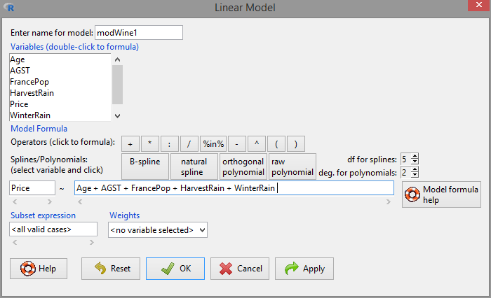
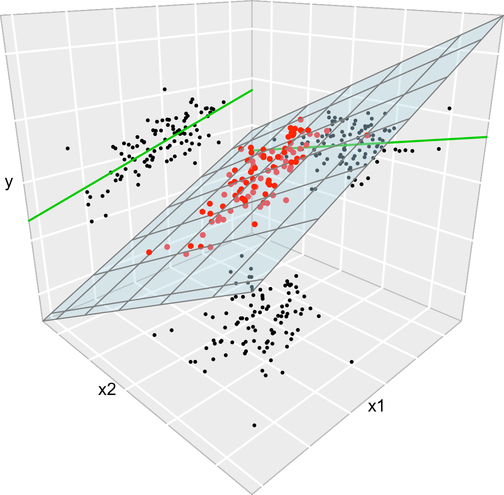
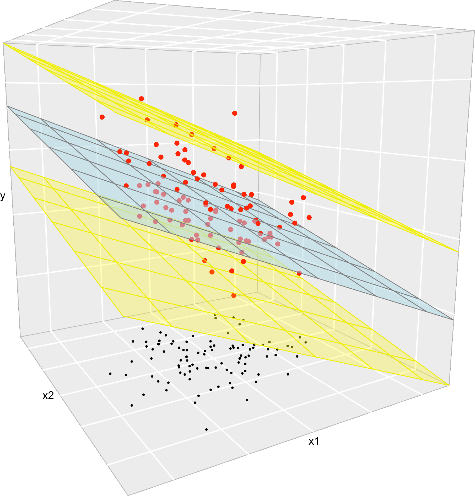

# Multiple linear regression {#mult}

The multiple linear regression is an *extension* of the simple linear regression saw in Chapter \@ref(simp). If the simple linear regression employed a *single* predictor $X$ to explain the response $Y$, the multiple linear regression employs *multiple* predictors $X_1,\ldots,X_k$ for explaining a single response $Y$:
\[
Y=\beta_0+\beta_1X_1+\beta_2X_2+\ldots+\beta_kX_k+\varepsilon
\]
To convince you why is useful, let's begin by seeing what it can deliver in real-case scenarios!

## Examples and applications {#eamult}

### Case study I: *The Bordeaux equation*

> Calculate the winter rain and the harvest rain (in millimeters). Add summer heat in the vineyard (in degrees centigrade). Subtract 12.145. And what do you have? A very, very passionate argument over wine.
>
> --- "Wine Equation Puts Some Noses Out of Joint", [The New York Times](http://www.nytimes.com/1990/03/04/us/wine-equation-puts-some-noses-out-of-joint.html), 04/03/1990

This case study is motivated by the study of Princeton professor Orley Ashenfelter [@Ashenfelter1995] on the quality of red Bordeaux vintages. The study became mainstream after disputes with the wine press, especially with Robert Parker, Jr., one of the most influential wine critic in America. See a short review of the story at the [Financial Times](http://www.ft.com/cms/s/0/1e9cb152-5824-11dc-8c65-0000779fd2ac.html) ([Google's cache](https://webcache.googleusercontent.com/search?q=cache:1mRF68v_Uz4J:https://www.ft.com/content/1e9cb152-5824-11dc-8c65-0000779fd2ac)) and at the video in Figure \@ref(fig:video2).

Red Bordeaux wines have been produced in Bordeaux, one of most famous and prolific wine regions in the world, in a very similar way for hundreds of years. However, *the quality of vintages is largely variable* from one season to another due to a long list of random factors, such as the weather conditions. Because Bordeaux wines taste better when they are older (young wines are astringent, when the wines age they lose their astringency),  there is an incentive to store the young wines until they are mature. Due to the important difference in taste, it is hard to determine the quality of the wine when it is so young just by tasting it, because it is going to change substantially when the aged wine is in the market. Therefore, being able to *predict the quality of a vintage* is a valuable information for investing resources, for determining a fair price for vintages and for understanding what factors are affecting the wine quality. The purpose of this case study is to answer:

- Q1. *Can we predict the quality of a vintage effectively?*
- Q2. *What is the interpretation of such prediction?*

The `wine.csv` file ([download](https://raw.githubusercontent.com/egarpor/SSS2-UC3M/master/datasets/wine.csv)) contains 27 red Bordeaux vintages. The data is the originally employed by @Ashenfelter1995, except for the inclusion of the variable `Year`, the exclusion of NAs and the reference price used for the wine. The original source is [here](http://www.liquidasset.com/winedata.html). Each row has the following variables:

- `Year`: year in which grapes were harvested to make wine.
- `Price`: *logarithm* of the average market price for Bordeaux vintages according to 1990--1991 auctions.^[In @Ashenfelter1995, this variable is expressed relative to the price of the 1961 vintage, regarded as the best one ever recorded. In other words, they consider `Price - 8.4937` as the price variable.] This is a nonlinear transformation of the *response* (hence different to what we did in Section \@ref(nonlin)) made to *linearize* the response.
- `WinterRain`: winter rainfall (in mm).
- `AGST`: Average Growing Season Temperature (in Celsius degrees).
- `HarvestRain`: harvest rainfall (in mm). 
- `Age`: age of the wine measured as the number of years stored in a cask.
- `FrancePop`: population of France at `Year` (in thousands).

The *quality* of the wine is quantified as the `Price`, a clever way of quantifying a qualitative measure. The data is shown in Table \@ref(tab:winetable). 

```{r, winetable, echo = FALSE, out.width = '90%', fig.align = 'center'}
wine <- read.csv(file = "datasets/wine.csv", header = TRUE)
knitr::kable(
  head(wine, 15),
  booktabs = TRUE,
  longtable = TRUE,
  caption = 'First 15 rows of the `wine` dataset.'
)
row.names(wine) <- wine$Year
wine$Year <- NULL
```

Let's begin by summarizing the information in Table \@ref(tab:winetable). First, import correctly the dataset into `R Commander` and `'Set case names...'` as the variable `Year`. Let's summarize and inspect the data in two ways:

1. **Numerically**. Go to `'Statistics' -> 'Summaries' -> 'Active data set'`.

    ```{r, collapse = TRUE}
    summary(wine)
    ```
    Additionally, other summary statistics are available in `'Statistics' -> 'Summaries' -> 'Numerical summaries...'`.

2. **Graphically**. Make a scatterplot matrix with all the variables. Add the `'Least-squares lines'`, `'Histograms'` on the diagonals and choose to identify 2 points.

    ```{r, scat, collapse = TRUE, out.width = '90%', fig.asp = 1, fig.align = 'center', fig.cap = 'Scatterplot matrix for `wine`.'}
    scatterplotMatrix(~ Age + AGST + FrancePop + HarvestRain + Price + WinterRain, 
                      reg.line = lm, smooth = FALSE, spread = FALSE, span = 0.5, 
                      ellipse = FALSE, levels = c(.5, .9), id.n = 2, 
                      diagonal = 'histogram', data = wine)
    ```

Recall that the objective is to **predict** `Price`. Based on the above matrix scatterplot the best we can predict `Price` by a simple linear regression seems to be with `AGST` or `HarvestRain`. Let's see which one yields the larger $R^2$.
```{r, collapse = TRUE}
modAGST <- lm(Price ~ AGST, data = wine)
summary(modAGST)

modHarvestRain <- lm(Price ~ HarvestRain, data = wine)
summary(modHarvestRain)
```
In `Price ~ AGST`, the intercept is not significant for the regression but the slope is, and  `AGST` has a positive effect on the `Price`. For `Price ~ HarvestRain`, both intercept and slope are significant and the effect is negative. 

```{block, type = 'rmdexercise'}
Complete the analysis by computing the linear models `Price ~ FrancePop`, `Price ~ Age` and `Price ~ WinterRain`. Name them as `modFrancePop`, `modAge` and `modWinterRain`. Check if the intercepts and slopes are significant for the regression.
```
```{r, echo = FALSE}
modFrancePop <- lm(Price ~ FrancePop, data = wine)
modAge <- lm(Price ~ Age, data = wine)
modWinterRain <- lm(Price ~ WinterRain, data = wine)
```

If we do the simple regressions of `Price` on the remaining predictors, we obtain a table like this for the $R^2$:

| Predictor | $R^2$ |
|:----------|:------|
|`AGST`| $0.4456$ |
|`HarvestRain`| $0.2572$ |
|`FrancePop`| $0.2314$ |
|`Age`| $0.2120$ |
|`WinterRain`| $0.0181$ |

A natural question to ask is:

> Can we *combine* these simple regressions to increase both the $R^2$ and the prediction accuracy for `Price`?

The answer is yes, by means of the **multiple linear regression**. In order to make our first one, go to `'Statistics' -> 'Fit models' -> 'Linear model...'`. A window like Figure \@ref(fig:lmod) will pop-up. 
    
```{r, lmod, echo = FALSE, out.width = '90%', fig.align = 'center', fig.cap = 'Window for performing multiple linear regression.'}

```

Set the response as `Price` and add the rest of variables as predictors, in the form `Age + AGST + FrancePop + HarvestRain + WinterRain`. Note the **use of `+` for including all the predictors**. This does *not* mean that they are all summed and then the regression is done on the sum!^[If you wanted to do so, you will need the function `I()` for indicating that `+` is not including predictors in the model, but is acting as a sum operator: `Price ~ I(Age + AGST + FrancePop + HarvestRain + WinterRain)`.]. Instead of, this notation is designed to **resemble the multiple linear model**:
\begin{align*}
Y=\beta_0+\beta_1X_1+\beta_2X_2+\ldots+\beta_kX_k+\varepsilon
\end{align*}
If the model is named `modWine1`, we get the following summary when clicking in `'OK'`:
```{r, collapse = TRUE}
modWine1 <- lm(Price ~ Age + AGST + FrancePop + HarvestRain + WinterRain, data = wine)
summary(modWine1)
```
The main difference with simple linear regressions is that we have more rows on the `'Coefficients'` section, since these correspond to each of the predictors. The fitted regression is `Price` $= -2.343 + 0.013\,\times$ `Age` $+ 0.614\,\times$ `AGST` $- 0.000\,\times$ `FrancePop` $- 0.003\,\times$ `HarvestRain` $+ 0.001\,\times$ `WinterRain`
. Recall that the `'Multiple R-squared'` has almost doubled with respect to the best simple linear regression!^[The $R^2$ for the multiple linear regression $Y=\beta_0+\beta_1X_1+\ldots+\beta_kX_k+\varepsilon$ is not the sum of the $R^2$'s for the simple linear regressions $Y=\beta_0+\beta_jX_j+\varepsilon$, $j=1,\ldots,k$.] This tells us that we can explain up to $82.75\%$ of the `Price` variability by the predictors.

Note however that **many predictors are not significant** for the regression: `FrancePop`, `Age` and the intercept are not significant. This is an indication of an **excess of predictors** adding little information to the response. Note the almost perfect correlation between `FrancePop` and `Age` shown in Figure \@ref(fig:scat): one of them is not adding any extra information to explain `Price`. This complicates the model unnecessarily and, more importantly, it has the undesirable effect of making the **coefficient estimates less precise**. We opt to remove the predictor `FrancePop` from the model since it is exogenous to the wine context.

```{block, type = 'rmdtip'}
Two useful tips  about `lm`'s syntax for including/excluding predictors faster:

- `Price ~ .` -> **includes all the variables in the dataset as predictors**. It is equivalent to `Price ~ Age + AGST + FrancePop + HarvestRain + WinterRain`.
- `Price ~ . - FrancePop` -> **includes all the variables except the ones with `-` as predictors**. It is equivalent to It is equivalent to `Price ~ Age + AGST + HarvestRain + WinterRain`.
```

Then, the model without `FrancePop` is
```{r, collapse = TRUE}
modWine2 <- lm(Price ~ . - FrancePop, data = wine)
summary(modWine2)
```
All the coefficients are significant at level $\alpha=0.05$. Therefore, there is no clear redundant information. In addition, the $R^2$ is very similar to the full model, but the `'Adjusted R-squared'`, a weighting of the $R^2$ to account for the number of predictors used by the model, is slightly larger. Hence, this means that, comparatively to the number of predictors used, `modWine2` explains more variability of `Price` than `modWine1`. Later in this chapter we will see the precise meaning of the $R^2$ adjusted.

The comparison of the coefficients of both models can be done with `'Models -> Compare model coefficients...'`:
```{r, collapse = TRUE}
compareCoefs(modWine1, modWine2)
```
Note how **the coefficients for `modWine2` have smaller errors than `modWine1`**.

As a conclusion, `modWine2` is a model that explains the $82.75\%$ of the variability in a non-redundant way and with all their coefficients significant. Therefore, we have a formula for effectively explaining and predicting the quality of a vintage (answers Q1).

The interpretation of `modWine2` agrees with well-known facts in viticulture that make perfect sense (Q2):

- Higher temperatures are associated with better quality (higher priced) wine.
- Rain before the growing season is good for the wine quality, but during harvest is bad.
- The quality of the wine improves with the age.

Although these were known facts, keep in mind that the model allows to *quantify the effect of each variable on the wine quality* and provides us with a precise way of *predicting the quality of future vintages*.

```{block, type = 'rmdexercise'}
Create a new variable in `wine` named `PriceOrley`, defined as `Price - 8.4937`. Check that the model `PriceOrley ~ . - FrancePop - Price` *kind of* coincides with the formula given in the second paragraph of the [Financial Times article](http://www.ft.com/cms/s/0/1e9cb152-5824-11dc-8c65-0000779fd2ac.html) ([Google's cache](https://webcache.googleusercontent.com/search?q=cache:1mRF68v_Uz4J:https://www.ft.com/content/1e9cb152-5824-11dc-8c65-0000779fd2ac)). (There are a couple of typos in the article's formula: the `Age` term is missing and the `ACGS` coefficient has an extra zero. Emailed the author, his answer: "Thanks for the heads up on this. Ian Ayres.".)

```{r, video2, echo = FALSE, fig.align = 'center', fig.cap = 'ABC interview to Orley Ashenfelter, broadcasted in 1992.', screenshot.opts = list(delay = 10), dev = 'png', cache = TRUE}
knitr::include_url("https://www.youtube.com/embed/Ec8hPHLMyzY")
```

### Case study II: Housing values in Boston

The second case study is motivated by @Harrison1978, who proposed an *hedonic model* for determining the willingness of house buyers to pay for clean air. An hedonic model is a model that decomposes the price of an item into separate components that determine its price. For example, an hedonic model for the price of a house may decompose its price into the house characteristics, the kind of neighborhood, and the location. The study of @Harrison1978 employed data from the Boston metropolitan area, containing 560 suburbs and 14 variables. The `Boston` dataset is available through the file `Boston.xlsx` file ([download](https://raw.githubusercontent.com/egarpor/SSS2-UC3M/master/datasets/Boston.xlsx)) and through the dataset `Boston` in the `MASS` package (load `MASS` by `'Tools' -> 'Load package(s)...'`). 

The description of the related variables can be found in `?Boston` and @Harrison1978^[But be aware of the changes in units for `medv`, `black`, `lstat` and `nox`.], but we summarize here the most important ones as they appear in `Boston`. They are aggregated into five topics:

- *Dependent* variable: `medv`, the median value of owner-occupied homes (in thousands of dollars).
- *Structural* variables indicating the house characteristics: `rm` (average number of rooms "in owner units") and `age` (proportion of owner-occupied units built prior to 1940).
- *Neighborhood* variables: `crim` (crime rate), `zn` (proportion of residential areas), `indus` (proportion of non-retail business area), `chas` (river limitation), `tax` (cost of public services in each community), `ptratio` (pupil-teacher ratio), `black` (variable $1000(B - 0.63)^2$, where $B$ is the black proportion of population -- low and high values of $B$ increase housing prices) and `lstat` (percent of lower status of the population).
- *Accesibility* variables: `dis` (distances to five Boston employment centers) and `rad` (accessibility to radial highways -- larger index denotes better accessibility).
- *Air pollution* variable: `nox`, the annual concentration of nitrogen oxide (in parts per ten million).

A summary of the data is shown below:
```{r, echo = FALSE, warning = FALSE}
library(RcmdrMisc)
Boston <- readXL("datasets/Boston.xlsx", rownames = FALSE, header = TRUE, na = "", 
                 sheet = "Hoja1", stringsAsFactors = TRUE)
```
```{r, collapse = TRUE}
summary(Boston)
```

The two goals of this case study are:

- Q1. *Quantify the influence of the predictor variables in the housing prices.*
- Q2. *Obtain the "best possible" model for decomposing the housing variables and interpret it.*

We begin by making an exploratory analysis of the data with a matrix scatterplot. Since the number of variables is high, we opt to plot only five variables: `crim`, `dis`, `medv`, `nox` and `rm`. Each of them represents the five topics in which variables were classified.

```{r, scat2, collapse = TRUE, out.width = '90%', fig.asp = 1, fig.align = 'center', fig.cap = 'Scatterplot matrix for `crim`, `dis`, `medv`, `nox` and `rm` from the `Boston` dataset.'}
scatterplotMatrix(~ crim + dis + medv + nox + rm, reg.line = lm, smooth = FALSE,
                  spread = FALSE, span = 0.5, ellipse = FALSE, levels = c(.5, .9), 
                  id.n = 0, diagonal = 'density', data = Boston)
```
The diagonal panels are showing an estimate of the unknown density of each variable. Note the peculiar distribution of `crim`, very concentrated at zero, and the asymmetry in `medv`, with a second mode associated to the most expensive properties. Inspecting the individual panels, it is clear that some nonlinearity exists in the data. For simplicity, we disregard that analysis for the moment (but see the final exercise).

Let's fit a multiple linear regression for explaining `medv`. There are a good number of variables now, and some of them might be of little use for predicting `medv`. However, there is no clear intuition of which predictors will yield better explanations of `medv` with the information at hand. Therefore, we can start by doing a linear model on *all* the predictors:
```{r, collapse = TRUE}
modHouse <- lm(medv ~ ., data = Boston)
summary(modHouse)
```
There are a couple of non-significant variables, but so far the model has an $R^2=0.74$ and the fitted coefficients are sensible with what it would be expected. For example, `crim`, `tax`, `ptratio` and `nox` have negative effects on `medv`, while `rm`, `rad` and `chas` have positive. However, the non-significant coefficients are not improving significantly the model, but only adding artificial noise and decreasing the overall accuracy of the coefficient estimates!

Let's polish a little bit the previous model. Instead of removing manually each non-significant variable to reduce the complexity, we employ an automatic tool in `R` called **stepwise model selection**. It as different flavors, that we will in detail later in this chapter, but essentially this powerful tool *usually* ends up selecting "a" *best model*: **a model that delivers the maximum fit with the minimum number of variables**.

The stepwise model selection is located at `'Models' -> 'Stepwise model selection...'` and is always applied on the active model. Apply it with the default options to `modBest`:

```{r, collapse = TRUE}
modBest <- stepwise(modHouse, direction = 'backward/forward', criterion = 'BIC')
```

Note the different steps: it starts with the full model and, when `+` is shown, it means that the variable is *excluded* at that step. The procedure seeks to minimize an **information criterion** (BIC or AIC)^[Although note that the printed messages always display `'AIC'` even if you choose `'BIC'`.]. An information criterion balances the fitness of a model with the number of predictors employed. Hence, it determines objectively the best model: *the one that minimizes the information criterion*. Remember to save the output to a variable if you want to have the final model (you need to do this in `R`)!

The summary of the final model is:
```{r, collapse = TRUE}
summary(modBest)
```
Let's compute the confidence intervals at level $\alpha=0.05$:
```{r, collapse = TRUE}
confint(modBest)
```
We have quantified the influence of the predictor variables in the housing prices (Q1) and we can conclude that, in the final model and with confidence level $\alpha=0.05$:

- `chas`, `age`, `rad` and `black` have a **significantly positive** influence on `medv`.
- `nox`, `dis`, `tax`, `pratio` and `lstat` have a **significantly negative** influence on `medv`.

```{block2, type = 'rmdexercise'}
The model employed in @Harrison1978 is different from `modBest`. In the paper, several nonlinear transformations of the predictors (remember Section \@ref(nonlin)) and the response are done to improve the linear fit. Also, different units are used for `medv`, `black`, `lstat` and `nox`. The authors considered these variables:

- *Response*: `log(1000 * medv)`
- *Linear predictors*: `age`, `black / 1000` (this variable corresponds to their $(B-0.63)^2$), `tax`, `ptratio`, `crim`, `zn`, `indus` and `chas`.
- *Nonlinear predictors*: `rm^2`, `log(dis)`, `log(rad)`, `log(lstat / 100)` and `(10 * nox)^2`.

Do the following:

1. Check if the model with such predictors corresponds to the one in the first column, Table VII, page 100 of @Harrison1978
(open-access paper available [here](https://deepblue.lib.umich.edu/bitstream/handle/2027.42/22636/0000186.pdf)). To do so, Save this model as `modelHarrison` and summarize it. **Hint**: the formula should be something like `I(log(1000 * medv)) ~ age + I(black / 1000) + ... + I(log(lstat / 100)) + I((10 * nox)^2)`. 

2. Make a `stepwise` selection of the variables in `modelHarrison` (use defaults) and save it as `modelHarrisonSel`. Summarize it.

3. Which model has a larger $R^2$? And adjusted $R^2$? Which is simpler and has more significant coefficients?

```
<!--
lm(I(log(medv*1000)) ~ I(rm^2) + age + log(dis) + log(rad) + tax + ptratio + I(black/1000) + I(log(lstat/100)) + crim + zn + indus + chas + I((10*nox)^2)
-->


## Model formulation and estimation by least squares {#modelmult}

The multiple linear model extends the simple linear model by describing the relation between the random variables $X_1,\ldots,X_k$ and $Y$. For example, in the last model for the `wine` dataset, we had $k=4$ variables $X_1=$`WinterRain`, $X_2=$`AGST`, $X_3=$`HarvestRain` and $X_4=$`Age`, and $Y=$ `Price`. Therefore, as in Section \@ref(modelsimp), the multiple linear model is *constructed by assuming* that the linear relation
\begin{align}
Y = \beta_0 + \beta_1 X_1 + \ldots + \beta_k X_k + \varepsilon (\#eq:k1)
\end{align}
holds between the predictors $X_1,\ldots,X_k$ and the response $Y$. In \@ref(eq:k1), $\beta_0$ is the *intercept* and $\beta_1,\ldots,\beta_k$ are the *slopes*, respectively. $\varepsilon$ is a random variable with mean zero and independent from $X_1,\ldots,X_n$. Another way of looking at \@ref(eq:k1) is
\begin{align}
\mathbb{E}[Y|X_1=x_1,\ldots,X_k=x_k]=\beta_0+\beta_1x_1+\ldots+\beta_kx_k, (\#eq:k2)
\end{align}
since $\mathbb{E}[\varepsilon|X_1=x_1,\ldots,X_k=x_k]=0$. 

The LHS of \@ref(eq:k2) is the conditional expectation of $Y$ given $X_1,\ldots,X_k$. It represents how the mean of the random variable $Y$ is changing according to particular values, denoted by $x_1,\ldots,x_k$, of the random variables $X_1,\ldots,X_k$. With the RHS, what we are saying is that the mean of $Y$ is changing in a *linear* fashion with respect to the value of $X$. Hence the interpretation of the coefficients:

- $\beta_0$: is the mean of $Y$ when $X_1=\ldots=X_k=0$.
- $\beta_j$, $j\geq1$: is the increment in mean of $Y$ for an increment of one unit in $X_j=x_j$, provided that the remaining variables $X_1,\ldots,X_{j-1},X_{j+1},\ldots,X_k$ *do not change*.

Figure \@ref(fig:leastsquares2) illustrates the geometrical interpretation of a multiple linear model: a plane in the $(k+1)$-dimensional space. If $k=1$, the plane is the regression line for simple linear regression. If $k=2$, then the plane can be visualized in a three-dimensional plot

```{r, leastsquares2, echo = FALSE, fig.cap = 'The least squares regression plane $y=\\hat\\beta_0+\\hat\\beta_1x_1+\\hat\\beta_2x_2$ and its dependence on the kind of squared distance considered.', screenshot.opts = list(delay = 10), dev = 'png', cache = TRUE, fig.align = 'center', out.width = '90%'}
knitr::include_app('https://egarpor.shinyapps.io/least-squares-3D/', height = '700px')
```

The estimation of $\beta_0,\beta_1,\ldots,\beta_k$ is done as in simple linear regression, by minimizing the Residual Sum of Squares (RSS). First we need to introduce some helpful *matrix notation*. In the following, **bold face** are used for distinguishing vectors and matrices from scalars:

- A sample of $(X_1,\ldots,X_k,Y)$ is $(X_{11},\ldots,X_{1k},Y_1),\ldots,(X_{n1},\ldots,X_{nk},Y_n)$, where $X_{ij}$ denotes the $i$-th observation of the $j$-th predictor $X_j$. We denote with $\mathbf{X}_i=(X_{i1},\ldots,X_{ik})$ to the $i$-th observation of $(X_1,\ldots,X_k)$, so the sample simplifies to $(\mathbf{X}_{1},Y_1),\ldots,(\mathbf{X}_{n},Y_n)$

- The *design matrix* contains all the information of the predictors and a column of ones
\[
\mathbf{X}=\begin{pmatrix}
1 & X_{11} & \cdots & X_{1k}\\
\vdots & \vdots & \ddots & \vdots\\
1 & X_{n1} & \cdots & X_{nk}
\end{pmatrix}_{n\times(k+1)}
\]

- The *vector of responses* $\mathbf{Y}$, the *vector of coefficients* $\boldsymbol\beta$ and the *vector of errors* are, respectively^[The vectors are regarded as column matrices.],
\[
\mathbf{Y}=\begin{pmatrix}
Y_1 \\
\vdots \\
Y_n
\end{pmatrix}_{n\times 1},\quad\boldsymbol\beta=\begin{pmatrix}
\beta_0 \\
\beta_1 \\
\vdots \\
\beta_k
\end{pmatrix}_{(k+1)\times 1}\text{ and }
\boldsymbol\varepsilon=\begin{pmatrix}
\varepsilon_1 \\
\vdots \\
\varepsilon_n
\end{pmatrix}_{n\times 1}.
\]
Thanks to the matrix notation, we can turn the sample version of the multiple linear model, namely
\begin{align*}
Y_i&=\beta_0 + \beta_1 X_{i1} + \ldots +\beta_k X_{ik} + \varepsilon_i,\quad i=1,\ldots,n
\end{align*}
into something as compact as
\begin{align*}
\mathbf{Y}=\mathbf{X}\boldsymbol\beta+\boldsymbol\varepsilon.
\end{align*}

```{block2, type = 'rmdinsight'}
Recall that if $k=1$ we have the simple linear model. In this case:
\[
\mathbf{X}=\begin{pmatrix}
1 & X_{11}\\
\vdots & \vdots\\
1 & X_{n1}
\end{pmatrix}_{n\times2}\text{ and } \beta=\begin{pmatrix}
\beta_0 \\
\beta_1 
\end{pmatrix}_{2\times 1}
\]
```

The RSS for the multiple linear regression is
\begin{align}
\text{RSS}(\boldsymbol\beta)&=\sum_{i=1}^n(Y_i-\beta_0-\beta_1X_{i1}-\ldots-\beta_kX_{ik})^2\nonumber\\
&=(\mathbf{Y}-\mathbf{X}\boldsymbol{\beta})^T(\mathbf{Y}-\mathbf{X}\boldsymbol{\beta}).(\#eq:rss)
\end{align}
The RSS aggregates the *squared vertical distances* from the data to a regression plane given by $\boldsymbol\beta$. Remember that the *vertical distances* are considered because we want to minimize the error in the *prediction* of $Y$. The least squares estimators are *the minimizers of the RSS*^[They are unique and always exist.]:
\begin{align*}
\hat{\boldsymbol{\beta}}=\arg\min_{\boldsymbol{\beta}\in\mathbb{R}^{k+1}} \text{RSS}(\boldsymbol{\beta}).
\end{align*}
Luckily, thanks to the matrix form of \@ref(eq:rss), it is simple to compute a closed-form expression for the least squares estimates:
\begin{align}
\hat{\boldsymbol{\beta}}=(\mathbf{X}^T\mathbf{X})^{-1}\mathbf{X}^T\mathbf{Y},(\#eq:k3)
\end{align}

```{block2, type = 'rmdinsight'}
There are some similarities between \@ref(eq:k3) and $\hat\beta_1=(s_x^2)^{-1}s_{xy}$ from the simple linear model: both are related to the covariance between $\mathbf{X}$ and $Y$ weighted by the variance of $\mathbf{X}$.
```

The data of the illustration has been generated with the following code:
```{r}
# Generates 50 points from a N(0, 1): predictors and error
set.seed(34567) # Fixes the seed for the random generator
x1 <- rnorm(50)
x2 <- rnorm(50)
x3 <- x1 + rnorm(50, sd = 0.05) # Make variables dependent
eps <- rnorm(50)

# Responses
yLin <- -0.5 + 0.5 * x1 + 0.5 * x2 + eps
yQua <- -0.5 + x1^2 + 0.5 * x2 + eps
yExp <- -0.5 + 0.5 * exp(x2) + x3 + eps

# Data
leastSquares3D <- data.frame(x1 = x1, x2 = x2, yLin = yLin, 
                             yQua = yQua, yExp = yExp)
```

Let's check that indeed the coefficients given by `lm` are the ones given by equation \@ref(eq:k3) for the regression `yLin ~ x1 + x2`.
```{r, echo = TRUE, collapse = TRUE}
# Matrix X
X <- cbind(1, x1, x2)

# Vector Y
Y <- yLin

# Coefficients 
beta <- solve(t(X) %*% X) %*% t(X) %*% Y
# %*% multiplies matrices
# solve() computes the inverse of a matrix
# t() transposes a matrix
beta

# Output from lm
mod <- lm(yLin ~ x1 + x2, data = leastSquares3D)
mod$coefficients
```

```{block2, type = 'rmdexercise'}
Compute $\boldsymbol{\beta}$ for the regressions `yLin ~ x1 + x2`, `yQua ~ x1 + x2` and `yExp ~ x2 + x3` using:

- equation \@ref(eq:k3) and 
- the function `lm`. 

Check that the fitted plane and the coefficient estimates are coherent.
```

Once we have the least squares estimates $\hat{\boldsymbol{\beta}}$, we can define the next two concepts:

- The *fitted values* $\hat Y_1,\ldots,\hat Y_n$, where 
\begin{align*}
\hat Y_i=\hat\beta_0+\hat\beta_1X_{i1}+\cdots+\hat\beta_kX_{ik},\quad i=1,\ldots,n.
\end{align*}
They are the vertical projections of $Y_1,\ldots,Y_n$ into the fitted line (see Figure \@ref(fig:leastsquares2)). In a matrix form, inputting \@ref(eq:rss)
\[
\hat{\mathbf{Y}}=\mathbf{X}\hat{\boldsymbol{\beta}}=\mathbf{X}(\mathbf{X}^T\mathbf{X})^{-1}\mathbf{X}^T\mathbf{Y}=\mathbf{H}\mathbf{Y},
\]
where $\mathbf{H}=\mathbf{X}(\mathbf{X}^T\mathbf{X})^{-1}\mathbf{X}^T\mathbf{Y}$ is called the *hat matrix* because it "puts the hat into $\mathbf{Y}$". What it does is to project $\mathbf{Y}$ into the regression plane (see Figure \@ref(fig:leastsquares2)).

- The *estimated residuals* $\hat \varepsilon_1,\ldots,\hat \varepsilon_n$, where 
\begin{align*}
\hat\varepsilon_i=Y_i-\hat Y_i,\quad i=1,\ldots,n.
\end{align*}
They are the vertical distances between actual data and fitted data. 

We conclude with an insight on the relation of multiple and simple linear regressions. It is illustrated in Figure \@ref(fig:multmarg).

```{block, type = 'rmdinsight'}
Consider the multiple linear model $Y=\beta_0+\beta_1X_1+\beta_2X_2+\varepsilon$ and its associated simple linear models $Y=\alpha_0+\alpha_1X_1+\varepsilon$ and $Y=\gamma_0+\gamma_1X_2+\varepsilon$. Assume that we have a sample $(X_{11},X_{12},Y_1),\ldots, (X_{n1},X_{n2},Y_n)$. Then, in general, $\hat\alpha_0\neq\hat\beta_0$, $\hat\alpha_1\neq\hat\beta_1$, $\hat\gamma_0\neq\hat\beta_0$ and $\hat\gamma_1\neq\hat\beta_1$. This is, in general, **the inclusion of a new predictor changes the coefficient estimates**.
```

```{r, multmarg, echo = FALSE, out.width = '90%', fig.align = 'center', fig.cap = 'The regression plane (blue) and its relation with the simple linear regressions (green lines). The red points represent the sample for $(X_1,X_2,Y)$ and the black points the subsamples for $(X_1,X_2)$ (bottom), $(X_1,Y)$ (left) and $(X_2,Y)$ (right).'}

```

The data employed in Figure \@ref(fig:multmarg) is:
```{r, echo = TRUE, collapse = TRUE}
set.seed(212542)
n <- 100
x1 <- rnorm(n, sd = 2)
x2 <- rnorm(n, mean = x1, sd = 3)
y <- 1 + 2 * x1 - x2 + rnorm(n, sd = 1)
data <- data.frame(x1 = x1, x2 = x2, y = y)
``` 

```{block, type = 'rmdexercise'}
With the above `data`, cheek how the fitted coefficients change for `y ~ x1`, `y ~ x2` and `y ~ x1 + x2`.
```

## Assumptions of the model {#assumptionsmult}

Some probabilistic assumptions are required for performing inference on the model parameters. In other words, to infer properties about the *unknown* population coefficients $\boldsymbol\beta$ from the sample $(\mathbf{X}_1, Y_1),\ldots,(\mathbf{X}_n, Y_n)$.

```{r, linearmodel2, echo = FALSE, out.width = '90%', fig.align = 'center', fig.cap = 'The key concepts of the multiple linear model when $k=2$. The space between the yellow planes denotes where the 95% of the data is, according to the model.'}

```

The assumptions of the multiple linear model are an extension of the simple linear model:

i. **Linearity**: $\mathbb{E}[Y|X_1=x_1,\ldots,X_k=x_k]=\beta_0+\beta_1x_1+\ldots+\beta_kx_k$.
ii. **Homocedasticity**: $\mathbb{V}\text{ar}(\varepsilon_i)=\sigma^2$, with $\sigma^2$ constant for $i=1,\ldots,n$.
iii. **Normality**: $\varepsilon_i\sim\mathcal{N}(0,\sigma^2)$ for $i=1,\ldots,n$.
iv. **Independence of the errors**: $\varepsilon_1,\ldots,\varepsilon_n$ are independent (or uncorrelated, $\mathbb{E}[\varepsilon_i\varepsilon_j]=0$, $i\neq j$, since they are assumed to be Normal).

A good one-line summary of the linear model is the following (independence is assumed)
\begin{align}
Y|(X_1=x_1,\ldots,X_k=x_k)\sim \mathcal{N}(\beta_0+\beta_1x_1+\ldots+\beta_kx_k,\sigma^2)(\#eq:condnorm)
\end{align}

```{block2, type = 'rmdinsight'}
Recall:

- Compared with simple liner regression, the only **different assumption is linearity**.

- Nothing is said about the distribution of $X_1,\ldots,X_k$. They could be deterministic or random. They could be discrete or continuous. 

- $X_1,\ldots,X_k$ are **not required to be independent** between them.

- **$Y$ has to be continuous**, since the errors are normal -- recall \@ref(eq:1).

```

Figure \@ref(fig:linearmodelassump) represent situations where the assumptions of the model are respected and violated, for the situation with two predictors. Clearly, the inspection of the scatterplots for identifying strange patterns is more complicated than in simple linear regression -- and here we are dealing only with two predictors. In Section \@ref(diagnostics) we will see more sophisticated methods for checking whether the assumptions hold or not for an arbitrary number of predictors. 

```{r, linearmodelassump, echo = FALSE, fig.cap = 'Valid (all the assumptions are verified) and problematic (a single assumption does not hold) multiple linear models, when there are two predictors.', screenshot.opts = list(delay = 10), dev = 'png', cache = TRUE, fig.align = 'center', out.width = '90%'}
knitr::include_app('https://egarpor.shinyapps.io/assump-lm-3D/', height = '700px')
```

To conclude this section, let's see how to make a 3D scatterplot with the regression plane, in order to evaluate visually how good the fit of the model is. We will do it with the `iris` dataset, that can be imported in `R` simply by running `data(iris)`. In `R Commander` go to `'Graphs' -> '3D Graphs' -> '3D scatterplot...'`. A window like Figures \@ref(fig:scatter3d1) and \@ref(fig:scatter3d2) will pop-up. The options are similar to the ones for `'Graphs' -> 'Scatterplot...'`.

```{r, scatter3d1, echo = FALSE, out.width = '70%', fig.align = 'center', fig.cap = '3D scatterplot window, `\'Data\'` panel.'}
knitr::include_graphics("images/screenshots/scatterplot3d1.png")
```
```{r, scatter3d2, echo = FALSE, out.width = '70%', fig.align = 'center', fig.cap = '3D scatterplot window, `\'Options\'` panel. Remember to tick the `\'Linear least-squares fit\'` box in order to display the fitted regression plane'}
knitr::include_graphics("images/screenshots/scatterplot3d2.png")
```

If you select the options as shown in Figures \@ref(fig:scatter3d1) and \@ref(fig:scatter3d2), you should get something like this:
```{r echo=FALSE}
# include this code chunk as-is to enable 3D graphs
library(rgl)
knitr::knit_hooks$set(webgl = hook_webgl)
```
```{r, webgl = TRUE, message = FALSE, warning = FALSE}
data(iris)
scatter3d(Petal.Length ~ Petal.Width + Sepal.Length, data = iris, fit = "linear", 
          residuals = TRUE, bg = "white", axis.scales = TRUE, grid = TRUE, 
          ellipsoid = FALSE, id.method = 'mahal', id.n = 2)
```

## Inference for model parameters

The assumptions introduced in the previous section allow to specify what is the distribution of the *random vector* $\hat{\boldsymbol{\beta}}$. The distribution is derived conditionally on the sample predictors $\mathbf{X}_1,\ldots,\mathbf{X}_n$. In other words, we assume that the randomness of $\mathbf{Y}=\mathbf{X}\boldsymbol{\beta}+\boldsymbol\varepsilon$ comes only from the error terms and not from the predictors. To denote this, we employ lowercase for the sample predictors $\mathbf{x}_1,\ldots,\mathbf{x}_n$.

### Distributions of the fitted coefficients

The distribution of $\hat{\boldsymbol{\beta}}$ is:
\begin{align}
\hat{\boldsymbol{\beta}}\sim\mathcal{N}_{k+1}\left(\boldsymbol\beta,\sigma^2(\mathbf{X}^T\mathbf{X})^{-1}\right)
(\#eq:normp)
\end{align}
where $\mathcal{N}_{m}$ is the $m$-dimensional Normal, this is, the extension of the usual Normal distribution to deal with $m$ random variables^[With $m=1$, the density of a $\mathcal{N}_{m}$ corresponds to a bell-shaped *curve* With $m=2$, the density is a *surface* similar to a bell.]. The interpretation of \@ref(eq:normp) is not so easy as in the simple linear case. Here are some broad remarks:

- **Bias**. Both estimates are unbiased. 
- **Variance**. Depending on:

    - *Sample size $n$*. Hidden inside $\mathbf{X}^T\mathbf{X}$. As $n$ grows, the precision of the estimators increases.
    - *Error variance $\sigma^2$*. The larger $\sigma^2$ is, the less precise $\hat{\boldsymbol{\beta}}$ is.
    - *Predictor sparsity $(\mathbf{X}^T\mathbf{X})^{-1}$*. The more *sparse* the predictor is (small $|(\mathbf{X}^T\mathbf{X})^{-1}|$), the more precise $\hat{\boldsymbol{\beta}}$ is.
    

The problem with \@ref(eq:normp) is that *$\sigma^2$ is unknown* in practice, so we need to estimate $\sigma^2$ from the data. We do so by computing a rescaled sample variance of the fitted residuals $\hat\varepsilon_1,\ldots,\hat\varepsilon_n$:
\begin{align*}
\hat\sigma^2=\frac{\sum_{i=1}^n\hat\varepsilon_i^2}{n-k-1}.
\end{align*}
Note the $n-k-1$ in the denominator. Now $n-k-1$ are the *degrees of freedom*, the number of data points minus the number of already fitted parameters ($k$ slopes and $1$ intercept). As in simple linear regression, *the mean of the fitted residuals $\hat\varepsilon_1,\ldots,\hat\varepsilon_n$ is zero*.

If we use the estimate $\hat\sigma^2$ instead of $\sigma^2$, we get more useful distributions, this time for the *individual* $\beta_j$'s:
\begin{align}
\frac{\hat\beta_j-\beta_j}{\hat{\mathrm{SE}}(\hat\beta_j)}\sim t_{n-k-1},\quad\hat{\mathrm{SE}}(\hat\beta_j)^2=\hat\sigma^2v_j^2(\#eq:normp2)
\end{align}
where $t_{n-k-1}$ represents the Student's $t$ distribution with $n-k-1$ degrees of freedom and 
\[
v_j\text{ is the $j$-th element of the diagonal of }(\mathbf{X}^T\mathbf{X})^{-1}.
\]
The LHSs of \@ref(eq:normp2) are the $t$-statistics for $\beta_j$, $j=0,\ldots,k$. They are employed for building confidence intervals and hypothesis tests. 


### Confidence intervals for the coefficients

Thanks to \@ref(eq:normp2), we can have the $100(1-\alpha)\%$ CI for the coefficient $\beta_j$, $j=0,\ldots,k$:
\begin{align}
\left(\hat\beta_j\pm\hat{\mathrm{SE}}(\hat\beta_j)t_{n-k-1;\alpha/2}\right)(\#eq:cip)
\end{align}
where $t_{n-k-1;\alpha/2}$ is the *$\alpha/2$-upper quantile of the distribution $t_{n-k-1}$*. Note that with $k=1$ we have same CI as in \@ref(eq:ci).

Let's see how we can compute the CIs. We return to the `wine` dataset, so in case you do not have it loaded, you can download it [here](https://raw.githubusercontent.com/egarpor/SSS2-UC3M/master/datasets/wine.RData) as an `.RData` file. We analyse the CI for the coefficients of `Price ~ Age + WinterRain`.
```{r, collapse = TRUE}
# Fit model
mod <- lm(Price ~ Age + WinterRain, data = wine)

# Confidence intervals at 95%
confint(mod)

# Confidence intervals at other levels
confint(mod, level = 0.90)
confint(mod, level = 0.99)
```
In this example, the 95% confidence interval for $\beta_0$ is $(4.7460, 7.2201)$, for $\beta_1$ is $(0.0077, 0.0644)$ and for $\beta_2$ is $(-0.0010, 0.0026)$. Therefore, we can say with a 95% confidence that *the coefficient of `WinterRain` is non significant*. But in Section \@ref(mult) we saw that it *was significant* in the model `Price ~ Age + AGST + HarvestRain + WinterRain`! How is this possible? The answer is that the presence of extra predictors affects the coefficient estimate, as we saw in Figure \@ref(fig:multmarg). Therefore, the precise statement to make is: **in the model `Price ~ Age + WinterRain`**, with a 95% confidence, the coefficient of `WinterRain` is non significant. Note that this **does not** mean that it will be always non significant: in `Price ~ Age + AGST + HarvestRain + WinterRain` it is.

```{block, type = 'rmdexercise'}
Compute and interpret the CIs for the coefficients, at levels $\alpha=0.10,0.05,0.01$, for the following regressions:

- `medv ~ . - lstat - chas - zn - crim` (`Boston`)
- `nox ~ chas + zn + indus + lstat + dis + rad` (`Boston`)
- `Price ~ WinterRain + HarvestRain + AGST` (`wine`)
- `AGST ~ Year + FrancePop` (`wine`)
```

### Testing on the coefficients

The distributions in \@ref(eq:normp2) also allow to conduct a formal hypothesis test on the coefficients $\beta_j$, $j=0,\ldots,k$. For example the *test for significance* is specially important, that is, the test of the hypotheses
\begin{align*}
H_0:\beta_j=0
\end{align*}
for $j=0,\ldots,k$. The test of $H_0:\beta_j=0$ with $j\geq1$ is specially interesting, since it allows to answer whether *the variable $X_j$ has a significant linear effect on $Y$*. The statistic used for testing for significance is the $t$-statistic
\begin{align*}
\frac{\hat\beta_j-0}{\hat{\mathrm{SE}}(\hat\beta_j)},
\end{align*}
which is distributed as a $t_{n-k-1}$ *under the (veracity of) the null hypothesis*. $H_0$ is tested *against* the *bilateral* alternative hypothesis $H_1:\beta_j\neq 0$.

Remember two important insights regarding hypothesis testing.

```{block, type = 'rmdinsight'}
In an hypothesis test, the *$p$-value measures the degree of veracity of $H_0$ according to the data*. The rule of thumb is the following:

**Is the $p$-value lower than $\alpha$?**

- **Yes $\rightarrow$ reject $H_0$**. 
- **No $\rightarrow$ do not reject $H_0$**.
```


```{block, type = 'rmdinsight'}
The connection of a $t$-test for $H_0:\beta_j=0$ and the CI for $\beta_j$, both at level $\alpha$, is the following.

**Is $0$ inside the CI for $\beta_j$?**

- **Yes $\leftrightarrow$ do not reject $H_0$**. 
- **No $\leftrightarrow$ reject $H_0$**.
```

The tests for significance are built-in in the `summary` function, as we saw in Section \@ref(eamult). For `mod`, the regression of `Price ~ Age + WinterRain`, we have:
```{r, collapse = TRUE}
summary(mod)
```


```{block, type = 'rmdinsight'}
The unilateral test $H_0:\beta_j\geq (\leq)0$ vs $H_1:\beta_j<(>)0$ can be done by means of the CI for $\beta_j$. If $H_0$ is rejected, they allow to conclude that *$\hat\beta_j$ is significantly negative (positive)* and that *for the considered regression model, $X_j$ has a significant negative (positive) effect on $Y$*. We have been doing them using the following rule of thumb:

**Is the CI for $\beta_j$ below (above) $0$ at level $\alpha$?**

- **Yes $\rightarrow$ reject $H_0$ at level $\alpha$. Conclude $X_j$ has a significant negative (positive) effect on $Y$ at level $\alpha$**. 
- **No $\rightarrow$ the criterion is not conclusive**.
```


## Prediction

As in the simple linear model, the forecast of $Y$ from $\mathbf{X}=\mathbf{x}$ (this is, $X_1=x_1,\ldots,X_k=x_k$) is approached by two different ways:

1. Inference on the **conditional mean** of $Y$ given $\mathbf{X}=\mathbf{x}$, $\mathbb{E}[Y|\mathbf{X}=\mathbf{x}]$. This is a deterministic quantity, which equals $\beta_0+\beta_1x_1+\ldots+\beta_{k+1}x_k$.
2. Prediction of the **conditional response** $Y|\mathbf{X}=\mathbf{x}$. This is a random variable distributed as $\mathcal{N}(\beta_0+\beta_1x_1+\ldots+\beta_{k+1}x_k,\sigma^2)$.

The prediction and computation of CIs can be done with the `R` function `predict` (unfortunately, there is no `R Commander` shortcut for his one). The objects required for `predict` are: first, the output of `lm`; second, a `data.frame` containing the locations $\mathbf{x}=(x_1,\ldots,x_k)$ where we want to predict $\beta_0+\beta_1x_1+\ldots+\beta_{k+1}x_k$. 

```{block, type = 'rmdcaution'}
It is mandatory to name the columns of the data frame with the same names of the predictors used in `lm`. Otherwise `predict` will generate an error, see below.
```

To illustrate the use of `predict`, we return to the `wine` dataset. 

```{r, collapse = TRUE}
# Fit a linear model for the price on WinterRain, HarvestRain and AGST
modelW <- lm(Price ~ WinterRain + HarvestRain + AGST, data = wine)
summary(modelW)

# Data for which we want a prediction
# Important! You have to name the column with the predictor name!
weather <- data.frame(WinterRain = 500, HarvestRain = 123, 
                      AGST = 18)

## Prediction of the mean

# Prediction of the mean at 95% - the defaults
predict(modelW, newdata = weather)

# Prediction of the with 95% confidence interval (the default)
# CI: (lwr, upr)
predict(modelW, newdata = weather, interval = "confidence")
predict(modelW, newdata = weather, interval = "confidence", level = 0.95)

# Other levels
predict(modelW, newdata = weather, interval = "confidence", level = 0.90)
predict(modelW, newdata = weather, interval = "confidence", level = 0.99)

## Prediction of the response

# Prediction of the mean at 95% - the defaults
predict(modelW, newdata = weather)

# Prediction of the with 95% confidence interval (the default)
# CI: (lwr, upr)
predict(modelW, newdata = weather, interval = "prediction")
predict(modelW, newdata = weather, interval = "prediction", level = 0.95)

# Other levels
predict(modelW, newdata = weather, interval = "prediction", level = 0.90)
predict(modelW, newdata = weather, interval = "prediction", level = 0.99)

# Predictions for several values
weather2 <- data.frame(WinterRain = c(500, 200), HarvestRain = c(123, 200), 
                       AGST = c(17, 18))
predict(modelW, newdata = weather2, interval = "prediction")
```

```{block, type = 'rmdexercise'}
For the `wine` dataset, do the following:

- Regress `WinterRain` on `HarvestRain` and `AGST`. Name the fitted model `modExercise`.
- Compute the estimate for the conditional mean of `WinterRain` for `HarvestRain`$=123.0$ and `AGST`$=16.15$. What is the CI at $\alpha=0.01$?
- Compute the estimate for the conditional response for `HarvestRain`$=125.0$ and `AGST`$=15$. What is the CI at $\alpha=0.10$?
- Check that `modExercise\$fitted.values` is the same as `predict(modExercise, newdata = data.frame(WinterRain = wine\$WinterRain, AGST = wine\$AGST))`. Why is so?
```

```{block, type = 'rmdinsight'}
Similarities and differences in the prediction of the conditional mean $\mathbb{E}[Y|\mathbf{X}=\mathbf{x}]$ and conditional response $Y|\mathbf{X}=\mathbf{x}$:

- *Similarities*. The estimate is the same, $\hat y=\hat\beta_0+\hat\beta_1x_1+\ldots+\hat\beta_kx_k$. Both CI are centered in $\hat y$.
- *Differences*. $\mathbb{E}[Y|\mathbf{X}=\mathbf{x}]$ is deterministic and $Y|\mathbf{X}=\mathbf{x}$ is random. Therefore, the variance is larger for the prediction of $Y|\mathbf{X}=\mathbf{x}$ than for the prediction of $\mathbb{E}[Y|\mathbf{X}=\mathbf{x}]$.
```

<!--
## Assessing model fit and ANOVA

The RSS always decreases as more variables are added to the model, hence the $R^2$ always increases as more variables are added. Why is so? Because the flexibility of the model increases.

\[
R^2=\frac{\text{SSR}}{\text{SST}}=\frac{\text{SST}-\text{SSE}}{\text{SST}}=1-\frac{\text{SSE}}{\text{SST}}
\]

\[
R^2_\text{Adj}=1-\frac{\text{RSS}/(n-k-1)}{\text{TSS}/(n-1)}
\]
Once all of the correct variables have been included in the model, adding additional *noise* variables will lead to only a very small decrease in RSS
Illustration $R^2$ and garbage

Graph $R^2$ and $R^2_\text{Adj}$ vs $k$

## Model selection {#selection}

## Nonlinear relationships and qualitative predictors {#nonlinear}

Qualitative predictors (one level and more than two levels)

Extensions and interactions

## Model diagnostics and multicollinearity {#diagnostics}

Animation:
- Insight into straight line in 3D

## Exercises and case studies

### Computing multiple linear regressions

```{block, type = 'rmdexercise'}
TBA
```

College
Wage
USArrests
Boston

### Case study I: *a marketing plan*

(Case study from )

### Case study II: 


-->
