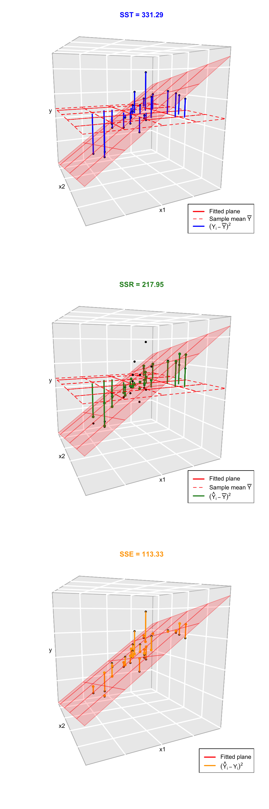
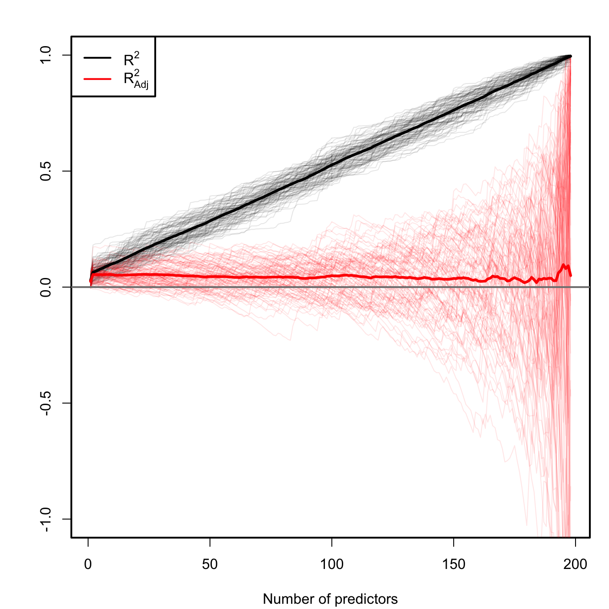
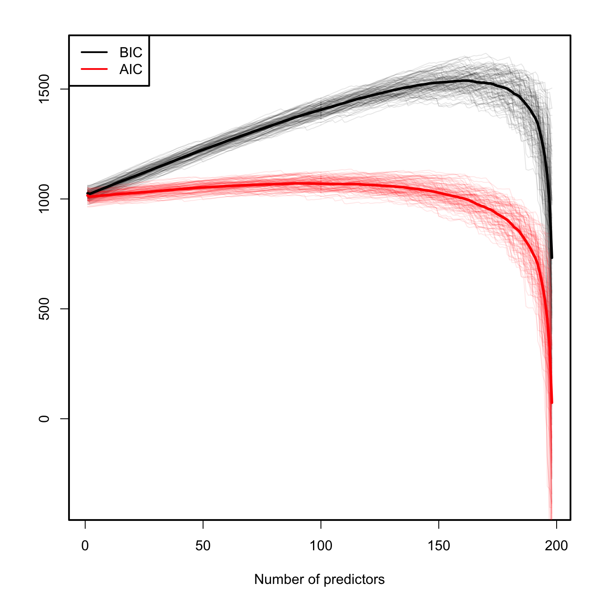
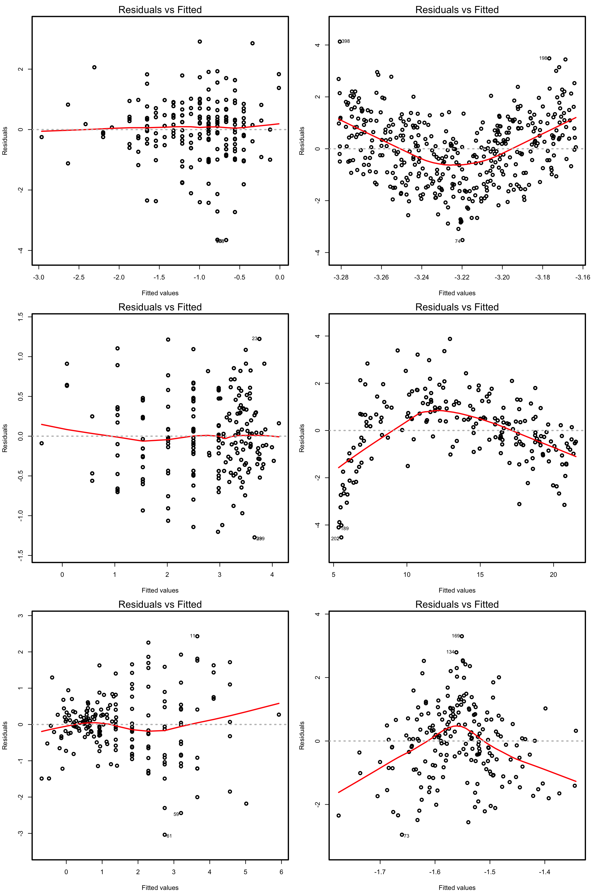
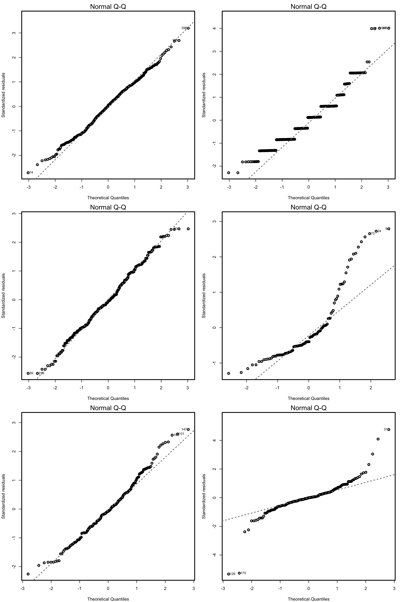
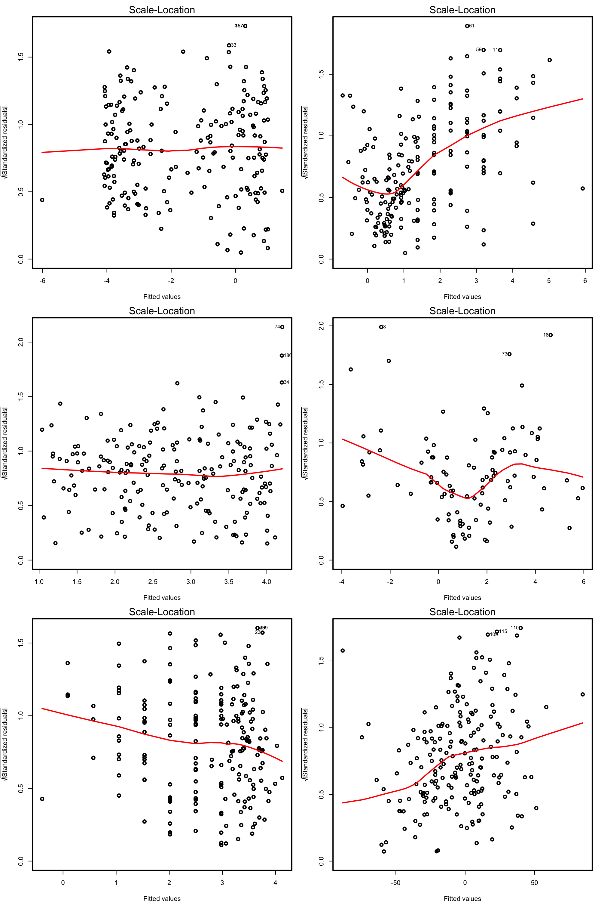

# Multiple linear regression {#multlin}

The multiple linear regression is an *extension* of the simple linear regression saw in Chapter \@ref(simplin). If the simple linear regression employed a *single* predictor $X$ to explain the response $Y$, the multiple linear regression employs *multiple* predictors $X_1,\ldots,X_k$ for explaining a single response $Y$:
\[
Y=\beta_0+\beta_1X_1+\beta_2X_2+\ldots+\beta_kX_k+\varepsilon
\]
To convince you why is useful, let's begin by seeing what it can deliver in real-case scenarios!

## Examples and applications {#multlin-examps}

### Case study I: *The Bordeaux equation* {#multlin-examps-wine}

> Calculate the winter rain and the harvest rain (in millimeters). Add summer heat in the vineyard (in degrees centigrade). Subtract 12.145. And what do you have? A very, very passionate argument over wine.
>
> --- "Wine Equation Puts Some Noses Out of Joint", [The New York Times](http://www.nytimes.com/1990/03/04/us/wine-equation-puts-some-noses-out-of-joint.html), 04/03/1990

This case study is motivated by the study of Princeton professor Orley Ashenfelter [@Ashenfelter1995] on the quality of red Bordeaux vintages. The study became mainstream after disputes with the wine press, especially with Robert Parker, Jr., one of the most influential wine critic in America. See a short review of the story at the [Financial Times](http://www.ft.com/cms/s/0/1e9cb152-5824-11dc-8c65-0000779fd2ac.html) ([Google's cache](https://webcache.googleusercontent.com/search?q=cache:1mRF68v_Uz4J:https://www.ft.com/content/1e9cb152-5824-11dc-8c65-0000779fd2ac)) and at the video in Figure \@ref(fig:video2).

Red Bordeaux wines have been produced in Bordeaux, one of most famous and prolific wine regions in the world, in a very similar way for hundreds of years. However, *the quality of vintages is largely variable* from one season to another due to a long list of random factors, such as the weather conditions. Because Bordeaux wines taste better when they are older (young wines are astringent, when the wines age they lose their astringency),  there is an incentive to store the young wines until they are mature. Due to the important difference in taste, it is hard to determine the quality of the wine when it is so young just by tasting it, because it is going to change substantially when the aged wine is in the market. Therefore, being able to *predict the quality of a vintage* is a valuable information for investing resources, for determining a fair price for vintages and for understanding what factors are affecting the wine quality. The purpose of this case study is to answer:

- Q1. *Can we predict the quality of a vintage effectively?*
- Q2. *What is the interpretation of such prediction?*

The `wine.csv` file ([download](https://raw.githubusercontent.com/egarpor/SSS2-UC3M/master/datasets/wine.csv)) contains 27 red Bordeaux vintages. The data is the originally employed by @Ashenfelter1995, except for the inclusion of the variable `Year`, the exclusion of NAs and the reference price used for the wine. The original source is [here](http://www.liquidasset.com/winedata.html). Each row has the following variables:

- `Year`: year in which grapes were harvested to make wine.
- `Price`: *logarithm* of the average market price for Bordeaux vintages according to 1990--1991 auctions.^[In Ashenfelter, Ashmore, and Lalonde (1995), this variable is expressed relative to the price of the 1961 vintage, regarded as the best one ever recorded. In other words, they consider `Price - 8.4937` as the price variable.] This is a nonlinear transformation of the *response* (hence different to what we did in Section \@ref(simplin-nonlin)) made to *linearize* the response.
- `WinterRain`: winter rainfall (in mm).
- `AGST`: Average Growing Season Temperature (in Celsius degrees).
- `HarvestRain`: harvest rainfall (in mm).
- `Age`: age of the wine measured as the number of years stored in a cask.
- `FrancePop`: population of France at `Year` (in thousands).

The *quality* of the wine is quantified as the `Price`, a clever way of quantifying a qualitative measure. The data is shown in Table \@ref(tab:winetable).

(ref:winetabletitle) First 15 rows of the `wine` dataset.

```{r, winetable, echo = FALSE, out.width = '90%', fig.align = 'center', fig.pos = 'h!', cache = TRUE}
wine <- read.csv(file = "datasets/wine.csv", header = TRUE)
knitr::kable(
  head(wine, 15),
  booktabs = TRUE,
  longtable = TRUE,
  caption = '(ref:winetabletitle)'
)
row.names(wine) <- wine$Year
wine$Year <- NULL
```

Let's begin by summarizing the information in Table \@ref(tab:winetable). First, import correctly the dataset into `R Commander` and `'Set case names...'` as the variable `Year`. Let's summarize and inspect the data in two ways:

(ref:scattitle) Scatterplot matrix for `wine`.

1. **Numerically**. Go to `'Statistics' -> 'Summaries' -> 'Active data set'`.

    ```{r, collapse = TRUE, cache = TRUE}
    summary(wine)
    ```
    Additionally, other summary statistics are available in `'Statistics' -> 'Summaries' -> 'Numerical summaries...'`.

2. **Graphically**. Make a scatterplot matrix with all the variables. Add the `'Least-squares lines'`, `'Histograms'` on the diagonals and choose to identify 2 points.

    ```{r, scat, collapse = TRUE, out.width = '70%', fig.asp = 1, fig.align = 'center', fig.pos = 'h!', fig.cap = '(ref:scattitle)', cache = TRUE}
    scatterplotMatrix(~ Age + AGST + FrancePop + HarvestRain + Price + WinterRain,
                      reg.line = lm, smooth = FALSE, spread = FALSE, span = 0.5,
                      ellipse = FALSE, levels = c(.5, .9), id.n = 2,
                      diagonal = 'histogram', data = wine)
    ```

Recall that the objective is to **predict** `Price`. Based on the above matrix scatterplot the best we can predict `Price` by a simple linear regression seems to be with `AGST` or `HarvestRain`. Let's see which one yields the larger $R^2$.
```{r, collapse = TRUE, cache = TRUE}
modAGST <- lm(Price ~ AGST, data = wine)
summary(modAGST)

modHarvestRain <- lm(Price ~ HarvestRain, data = wine)
summary(modHarvestRain)
```
In `Price ~ AGST`, the intercept is not significant for the regression but the slope is, and  `AGST` has a positive effect on the `Price`. For `Price ~ HarvestRain`, both intercept and slope are significant and the effect is negative.

```{block, type = 'rmdexercise'}
Complete the analysis by computing the linear models `Price ~ FrancePop`, `Price ~ Age` and `Price ~ WinterRain`. Name them as `modFrancePop`, `modAge` and `modWinterRain`. Check if the intercepts and slopes are significant for the regression.
```
```{r, echo = FALSE, cache = TRUE}
modFrancePop <- lm(Price ~ FrancePop, data = wine)
modAge <- lm(Price ~ Age, data = wine)
modWinterRain <- lm(Price ~ WinterRain, data = wine)
```

If we do the simple regressions of `Price` on the remaining predictors, we obtain a table like this for the $R^2$:

| Predictor | $R^2$ |
|:----------|:------|
|`AGST`| $0.4456$ |
|`HarvestRain`| $0.2572$ |
|`FrancePop`| $0.2314$ |
|`Age`| $0.2120$ |
|`WinterRain`| $0.0181$ |

A natural question to ask is:

> Can we *combine* these simple regressions to increase both the $R^2$ and the prediction accuracy for `Price`?

The answer is yes, by means of the **multiple linear regression**. In order to make our first one, go to `'Statistics' -> 'Fit models' -> 'Linear model...'`. A window like Figure \@ref(fig:lmod) will pop-up.

```{r, lmod, echo = FALSE, out.width = '70%', fig.align = 'center', fig.pos = 'h!', fig.cap = 'Window for performing multiple linear regression.', cache = TRUE}
knitr::include_graphics("images/screenshots/lmm.png")
```

Set the response as `Price` and add the rest of variables as predictors, in the form `Age + AGST + FrancePop + HarvestRain + WinterRain`. Note the **use of `+` for including all the predictors**. This does *not* mean that they are all summed and then the regression is done on the sum!^[If you wanted to do so, you will need the function `I()` for indicating that `+` is not including predictors in the model, but is acting as a sum operator: `Price ~ I(Age + AGST + FrancePop + HarvestRain + WinterRain)`.]. Instead of, this notation is designed to **resemble the multiple linear model**:
\begin{align*}
Y=\beta_0+\beta_1X_1+\beta_2X_2+\ldots+\beta_kX_k+\varepsilon
\end{align*}
If the model is named `modWine1`, we get the following summary when clicking in `'OK'`:
```{r, collapse = TRUE, cache = TRUE}
modWine1 <- lm(Price ~ Age + AGST + FrancePop + HarvestRain + WinterRain, data = wine)
summary(modWine1)
```
The main difference with simple linear regressions is that we have more rows on the `'Coefficients'` section, since these correspond to each of the predictors. The fitted regression is `Price` $= -2.343 + 0.013\,\times$ `Age` $+ 0.614\,\times$ `AGST` $- 0.000\,\times$ `FrancePop` $- 0.003\,\times$ `HarvestRain` $+ 0.001\,\times$ `WinterRain`
. Recall that the `'Multiple R-squared'` has almost doubled with respect to the best simple linear regression!^[The $R^2$ for the multiple linear regression $Y=\beta_0+\beta_1X_1+\ldots+\beta_kX_k+\varepsilon$ is not the sum of the $R^2$'s for the simple linear regressions $Y=\beta_0+\beta_jX_j+\varepsilon$, $j=1,\ldots,k$.] This tells us that we can explain up to $82.75\%$ of the `Price` variability by the predictors.

Note however that **many predictors are not significant** for the regression: `FrancePop`, `Age` and the intercept are not significant. This is an indication of an **excess of predictors** adding little information to the response. Note the almost perfect correlation between `FrancePop` and `Age` shown in Figure \@ref(fig:scat): one of them is not adding any extra information to explain `Price`. This complicates the model unnecessarily and, more importantly, it has the undesirable effect of making the **coefficient estimates less precise**. We opt to remove the predictor `FrancePop` from the model since it is exogenous to the wine context.

```{block, type = 'rmdtip'}
Two useful tips  about `lm`'s syntax for including/excluding predictors faster:

- `Price ~ .` -> **includes all the variables in the dataset as predictors**. It is equivalent to `Price ~ Age + AGST + FrancePop + HarvestRain + WinterRain`.
- `Price ~ . - FrancePop` -> **includes all the variables except the ones with `-` as predictors**. It is equivalent to It is equivalent to `Price ~ Age + AGST + HarvestRain + WinterRain`.
```

Then, the model without `FrancePop` is
```{r, collapse = TRUE, cache = TRUE}
modWine2 <- lm(Price ~ . - FrancePop, data = wine)
summary(modWine2)
```
All the coefficients are significant at level $\alpha=0.05$. Therefore, there is no clear redundant information. In addition, the $R^2$ is very similar to the full model, but the `'Adjusted R-squared'`, a weighting of the $R^2$ to account for the number of predictors used by the model, is slightly larger. Hence, this means that, comparatively to the number of predictors used, `modWine2` explains more variability of `Price` than `modWine1`. Later in this chapter we will see the precise meaning of the $R^2$ adjusted.

The comparison of the coefficients of both models can be done with `'Models -> Compare model coefficients...'`:
```{r, collapse = TRUE, cache = TRUE}
compareCoefs(modWine1, modWine2)
```
Note how **the coefficients for `modWine2` have smaller errors than `modWine1`**.

As a conclusion, `modWine2` is a model that explains the $82.75\%$ of the variability in a non-redundant way and with all their coefficients significant. Therefore, we have a formula for effectively explaining and predicting the quality of a vintage (answers Q1).

The interpretation of `modWine2` agrees with well-known facts in viticulture that make perfect sense (Q2):

- Higher temperatures are associated with better quality (higher priced) wine.
- Rain before the growing season is good for the wine quality, but during harvest is bad.
- The quality of the wine improves with the age.

Although these were known facts, keep in mind that the model allows to *quantify the effect of each variable on the wine quality* and provides us with a precise way of *predicting the quality of future vintages*.

```{block, type = 'rmdexercise'}
Create a new variable in `wine` named `PriceOrley`, defined as `Price - 8.4937`. Check that the model `PriceOrley ~ . - FrancePop - Price` *kind of* coincides with the formula given in the second paragraph of the [Financial Times article](http://www.ft.com/cms/s/0/1e9cb152-5824-11dc-8c65-0000779fd2ac.html) ([Google's cache](https://webcache.googleusercontent.com/search?q=cache:1mRF68v_Uz4J:https://www.ft.com/content/1e9cb152-5824-11dc-8c65-0000779fd2ac)). (There are a couple of typos in the article's formula: the `Age` term is missing and the `ACGS` coefficient has an extra zero. Emailed the author, his answer: "Thanks for the heads up on this. Ian Ayres.".)

```{r, video2, echo = FALSE, fig.align = 'center', fig.pos = 'h!', fig.cap = 'ABC interview to Orley Ashenfelter, broadcasted in 1992.', screenshot.opts = list(delay = 15), dev = 'png', cache = TRUE}
knitr::include_url("https://www.youtube.com/embed/Ec8hPHLMyzY")
```

### Case study II: Housing values in Boston {#multlin-examps-boston}

The second case study is motivated by @Harrison1978, who proposed an *hedonic model* for determining the willingness of house buyers to pay for clean air. An hedonic model is a model that decomposes the price of an item into separate components that determine its price. For example, an hedonic model for the price of a house may decompose its price into the house characteristics, the kind of neighborhood, and the location. The study of @Harrison1978 employed data from the Boston metropolitan area, containing 560 suburbs and 14 variables. The `Boston` dataset is available through the file `Boston.xlsx` file ([download](https://raw.githubusercontent.com/egarpor/SSS2-UC3M/master/datasets/Boston.xlsx)) and through the dataset `Boston` in the `MASS` package (load `MASS` by `'Tools' -> 'Load package(s)...'`).

The description of the related variables can be found in `?Boston` and @Harrison1978^[But be aware of the changes in units for `medv`, `black`, `lstat` and `nox`.], but we summarize here the most important ones as they appear in `Boston`. They are aggregated into five topics:

- *Dependent* variable: `medv`, the median value of owner-occupied homes (in thousands of dollars).
- *Structural* variables indicating the house characteristics: `rm` (average number of rooms "in owner units") and `age` (proportion of owner-occupied units built prior to 1940).
- *Neighborhood* variables: `crim` (crime rate), `zn` (proportion of residential areas), `indus` (proportion of non-retail business area), `chas` (river limitation), `tax` (cost of public services in each community), `ptratio` (pupil-teacher ratio), `black` (variable $1000(B - 0.63)^2$, where $B$ is the black proportion of population -- low and high values of $B$ increase housing prices) and `lstat` (percent of lower status of the population).
- *Accesibility* variables: `dis` (distances to five Boston employment centers) and `rad` (accessibility to radial highways -- larger index denotes better accessibility).
- *Air pollution* variable: `nox`, the annual concentration of nitrogen oxide (in parts per ten million).

A summary of the data is shown below:
```{r, echo = FALSE, warning = FALSE, cache = TRUE}
library(RcmdrMisc)
Boston <- readXL("datasets/Boston.xlsx", rownames = FALSE, header = TRUE, na = "",
                 sheet = "Hoja1", stringsAsFactors = TRUE)
```
```{r, collapse = TRUE, cache = TRUE}
summary(Boston)
```

The two goals of this case study are:

- Q1. *Quantify the influence of the predictor variables in the housing prices.*
- Q2. *Obtain the "best possible" model for decomposing the housing variables and interpret it.*

We begin by making an exploratory analysis of the data with a matrix scatterplot. Since the number of variables is high, we opt to plot only five variables: `crim`, `dis`, `medv`, `nox` and `rm`. Each of them represents the five topics in which variables were classified.

(ref:scat2title) Scatterplot matrix for `crim`, `dis`, `medv`, `nox` and `rm` from the `Boston` dataset.

```{r, scat2, collapse = TRUE, out.width = '70%', fig.asp = 1, fig.align = 'center', fig.pos = 'h!', fig.cap = '(ref:scat2title)', cache = TRUE}
scatterplotMatrix(~ crim + dis + medv + nox + rm, reg.line = lm, smooth = FALSE,
                  spread = FALSE, span = 0.5, ellipse = FALSE, levels = c(.5, .9),
                  id.n = 0, diagonal = 'density', data = Boston)
```
The diagonal panels are showing an estimate of the unknown density of each variable. Note the peculiar distribution of `crim`, very concentrated at zero, and the asymmetry in `medv`, with a second mode associated to the most expensive properties. Inspecting the individual panels, it is clear that some nonlinearity exists in the data. For simplicity, we disregard that analysis for the moment (but see the final exercise).

Let's fit a multiple linear regression for explaining `medv`. There are a good number of variables now, and some of them might be of little use for predicting `medv`. However, there is no clear intuition of which predictors will yield better explanations of `medv` with the information at hand. Therefore, we can start by doing a linear model on *all* the predictors:
```{r, collapse = TRUE, cache = TRUE}
modHouse <- lm(medv ~ ., data = Boston)
summary(modHouse)
```
There are a couple of non-significant variables, but so far the model has an $R^2=0.74$ and the fitted coefficients are sensible with what it would be expected. For example, `crim`, `tax`, `ptratio` and `nox` have negative effects on `medv`, while `rm`, `rad` and `chas` have positive. However, the non-significant coefficients are not improving significantly the model, but only adding artificial noise and decreasing the overall accuracy of the coefficient estimates!

Let's polish a little bit the previous model. Instead of removing manually each non-significant variable to reduce the complexity, we employ an automatic tool in `R` called **stepwise model selection**. It has different flavors, that we will see in detail in Section \@ref(multlin-modsel), but essentially this powerful tool *usually* ends up selecting "a" *best model*: **a model that delivers the maximum fit with the minimum number of variables**.

The stepwise model selection is located at `'Models' -> 'Stepwise model selection...'` and is always applied on the active model. Apply it with the default options to `modBest`:

```{r, collapse = TRUE, cache = TRUE}
modBest <- stepwise(modHouse, direction = 'backward/forward', criterion = 'BIC')
```

Note the different steps: it starts with the full model and, when `+` is shown, it means that the variable is *excluded* at that step. The procedure seeks to minimize an **information criterion** (BIC or AIC)^[Although note that the printed messages always display `'AIC'` even if you choose `'BIC'`.]. An information criterion balances the fitness of a model with the number of predictors employed. Hence, it determines objectively the *best model*: *the one that minimizes the information criterion*. Remember to save the output to a variable if you want to have the final model (you need to do this in `R`)!

The summary of the final model is:
```{r, collapse = TRUE, cache = TRUE}
summary(modBest)
```
Let's compute the confidence intervals at level $\alpha=0.05$:
```{r, collapse = TRUE, cache = TRUE}
confint(modBest)
```
We have quantified the influence of the predictor variables in the housing prices (Q1) and we can conclude that, in the final model and with confidence level $\alpha=0.05$:

- `chas`, `age`, `rad` and `black` have a **significantly positive** influence on `medv`.
- `nox`, `dis`, `tax`, `pratio` and `lstat` have a **significantly negative** influence on `medv`.

```{block2, type = 'rmdexercise'}
The model employed in @Harrison1978 is different from `modBest`. In the paper, several nonlinear transformations of the predictors (remember Section \@ref(simplin-nonlin)) and the response are done to improve the linear fit. Also, different units are used for `medv`, `black`, `lstat` and `nox`. The authors considered these variables:

- *Response*: `log(1000 * medv)`
- *Linear predictors*: `age`, `black / 1000` (this variable corresponds to their $(B-0.63)^2$), `tax`, `ptratio`, `crim`, `zn`, `indus` and `chas`.
- *Nonlinear predictors*: `rm^2`, `log(dis)`, `log(rad)`, `log(lstat / 100)` and `(10 * nox)^2`.

Do the following:

1. Check if the model with such predictors corresponds to the one in the first column, Table VII, page 100 of @Harrison1978
(open-access paper available [here](https://deepblue.lib.umich.edu/bitstream/handle/2027.42/22636/0000186.pdf)). To do so, Save this model as `modelHarrison` and summarize it. **Hint**: the formula should be something like `I(log(1000 * medv)) ~ age + I(black / 1000) + ... + I(log(lstat / 100)) + I((10 * nox)^2)`.

2. Make a `stepwise` selection of the variables in `modelHarrison` (use defaults) and save it as `modelHarrisonSel`. Summarize it.

3. Which model has a larger $R^2$? And adjusted $R^2$? Which is simpler and has more significant coefficients?

```
<!--
lm(I(log(medv*1000)) ~ I(rm^2) + age + log(dis) + log(rad) + tax + ptratio + I(black/1000) + I(log(lstat/100)) + crim + zn + indus + chas + I((10*nox)^2), data = Boston)
-->

## Model formulation and estimation by least squares {#multlin-model}

The multiple linear model extends the simple linear model by describing the relation between the random variables $X_1,\ldots,X_k$ and $Y$. For example, in the last model for the `wine` dataset, we had $k=4$ variables $X_1=$`WinterRain`, $X_2=$`AGST`, $X_3=$`HarvestRain` and $X_4=$`Age`, and $Y=$ `Price`. Therefore, as in Section \@ref(simplin-model), the multiple linear model is *constructed by assuming* that the linear relation
\begin{align}
Y = \beta_0 + \beta_1 X_1 + \ldots + \beta_k X_k + \varepsilon (\#eq:k1)
\end{align}
holds between the predictors $X_1,\ldots,X_k$ and the response $Y$. In \@ref(eq:k1), $\beta_0$ is the *intercept* and $\beta_1,\ldots,\beta_k$ are the *slopes*, respectively. $\varepsilon$ is a random variable with mean zero and independent from $X_1,\ldots,X_k$. Another way of looking at \@ref(eq:k1) is
\begin{align}
\mathbb{E}[Y|X_1=x_1,\ldots,X_k=x_k]=\beta_0+\beta_1x_1+\ldots+\beta_kx_k, (\#eq:k2)
\end{align}
since $\mathbb{E}[\varepsilon|X_1=x_1,\ldots,X_k=x_k]=0$.

The LHS of \@ref(eq:k2) is the conditional expectation of $Y$ given $X_1,\ldots,X_k$. It represents how the mean of the random variable $Y$ is changing according to particular values, denoted by $x_1,\ldots,x_k$, of the random variables $X_1,\ldots,X_k$. With the RHS, what we are saying is that the mean of $Y$ is changing in a *linear* fashion with respect to the values of $X_1,\ldots,X_k$. Hence the interpretation of the coefficients:

- $\beta_0$: is the mean of $Y$ when $X_1=\ldots=X_k=0$.
- $\beta_j$, $1\leq j\leq k$: is the increment in mean of $Y$ for an increment of one unit in $X_j=x_j$, provided that the remaining variables $X_1,\ldots,X_{j-1},X_{j+1},\ldots,X_k$ *do not change*.

Figure \@ref(fig:leastsquares2) illustrates the geometrical interpretation of a multiple linear model: a plane in the $(k+1)$-dimensional space. If $k=1$, the plane is the regression line for simple linear regression. If $k=2$, then the plane can be visualized in a three-dimensional plot

(ref:leastsquares2title) The least squares regression plane $y=\hat\beta_0+\hat\beta_1x_1+\hat\beta_2x_2$ and its dependence on the kind of squared distance considered. Application also available [here](https://ec2-35-177-34-200.eu-west-2.compute.amazonaws.com/least-squares-3D/).

```{r, leastsquares2, echo = FALSE, fig.cap = '(ref:leastsquares2title)', screenshot.alt = "images/screenshots/least-squares-3D.png", dev = 'png', cache = TRUE, fig.align = 'center', fig.pos = 'h!', out.width = '90%'}
knitr::include_app('https://ec2-35-177-34-200.eu-west-2.compute.amazonaws.com/least-squares-3D/', height = '700px')
```

The estimation of $\beta_0,\beta_1,\ldots,\beta_k$ is done as in simple linear regression, by minimizing the Residual Sum of Squares (RSS). First we need to introduce some helpful *matrix notation*. In the following, **bold face** are used for distinguishing vectors and matrices from scalars:

- A sample of $(X_1,\ldots,X_k,Y)$ is $(X_{11},\ldots,X_{1k},Y_1),\ldots,(X_{n1},\ldots,X_{nk},Y_n)$, where $X_{ij}$ denotes the $i$-th observation of the $j$-th predictor $X_j$. We denote with $\mathbf{X}_i=(X_{i1},\ldots,X_{ik})$ to the $i$-th observation of $(X_1,\ldots,X_k)$, so the sample simplifies to $(\mathbf{X}_{1},Y_1),\ldots,(\mathbf{X}_{n},Y_n)$.

- The *design matrix* contains all the information of the predictors and a column of ones
\[
\mathbf{X}=\begin{pmatrix}
1 & X_{11} & \cdots & X_{1k}\\
\vdots & \vdots & \ddots & \vdots\\
1 & X_{n1} & \cdots & X_{nk}
\end{pmatrix}_{n\times(k+1)}.
\]

- The *vector of responses* $\mathbf{Y}$, the *vector of coefficients* $\boldsymbol{\beta}$ and the *vector of errors* are, respectively^[The vectors are regarded as column matrices.],
\[
\mathbf{Y}=\begin{pmatrix}
Y_1 \\
\vdots \\
Y_n
\end{pmatrix}_{n\times 1},\quad\boldsymbol{\beta}=\begin{pmatrix}
\beta_0 \\
\beta_1 \\
\vdots \\
\beta_k
\end{pmatrix}_{(k+1)\times 1}\text{ and }
\boldsymbol{\varepsilon}=\begin{pmatrix}
\varepsilon_1 \\
\vdots \\
\varepsilon_n
\end{pmatrix}_{n\times 1}.
\]
Thanks to the matrix notation, we can turn the sample version of the multiple linear model, namely
\[
Y_i=\beta_0 + \beta_1 X_{i1} + \ldots +\beta_k X_{ik} + \varepsilon_i,\quad i=1,\ldots,n,
\]
into something as compact as
\[
\mathbf{Y}=\mathbf{X}\boldsymbol{\beta}+\boldsymbol{\varepsilon}.
\]

```{block2, type = 'rmdinsight'}
Recall that if $k=1$ we have the simple linear model. In this case:
\[
\mathbf{X}=\begin{pmatrix}
1 & X_{11}\\
\vdots & \vdots\\
1 & X_{n1}
\end{pmatrix}_{n\times2}\text{ and } \beta=\begin{pmatrix}
\beta_0 \\
\beta_1
\end{pmatrix}_{2\times 1}.
\]
```

The RSS for the multiple linear regression is
\begin{align}
\text{RSS}(\boldsymbol{\beta})&=\sum_{i=1}^n(Y_i-\beta_0-\beta_1X_{i1}-\ldots-\beta_kX_{ik})^2\nonumber\\
&=(\mathbf{Y}-\mathbf{X}\boldsymbol{\beta})^T(\mathbf{Y}-\mathbf{X}\boldsymbol{\beta}).(\#eq:rss)
\end{align}
The RSS aggregates the *squared vertical distances* from the data to a regression plane given by $\boldsymbol{\beta}$. Remember that the *vertical distances* are considered because we want to minimize the error in the *prediction* of $Y$. The least squares estimators are *the minimizers of the RSS*^[They are unique and always exist.]:
\begin{align*}
\hat{\boldsymbol{\beta}}=\arg\min_{\boldsymbol{\beta}\in\mathbb{R}^{k+1}} \text{RSS}(\boldsymbol{\beta}).
\end{align*}
Luckily, thanks to the matrix form of \@ref(eq:rss), it is simple to compute a closed-form expression for the least squares estimates:
\begin{align}
\hat{\boldsymbol{\beta}}=(\mathbf{X}^T\mathbf{X})^{-1}\mathbf{X}^T\mathbf{Y}.(\#eq:k3)
\end{align}

```{block2, type = 'rmdinsight'}
There are some similarities between \@ref(eq:k3) and $\hat\beta_1=(s_x^2)^{-1}s_{xy}$ from the simple linear model: both are related to the covariance between $\mathbf{X}$ and $Y$ weighted by the variance of $\mathbf{X}$.
```

The data of the illustration has been generated with the following code:
```{r, cache = TRUE}
# Generates 50 points from a N(0, 1): predictors and error
set.seed(34567) # Fixes the seed for the random generator
x1 <- rnorm(50)
x2 <- rnorm(50)
x3 <- x1 + rnorm(50, sd = 0.05) # Make variables dependent
eps <- rnorm(50)

# Responses
yLin <- -0.5 + 0.5 * x1 + 0.5 * x2 + eps
yQua <- -0.5 + x1^2 + 0.5 * x2 + eps
yExp <- -0.5 + 0.5 * exp(x2) + x3 + eps

# Data
leastSquares3D <- data.frame(x1 = x1, x2 = x2, yLin = yLin,
                             yQua = yQua, yExp = yExp)
```

Let's check that indeed the coefficients given by `lm` are the ones given by equation \@ref(eq:k3) for the regression `yLin ~ x1 + x2`.
```{r, echo = TRUE, collapse = TRUE, cache = TRUE}
# Matrix X
X <- cbind(1, x1, x2)

# Vector Y
Y <- yLin

# Coefficients
beta <- solve(t(X) %*% X) %*% t(X) %*% Y
# %*% multiplies matrices
# solve() computes the inverse of a matrix
# t() transposes a matrix
beta

# Output from lm
mod <- lm(yLin ~ x1 + x2, data = leastSquares3D)
mod$coefficients
```

```{block2, type = 'rmdexercise'}
Compute $\boldsymbol{\beta}$ for the regressions `yLin ~ x1 + x2`, `yQua ~ x1 + x2` and `yExp ~ x2 + x3` using:

- equation \@ref(eq:k3) and
- the function `lm`.

Check that the fitted plane and the coefficient estimates are coherent.
```

Once we have the least squares estimates $\hat{\boldsymbol{\beta}}$, we can define the next two concepts:

- The *fitted values* $\hat Y_1,\ldots,\hat Y_n$, where
\begin{align*}
\hat Y_i=\hat\beta_0+\hat\beta_1X_{i1}+\ldots+\hat\beta_kX_{ik},\quad i=1,\ldots,n.
\end{align*}
They are the vertical projections of $Y_1,\ldots,Y_n$ into the fitted line (see Figure \@ref(fig:leastsquares2)). In a matrix form, inputting \@ref(eq:rss)
\[
\hat{\mathbf{Y}}=\mathbf{X}\hat{\boldsymbol{\beta}}=\mathbf{X}(\mathbf{X}^T\mathbf{X})^{-1}\mathbf{X}^T\mathbf{Y}=\mathbf{H}\mathbf{Y},
\]
where $\mathbf{H}=\mathbf{X}(\mathbf{X}^T\mathbf{X})^{-1}\mathbf{X}^T$ is called the *hat matrix* because it "puts the hat into $\mathbf{Y}$". What it does is to project $\mathbf{Y}$ into the regression plane (see Figure \@ref(fig:leastsquares2)).

- The *residuals* (or estimated errors) $\hat \varepsilon_1,\ldots,\hat \varepsilon_n$, where
\begin{align*}
\hat\varepsilon_i=Y_i-\hat Y_i,\quad i=1,\ldots,n.
\end{align*}
They are the vertical distances between actual data and fitted data.

We conclude with an insight on the relation of multiple and simple linear regressions. It is illustrated in Figure \@ref(fig:multmarg).

```{block, type = 'rmdinsight'}
Consider the multiple linear model $Y=\beta_0+\beta_1X_1+\beta_2X_2+\varepsilon$ and its associated simple linear models $Y=\alpha_0+\alpha_1X_1+\varepsilon$ and $Y=\gamma_0+\gamma_1X_2+\varepsilon$. Assume that we have a sample $(X_{11},X_{12},Y_1),\ldots, (X_{n1},X_{n2},Y_n)$. Then, in general, $\hat\alpha_0\neq\hat\beta_0$, $\hat\alpha_1\neq\hat\beta_1$, $\hat\gamma_0\neq\hat\beta_0$ and $\hat\gamma_1\neq\hat\beta_1$. This is, in general, **the inclusion of a new predictor changes the coefficient estimates**.
```

```{r, multmarg, echo = FALSE, out.width = '70%', fig.align = 'center', fig.pos = 'h!', fig.cap = 'The regression plane (blue) and its relation with the simple linear regressions (green lines). The red points represent the sample for $(X_1,X_2,Y)$ and the black points the subsamples for $(X_1,X_2)$ (bottom), $(X_1,Y)$ (left) and $(X_2,Y)$ (right).', cache = TRUE}
knitr::include_graphics("images/R/multmarg.png")
```

The data employed in Figure \@ref(fig:multmarg) is:
```{r, echo = TRUE, collapse = TRUE, cache = TRUE}
set.seed(212542)
n <- 100
x1 <- rnorm(n, sd = 2)
x2 <- rnorm(n, mean = x1, sd = 3)
y <- 1 + 2 * x1 - x2 + rnorm(n, sd = 1)
data <- data.frame(x1 = x1, x2 = x2, y = y)
```

```{block, type = 'rmdexercise'}
With the above `data`, cheek how the fitted coefficients change for `y ~ x1`, `y ~ x2` and `y ~ x1 + x2`.
```

## Assumptions of the model {#multlin-assumps}

Some probabilistic assumptions are required for performing inference on the model parameters. In other words, to infer properties about the *unknown* population coefficients $\boldsymbol{\beta}$ from the sample $(\mathbf{X}_1, Y_1),\ldots,(\mathbf{X}_n, Y_n)$.

```{r, linearmodel2, echo = FALSE, out.width = '70%', fig.align = 'center', fig.pos = 'h!', fig.cap = 'The key concepts of the multiple linear model when $k=2$. The space between the yellow planes denotes where the $95\\%$ of the data is, according to the model.', cache = TRUE}
knitr::include_graphics("images/R/linearmodel2.png")
```

The assumptions of the multiple linear model are an extension of the simple linear model:

i. **Linearity**: $\mathbb{E}[Y|X_1=x_1,\ldots,X_k=x_k]=\beta_0+\beta_1x_1+\ldots+\beta_kx_k$.
ii. **Homoscedasticity**: $\mathbb{V}\text{ar}(\varepsilon_i)=\sigma^2$, with $\sigma^2$ constant for $i=1,\ldots,n$.
iii. **Normality**: $\varepsilon_i\sim\mathcal{N}(0,\sigma^2)$ for $i=1,\ldots,n$.
iv. **Independence of the errors**: $\varepsilon_1,\ldots,\varepsilon_n$ are independent (or uncorrelated, $\mathbb{E}[\varepsilon_i\varepsilon_j]=0$, $i\neq j$, since they are assumed to be Normal).

A good one-line summary of the linear model is the following (independence is assumed)
\begin{align}
Y|(X_1=x_1,\ldots,X_k=x_k)\sim \mathcal{N}(\beta_0+\beta_1x_1+\ldots+\beta_kx_k,\sigma^2).(\#eq:condnorm)
\end{align}

```{block2, type = 'rmdinsight'}
Recall:

- Compared with simple liner regression, the only **different assumption is linearity**.

- Nothing is said about the distribution of $X_1,\ldots,X_k$. They could be deterministic or random. They could be discrete or continuous.

- $X_1,\ldots,X_k$ are **not required to be independent** between them.

- **$Y$ has to be continuous**, since the errors are normal -- recall \@ref(eq:1).

```

Figure \@ref(fig:linearmodelassump) represents situations where the assumptions of the model are respected and violated, for the situation with two predictors. Clearly, the inspection of the scatterplots for identifying strange patterns is more complicated than in simple linear regression -- and here we are dealing only with two predictors. In Section \@ref(multlin-diagnostics) we will see more sophisticated methods for checking whether the assumptions hold or not for an arbitrary number of predictors.

(ref:linearmodelassumptitle) Valid (all the assumptions are verified) and problematic (a single assumption does not hold) multiple linear models, when there are two predictors. Application also available [here](https://ec2-35-177-34-200.eu-west-2.compute.amazonaws.com/assump-lm-3D/).

```{r, linearmodelassump, echo = FALSE, fig.cap = '(ref:linearmodelassumptitle)', screenshot.alt = "images/screenshots/assump-lm-3D.png", dev = 'png', cache = TRUE, fig.align = 'center', fig.pos = 'h!', out.width = '90%'}
knitr::include_app('https://ec2-35-177-34-200.eu-west-2.compute.amazonaws.com/assump-lm-3D/', height = '700px')
```

To conclude this section, let's see how to make a 3D scatterplot with the regression plane, in order to evaluate visually how good the fit of the model is. We will do it with the `iris` dataset, that can be imported in `R` simply by running `data(iris)`. In `R Commander` go to `'Graphs' -> '3D Graphs' -> '3D scatterplot...'`. A window like Figures \@ref(fig:scatter3d1) and \@ref(fig:scatter3d2) will pop-up. The options are similar to the ones for `'Graphs' -> 'Scatterplot...'`.

(ref:scatter3d1title) 3D scatterplot window, `'Data'` panel.
(ref:scatter3d2title) 3D scatterplot window, `'Options'` panel. Remember to tick the `'Linear least-squares fit'` box in order to display the fitted regression plane.

```{r, scatter3d1, echo = FALSE, out.width = '45%', fig.align = 'center', fig.pos = 'h!', fig.cap = '(ref:scatter3d1title)', cache = TRUE}
knitr::include_graphics("images/screenshots/scatterplot3d1.png")
```
```{r, scatter3d2, echo = FALSE, out.width = '45%', fig.align = 'center', fig.pos = 'h!', fig.cap = '(ref:scatter3d2title)', cache = TRUE}
knitr::include_graphics("images/screenshots/scatterplot3d2.png")
```

If you select the options as shown in Figures \@ref(fig:scatter3d1) and \@ref(fig:scatter3d2), you should get something like this:
```{r echo = FALSE, warning = FALSE, eval = knitr:::is_html_output(), cache = TRUE}
# include this code chunk as-is to enable 3D graphs
library(rgl)
knitr::knit_hooks$set(webgl = hook_webgl)
```
```{r, webgl = knitr:::is_html_output(), cache = TRUE, eval = knitr:::is_html_output()}
data(iris)
scatter3d(Petal.Length ~ Petal.Width + Sepal.Length, data = iris, fit = "linear",
          residuals = TRUE, bg = "white", axis.scales = TRUE, grid = TRUE,
          ellipsoid = FALSE, id.method = 'mahal', id.n = 2)
```

## Inference for model parameters {#multlin-inference}

The assumptions introduced in the previous section allow to specify what is the distribution of the *random vector* $\hat{\boldsymbol{\beta}}$. The distribution is derived conditionally on the sample predictors $\mathbf{X}_1,\ldots,\mathbf{X}_n$. In other words, we assume that the randomness of $\mathbf{Y}=\mathbf{X}\boldsymbol{\beta}+\boldsymbol{\varepsilon}$ comes only from the error terms and not from the predictors. To denote this, we employ lowercase for the sample predictors $\mathbf{x}_1,\ldots,\mathbf{x}_n$.

### Distributions of the fitted coefficients {#multlin-inference-dists}

The distribution of $\hat{\boldsymbol{\beta}}$ is:
\begin{align}
\hat{\boldsymbol{\beta}}\sim\mathcal{N}_{k+1}\left(\boldsymbol{\beta},\sigma^2(\mathbf{X}^T\mathbf{X})^{-1}\right)
(\#eq:normp)
\end{align}
where $\mathcal{N}_{m}$ is the $m$-dimensional Normal, this is, the extension of the usual Normal distribution to deal with $m$ random variables^[With $m=1$, the density of a $\mathcal{N}_{m}$ corresponds to a bell-shaped *curve* With $m=2$, the density is a *surface* similar to a bell.]. The interpretation of \@ref(eq:normp) is not so easy as in the simple linear case. Here are some broad remarks:

- **Bias**. The estimates are unbiased.
- **Variance**. Depending on:

    - *Sample size $n$*. Hidden inside $\mathbf{X}^T\mathbf{X}$. As $n$ grows, the precision of the estimators increases.
    - *Error variance $\sigma^2$*. The larger $\sigma^2$ is, the less precise $\hat{\boldsymbol{\beta}}$ is.
    - *Predictor sparsity $(\mathbf{X}^T\mathbf{X})^{-1}$*. The more *sparse* the predictor is (small $|(\mathbf{X}^T\mathbf{X})^{-1}|$), the more precise $\hat{\boldsymbol{\beta}}$ is.


The problem with \@ref(eq:normp) is that *$\sigma^2$ is unknown* in practice, so we need to estimate $\sigma^2$ from the data. We do so by computing a rescaled sample variance of the fitted residuals $\hat\varepsilon_1,\ldots,\hat\varepsilon_n$:
\begin{align*}
\hat\sigma^2=\frac{\sum_{i=1}^n\hat\varepsilon_i^2}{n-k-1}.
\end{align*}
Note the $n-k-1$ in the denominator. Now $n-k-1$ are the *degrees of freedom*, the number of data points minus the number of already fitted parameters ($k$ slopes and $1$ intercept). As in simple linear regression, *the mean of the fitted residuals $\hat\varepsilon_1,\ldots,\hat\varepsilon_n$ is zero*.

If we use the estimate $\hat\sigma^2$ instead of $\sigma^2$, we get more useful distributions, this time for the *individual* $\beta_j$'s:
\begin{align}
\frac{\hat\beta_j-\beta_j}{\hat{\mathrm{SE}}(\hat\beta_j)}\sim t_{n-k-1},\quad\hat{\mathrm{SE}}(\hat\beta_j)^2=\hat\sigma^2v_j^2(\#eq:normp2)
\end{align}
where $t_{n-k-1}$ represents the Student's $t$ distribution with $n-k-1$ degrees of freedom and
\[
v_j\text{ is the }j\text{-th element of the diagonal of }(\mathbf{X}^T\mathbf{X})^{-1}.
\]
The LHS of \@ref(eq:normp2) is the $t$-statistic for $\beta_j$, $j=0,\ldots,k$. They are employed for building confidence intervals and hypothesis tests.

### Confidence intervals for the coefficients {#multlin-inference-cis}

Thanks to \@ref(eq:normp2), we can have the $100(1-\alpha)\%$ CI for the coefficient $\beta_j$, $j=0,\ldots,k$:
\begin{align}
\left(\hat\beta_j\pm\hat{\mathrm{SE}}(\hat\beta_j)t_{n-k-1;\alpha/2}\right)(\#eq:cip)
\end{align}
where $t_{n-k-1;\alpha/2}$ is the *$\alpha/2$-upper quantile of the $t_{n-k-1}$*. Note that with $k=1$ we have same CI as in \@ref(eq:ci).

Let's see how we can compute the CIs. We return to the `wine` dataset, so in case you do not have it loaded, you can download it [here](https://raw.githubusercontent.com/egarpor/SSS2-UC3M/master/datasets/wine.RData) as an `.RData` file. We analyse the CI for the coefficients of `Price ~ Age + WinterRain`.
```{r, collapse = TRUE, cache = TRUE}
# Fit model
mod <- lm(Price ~ Age + WinterRain, data = wine)

# Confidence intervals at 95%
confint(mod)

# Confidence intervals at other levels
confint(mod, level = 0.90)
confint(mod, level = 0.99)
```
In this example, the 95% confidence interval for $\beta_0$ is $(4.7460, 7.2201)$, for $\beta_1$ is $(0.0077, 0.0644)$ and for $\beta_2$ is $(-0.0010, 0.0026)$. Therefore, we can say with a 95% confidence that *the coefficient of* `WinterRain` *is non significant*. But in Section \@ref(multlin-examps-wine) we saw that it *was significant* in the model `Price ~ Age + AGST + HarvestRain + WinterRain`! How is this possible? The answer is that the presence of extra predictors affects the coefficient estimate, as we saw in Figure \@ref(fig:multmarg). Therefore, the precise statement to make is: **in the model `Price ~ Age + WinterRain`**, with $\alpha=0.05$, the coefficient of `WinterRain` is non significant. Note that this **does not** mean that it will be always non significant: in `Price ~ Age + AGST + HarvestRain + WinterRain` it is.

```{block, type = 'rmdexercise'}
Compute and interpret the CIs for the coefficients, at levels $\alpha=0.10,0.05,0.01$, for the following regressions:

- `medv ~ . - lstat - chas - zn - crim` (`Boston`)
- `nox ~ chas + zn + indus + lstat + dis + rad` (`Boston`)
- `Price ~ WinterRain + HarvestRain + AGST` (`wine`)
- `AGST ~ Year + FrancePop` (`wine`)
```

### Testing on the coefficients {#multlin-inference-tests}

The distributions in \@ref(eq:normp2) also allow to conduct a formal hypothesis test on the coefficients $\beta_j$, $j=0,\ldots,k$. For example the test for significance is specially important:
\begin{align*}
H_0:\beta_j=0
\end{align*}
for $j=0,\ldots,k$. The test of $H_0:\beta_j=0$ with $1\leq j\leq k$ is specially interesting, since it allows to answer whether *the variable $X_j$ has a significant linear effect on $Y$*. The statistic used for testing for significance is the $t$-statistic
\begin{align*}
\frac{\hat\beta_j-0}{\hat{\mathrm{SE}}(\hat\beta_j)},
\end{align*}
which is distributed as a $t_{n-k-1}$ *under the (veracity of) the null hypothesis*. $H_0$ is tested *against* the *bilateral* alternative hypothesis $H_1:\beta_j\neq 0$.

Remember two important insights regarding hypothesis testing.

```{block, type = 'rmdinsight'}
In an hypothesis test, the *$p$-value measures the degree of veracity of $H_0$ according to the data*. The rule of thumb is the following:

**Is the $p$-value lower than $\alpha$?**

- **Yes $\rightarrow$ reject $H_0$**.
- **No $\rightarrow$ do not reject $H_0$**.
```


```{block, type = 'rmdinsight'}
The connection of a $t$-test for $H_0:\beta_j=0$ and the CI for $\beta_j$, both at level $\alpha$, is the following.

**Is $0$ inside the CI for $\beta_j$?**

- **Yes $\leftrightarrow$ do not reject $H_0$**.
- **No $\leftrightarrow$ reject $H_0$**.
```

The tests for significance are built-in in the `summary` function, as we saw in Section \@ref(multlin). For `mod`, the regression of `Price ~ Age + WinterRain`, we have:
```{r, collapse = TRUE, cache = TRUE}
summary(mod)
```

```{block, type = 'rmdinsight'}
The unilateral test $H_0:\beta_j\geq 0$ (respectively, $H_0:\beta_j\leq 0$) vs $H_1:\beta_j<0$ ($H_1:\beta_j>0$) can be done by means of the CI for $\beta_j$. If $H_0$ is rejected, they allow to conclude that *$\hat\beta_j$ is significantly negative (positive)* and that *for the considered regression model, $X_j$ has a significant negative (positive) effect on $Y$*. We have been doing them using the following rule of thumb:

**Is the CI for $\beta_j$ below (above) $0$ at level $\alpha$?**

- **Yes $\rightarrow$ reject $H_0$ at level $\alpha$. Conclude $X_j$ has a significant negative (positive) effect on $Y$ at level $\alpha$**.
- **No $\rightarrow$ the criterion is not conclusive**.
```

## Prediction {#multlin-prediction}

As in the simple linear model, the forecast of $Y$ from $\mathbf{X}=\mathbf{x}$ (this is, $X_1=x_1,\ldots,X_k=x_k$) is approached by two different ways:

1. Inference on the **conditional mean** of $Y$ given $\mathbf{X}=\mathbf{x}$, $\mathbb{E}[Y|\mathbf{X}=\mathbf{x}]$. This is a deterministic quantity, which equals $\beta_0+\beta_1x_1+\ldots+\beta_{k}x_k$.
2. Prediction of the **conditional response** $Y|\mathbf{X}=\mathbf{x}$. This is a random variable distributed as $\mathcal{N}(\beta_0+\beta_1x_1+\ldots+\beta_{k}x_k,\sigma^2)$.

The prediction and computation of CIs can be done with the `R` function `predict` (unfortunately, there is no `R Commander` shortcut for this one). The objects required for `predict` are: first, the output of `lm`; second, a `data.frame` containing the locations $\mathbf{x}=(x_1,\ldots,x_k)$ where we want to predict $\beta_0+\beta_1x_1+\ldots+\beta_{k}x_k$. The prediction is $\hat\beta_0+\hat\beta_1x_1+\ldots+\hat\beta_{k}x_k$

```{block, type = 'rmdcaution'}
It is mandatory to name the columns of the data frame with the same names of the predictors used in `lm`. Otherwise `predict` will generate an error, see below.
```

To illustrate the use of `predict`, we return to the `wine` dataset.

```{r, collapse = TRUE, cache = TRUE}
# Fit a linear model for the price on WinterRain, HarvestRain and AGST
modelW <- lm(Price ~ WinterRain + HarvestRain + AGST, data = wine)
summary(modelW)

# Data for which we want a prediction
# Important! You have to name the column with the predictor name!
weather <- data.frame(WinterRain = 500, HarvestRain = 123,
                      AGST = 18)

## Prediction of the mean

# Prediction of the mean at 95% - the defaults
predict(modelW, newdata = weather)

# Prediction of the with 95% confidence interval (the default)
# CI: (lwr, upr)
predict(modelW, newdata = weather, interval = "confidence")
predict(modelW, newdata = weather, interval = "confidence", level = 0.95)

# Other levels
predict(modelW, newdata = weather, interval = "confidence", level = 0.90)
predict(modelW, newdata = weather, interval = "confidence", level = 0.99)

## Prediction of the response

# Prediction of the mean at 95% - the defaults
predict(modelW, newdata = weather)

# Prediction of the with 95% confidence interval (the default)
# CI: (lwr, upr)
predict(modelW, newdata = weather, interval = "prediction")
predict(modelW, newdata = weather, interval = "prediction", level = 0.95)

# Other levels
predict(modelW, newdata = weather, interval = "prediction", level = 0.90)
predict(modelW, newdata = weather, interval = "prediction", level = 0.99)

# Predictions for several values
weather2 <- data.frame(WinterRain = c(500, 200), HarvestRain = c(123, 200),
                       AGST = c(17, 18))
predict(modelW, newdata = weather2, interval = "prediction")
```

```{block, type = 'rmdexercise'}
For the `wine` dataset, do the following:

- Regress `WinterRain` on `HarvestRain` and `AGST`. Name the fitted model `modExercise`.
- Compute the estimate for the conditional mean of `WinterRain` for `HarvestRain`$=123.0$ and `AGST`$=16.15$. What is the CI at $\alpha=0.01$?
- Compute the estimate for the conditional response for `HarvestRain`$=125.0$ and `AGST`$=15$. What is the CI at $\alpha=0.10$?
- Check that `modExercise$fitted.values` is the same as `predict(modExercise, newdata = data.frame(WinterRain = wine$HarvestRain, AGST = wine$AGST))`. Why is so?
```

```{block, type = 'rmdinsight'}
Similarities and differences in the prediction of the conditional mean $\mathbb{E}[Y|\mathbf{X}=\mathbf{x}]$ and conditional response $Y|\mathbf{X}=\mathbf{x}$:

- *Similarities*. The estimate is the same, $\hat y=\hat\beta_0+\hat\beta_1x_1+\ldots+\hat\beta_kx_k$. Both CI are centered in $\hat y$.
- *Differences*. $\mathbb{E}[Y|\mathbf{X}=\mathbf{x}]$ is deterministic and $Y|\mathbf{X}=\mathbf{x}$ is random. Therefore, the variance is larger for the prediction of $Y|\mathbf{X}=\mathbf{x}$ than for the prediction of $\mathbb{E}[Y|\mathbf{X}=\mathbf{x}]$.
```

## ANOVA and model fit {#multlin-aovfit}

### ANOVA {#multlin-aovfit-anova}

The ANOVA decomposition for multiple linear regression is quite analogous to the one in simple linear regression. The ANOVA decomposes the variance of $Y$ into two parts, each one corresponding to the regression and to the error, respectively. Since the difference between simple and multiple linear regression is the number of predictors -- the response $Y$ is unique in both cases -- the ANOVA decompositions are highly similar, as we will see.

As in simple linear regression, *the mean of the fitted values $\hat Y_1,\ldots,\hat Y_n$ is the mean of $Y_1,\ldots, Y_n$*. This is an important result that can be checked if we use matrix notation. The ANOVA decomposition considers the following measures of variation related with the response:

- $\text{SST}=\sum_{i=1}^n\left(Y_i-\bar Y\right)^2$, the **total sum of squares**. This is the *total variation* of $Y_1,\ldots,Y_n$, since $\text{SST}=ns_y^2$, where $s_y^2$ is the sample variance of $Y_1,\ldots,Y_n$.
- $\text{SSR}=\sum_{i=1}^n\left(\hat Y_i-\bar Y\right)^2$, the **regression sum of squares**. This is the variation explained by the regression plane, that is, *the variation from $\bar Y$ that is explained by the estimated conditional mean $\hat Y_i=\hat\beta_0+\hat\beta_1X_{i1}+\ldots+\hat\beta_kX_{ik}$*. $\text{SSR}=ns_{\hat y}^2$, where $s_{\hat y}^2$ is the sample variance of $\hat Y_1,\ldots,\hat Y_n$.
- $\text{SSE}=\sum_{i=1}^n\left(Y_i-\hat Y_i\right)^2$, the **sum of squared errors**^[SSE and RSS are two names for the same quantity (that appears in different contexts): $\text{SSE}=\sum_{i=1}^n\left(Y_i-\hat Y_i\right)^2=\sum_{i=1}^n\left(Y_i-\hat \beta_0-\hat \beta_1X_{i1}-\ldots-\hat \beta_kX_{ik}\right)^2=\mathrm{RSS}(\hat{\boldsymbol{\beta}})$.]. Is the variation around the conditional mean. Recall that $\text{SSE}=\sum_{i=1}^n \hat\varepsilon_i^2=(n-k-1)\hat\sigma^2$, where $\hat\sigma^2$ is the sample variance of $\hat \varepsilon_1,\ldots,\hat \varepsilon_n$.

The ANOVA decomposition is exactly the same as in simple linear regression:
\begin{align}
\underbrace{\text{SST}}_{\text{Variation of }Y_i's} = \underbrace{\text{SSR}}_{\text{Variation of }\hat Y_i's} + \underbrace{\text{SSE}}_{\text{Variation of }\hat \varepsilon_i's} (\#eq:anovamult)
\end{align}
or, equivalently (dividing by $n$ in \@ref(eq:anovamult)),
\begin{align*}
\underbrace{s_y^2}_{\text{Variance of }Y_i's} = \underbrace{s_{\hat y}^2}_{\text{Variance of }\hat Y_i's} + \underbrace{(n-k-1)/n\times\hat\sigma^2}_{\text{Variance of }\hat\varepsilon_i's}.
\end{align*}
Notice the $n-k-1$ instead of simple linear regression's $n-2$, which is the main change. The graphical interpretation of \@ref(eq:anovamult) when $k=2$ is shown in Figures \@ref(fig:anova3D) and \@ref(fig:anovaillus3D).

```{r, anova3D, echo = FALSE, out.width = '70%', fig.align = 'center', fig.pos = 'h!', fig.cap = 'Visualization of the ANOVA decomposition when $k=2$. SST measures the variation of $Y_1,\\ldots,Y_n$ with respect to $\\bar Y$. SST measures the variation with respect to the conditional means, $\\hat\\beta_0+\\hat\\beta_1X_{i1}+\\hat\\beta_2X_{i2}$. SSE collects the variation of the residuals.', fig.show = 'hold', cache = TRUE}

```

(ref:anovaillus3D) Illustration of the ANOVA decomposition and its dependence on $\sigma^2$ and $\hat\sigma^2$. Application also available [here](https://ec2-35-177-34-200.eu-west-2.compute.amazonaws.com/anova-3D/).

```{r, anovaillus3D, echo = FALSE, fig.cap = '(ref:anovaillus3D)', screenshot.alt = "images/screenshots/anova-3D.png", dev = 'png', cache = TRUE, fig.align = 'center', fig.pos = 'h!', out.width = '90%', cache = TRUE}
knitr::include_app('https://ec2-35-177-34-200.eu-west-2.compute.amazonaws.com/anova-3D/', height = '900px')
```

The ANOVA table summarizes the decomposition of the variance.

|     | Degrees of freedom | Sum Squares | Mean Squares | $F$-value | $p$-value |
|-----|------------|--------|---------|----------------|----------------|
| Predictors | $k$ | SSR | $\frac{\text{SSR}}{k}$ | $\frac{\text{SSR}/k}{\text{SSE}/(n-k-1)}$ | $p$ |
| Residuals | $n - k-1$ | SSE | $\frac{\text{SSE}}{n-k-1}$ | | |

The "$F$-value" of the ANOVA table represents the value of the $F$-statistic $\frac{\text{SSR}/k}{\text{SSE}/(n-k-1)}$. This statistic is employed to test
\begin{align*}
H_0:\beta_1=\ldots=\beta_k=0\quad\text{vs.}\quad H_1:\beta_j\neq 0\text{ for any }j,
\end{align*}
that is, the hypothesis of *no linear dependence of $Y$ on $X_1,\ldots,X_k$* (the plane is completely flat, with no inclination). If $H_0$ is rejected, it means that *at least one $\beta_j$ is significantly different from zero*. It happens that
\begin{align*}
F=\frac{\text{SSR}/k}{\text{SSE}/(n-k-1)}\stackrel{H_0}{\sim} F_{k,n-k-1},
\end{align*}
where $F_{k,n-k-1}$ is the *Snedecor's $F$ distribution* with $k$ and $n-k-1$ degrees of freedom. If $H_0$ is true, then $F$ is expected to be *small* since SSR will be close to zero (little variation is explained by the regression model since $\hat{\boldsymbol{\beta}}\approx\mathbf{0}$). The $p$-value of this test is **not** the same as the $p$-value of the $t$-test for $H_0:\beta_1=0$, that only happens in simple linear regression because $k=1$!

```{block, type = 'rmdcaution'}
The "ANOVA table" is a broad concept in statistics, with different variants. Here we are only covering the basic ANOVA table from the relation $\text{SST} = \text{SSR} + \text{SSE}$. However, further sophistications are possible when $\text{SSR}$ is decomposed into the variations contributed by *each* predictor. In particular, for multiple linear regression `R`'s `anova` implements a *sequential (type I) ANOVA table*, which is **not** the previous table!
```

The `anova` function in `R` takes a model as an input and returns the following *sequential* ANOVA table^[More complex -- included here just for clarification of the `anova`'s output.]:

|              | Degrees of freedom | Sum Squares | Mean Squares | $F$-value |$p$-value|
|--------------|------------|--------|---------|----------------|-------------|
| Predictor 1| $1$ | SSR$_1$ | $\frac{\text{SSR}_1}{1}$ | $\frac{\text{SSR}_1/1}{\text{SSE}/(n-k-1)}$ | $p_1$ |
| Predictor 2| $1$ | SSR$_2$ | $\frac{\text{SSR}_2}{1}$ | $\frac{\text{SSR}_2/1}{\text{SSE}/(n-k-1)}$ | $p_2$ |
| $\vdots$| $\vdots$ | $\vdots$ | $\vdots$ | $\vdots$ | $\vdots$ |
| Predictor $k$| $1$ | SSR$_k$ | $\frac{\text{SSR}_k}{1}$ | $\frac{\text{SSR}_k/1}{\text{SSE}/(n-k-1)}$ | $p_k$ |
| Residuals | $n - k - 1$ | SSE | $\frac{\text{SSE}}{n-k-1}$ | | |

Here the SSR$_j$ represents the regression sum of squares associated to the inclusion of $X_j$ in the model with predictors $X_1,\ldots,X_{j-1}$, this is:
\[
\text{SSR}_j=\text{SSR}(X_1,\ldots,X_j)-\text{SSR}(X_1,\ldots,X_{j-1}).
\]
The $p$-values $p_1,\ldots,p_k$ correspond to the testing of the hypotheses
\begin{align*}
H_0:\beta_j=0\quad\text{vs.}\quad H_1:\beta_j\neq 0,
\end{align*}
carried out **inside the linear model** $Y=\beta_0+\beta_1X_1+\ldots+\beta_jX_j+\varepsilon$. This is like the $t$-test for $\beta_j$ for the model with predictors $X_1,\ldots,X_j$.

Let's see how we can compute both ANOVA tables in `R`. The sequential table is simple: use `anova`. We illustrate it with the `Boston` dataset.

```{r, collapse = TRUE, message=FALSE, cache = TRUE}
# Load data
library(MASS)
data(Boston)

# Fit a linear model
model <- lm(medv ~ crim + lstat + zn + nox, data = Boston)
summary(model)

# ANOVA table with sequential test
anova(model)
# The last p-value is the one of the last t-test
```

In order to compute the simplified ANOVA table, we need to rely on an ad-hoc *function*^[You will need to run this piece of code whenever you want to call `simpleAnova`, since it is not part of `R` nor `R Commander`.]. The function takes as input a fitted `lm`:

```{r, cache = TRUE}
# This function computes the simplied anova from a linear model
simpleAnova <- function(object, ...) {

  # Compute anova table
  tab <- anova(object, ...)

  # Obtain number of predictors
  p <- nrow(tab) - 1

  # Add predictors row
  predictorsRow <- colSums(tab[1:p, 1:2])
  predictorsRow <- c(predictorsRow, predictorsRow[2] / predictorsRow[1])

  # F-quantities
  Fval <- predictorsRow[3] / tab[p + 1, 3]
  pval <- pf(Fval, df1 = p, df2 = tab$Df[p + 1], lower.tail = FALSE)
  predictorsRow <- c(predictorsRow, Fval, pval)

  # Simplified table
  tab <- rbind(predictorsRow, tab[p + 1, ])
  row.names(tab)[1] <- "Predictors"
  return(tab)

}

# Simplified ANOVA
simpleAnova(model)
```

Recall that the $F$-statistic, its $p$-value and the degrees of freedom are also given in the output of `summary`.

```{block, type = 'rmdexercise'}
Compute the ANOVA table for the regression `Price ~ WinterRain + AGST + HarvestRain + Age` in the `wine` dataset. Check that the $p$-value for the $F$-test given in `summary` and by `simpleAnova` are the same.
```

### The $R^2$ {#multlin-aovfit-R2}

The *coefficient of determination* $R^2$ is defined as in simple linear regression:
\begin{align*}
R^2=\frac{\text{SSR}}{\text{SST}}=\frac{\text{SSR}}{\text{SSR}+\text{SSE}}=\frac{\text{SSR}}{\text{SSR}+(n-k-1)\hat\sigma^2}.
\end{align*}
$R^2$ measures the **proportion of variation** of the response variable $Y$ that is **explained** by the predictor $X$ through the regression. Intuitively, $R^2$ measures the **tightness of the data cloud around the regression plane**. Check in Figure \@ref(fig:anovaillus3D) how changing the value of $\sigma^2$ (not $\hat\sigma^2$, but $\hat\sigma^2$ is obviously dependent on $\sigma^2$) affects the $R^2$. Also, as we saw in Section \@ref(simplin-aovfit), $R^2=r^2_{y\hat y}$, that is, *the square of the sample correlation coefficient between $Y_1,\ldots,Y_n$ and $\hat Y_1,\ldots,\hat Y_n$ is $R^2$*.

Trusting blindly the $R^2$ can lead to catastrophic conclusions in model selection. Here is a counterexample of a multiple regression where the $R^2$ is apparently large but the assumptions discussed in Section \@ref(multlin-assumps) are clearly not satisfied.

```{r, collapse = TRUE, cache = TRUE}
# Create data that:
# 1) does not follow a linear model
# 2) the error is heteroskedastic
x1 <- seq(0.15, 1, l = 100)
set.seed(123456)
x2 <- runif(100, -3, 3)
eps <- rnorm(n = 100, sd = 0.25 * x1^2)
y <- 1 - 3 * x1 * (1 + 0.25 * sin(4 * pi * x1)) + 0.25 * cos(x2) + eps

# Great R^2!?
reg <- lm(y ~ x1 + x2)
summary(reg)
```

```{r, collapse = TRUE, webgl = knitr:::is_html_output(), cache = TRUE, eval = knitr:::is_html_output()}
# But prediction is obviously problematic
scatter3d(y ~ x1 + x2, fit = "linear")
```

```{block, type = 'rmdinsight'}
Remember that:

- $R^2$ does not measure the correctness of a linear model but its **usefulness**, assuming the model is correct.
- $R^2$ is the proportion of variance of $Y$ explained by $X_1,\ldots,X_k$, but, of course, *only when the linear model is correct*.
```

We finalize by pointing out a nice connection between the $R^2$, the ANOVA decomposition and the least squares estimator $\hat{\boldsymbol{\beta}}$:

```{block, type = 'rmdinsight'}
The ANOVA decomposition gives another interpretation of the least-squares estimates: **$\hat{\boldsymbol{\beta}}$ are the estimated coefficients that maximize the $R^2$** (among all the possible estimates we could think about). To see this, recall that
\[
R^2=\frac{\text{SSR}}{\text{SST}}=\frac{\text{SST} - \text{SSE}}{\text{SST}}=\frac{\text{SST} - \text{RSS}(\hat{\boldsymbol{\beta}})}{\text{SST}},
\]
so if $\text{RSS}(\hat{\boldsymbol{\beta}})=\min_{\boldsymbol{\beta}\in\mathbb{R}^{k+1}}\text{RSS}(\boldsymbol{\beta})$, then $R^2$ is maximal for $\hat{\boldsymbol{\beta}}$!
```

### The $R^2_{\text{Adj}}$ {#multlin-aovfit-R2Adj}

As we saw, these are equivalent forms for $R^2$:
\begin{align}
R^2&=\frac{\text{SSR}}{\text{SST}}=\frac{\text{SST}-\text{SSE}}{\text{SST}}=1-\frac{\text{SSE}}{\text{SST}}\nonumber\\
&=1-\frac{\hat\sigma^2}{\text{SST}}\times(n-k-1).(\#eq:R2)
\end{align}
The SSE on the numerator always decreases as more predictors are added to the model, even if these are no significant. As a consequence, the **$R^2$ always increases with $k$**. Why is so? Intuitively, because the complexity -- hence the flexibility -- of the model augments when we use more predictors to explain $Y$. Mathematically, because when $k$ approaches $n-1$ and $\hat\sigma^2$, then the second term in \@ref(eq:R2) is reduced and as a consequence $R^2$ grows.

The *adjusted $R^2$* is an important quantity specifically designed to cover this $R^2$'s flaw, which is ubiquitous in multiple linear regression. The purpose is to have a better tool for **comparing models without systematically favoring complexer models**. This alternative coefficient is defined as
\begin{align}
R^2_{\text{Adj}}&=1-\frac{\text{SSE}/(n-k-1)}{\text{SST}/(n-1)}=1-\frac{\text{SSE}}{\text{SST}}\times\frac{n-1}{n-k-1}\nonumber\\
&=1-\frac{\hat\sigma^2}{\text{SST}}\times (n-1).(\#eq:R2A)
\end{align}
The $R^2_{\text{Adj}}$ is independent of $k$, at least explicitly. If $k=1$ then $R^2_{\text{Adj}}$ is *almost* $R^2$ (practically identical if $n$ is large). Both \@ref(eq:R2) and \@ref(eq:R2A) are quite similar except for the last factor, which in the former does not depend on $k$. Therefore, \@ref(eq:R2A) will only increase if $\hat\sigma^2$ is reduced with $k$ -- in other words, if the new variables contribute in the reduction of variability around the regression plane.

The different behavior between $R^2$ and $R^2_\text{Adj}$ can be visualized by a small simulation. Suppose that we generate a random dataset, with $n=200$ observations of a response $Y$ and two predictors $X_1,X_2$. This is, the sample $\{(X_{i1},X_{i2},Y_i)\}_{i=1}^n$ with
\[
Y_i=\beta_0+\beta_1X_{i1}+\beta_2X_{i2}+\varepsilon_i,\quad \varepsilon_i\sim\mathcal{N}(0,1).
\]
Tho this data, we add $196$ *garbage* predictors that are completely independent from $Y$. Therefore, we end up with $k=198$ predictors. Now we compute the $R^2(j)$ and $R^2_\text{Adj}(j)$ for the models
\[
Y=\beta_0+\beta_1X_{1}+\ldots+\beta_jX_{j}+\varepsilon,
\]
with $j=1,\ldots,k$ and we plot them as the curves $(j,R^2(j))$ and $(j,R_\text{Adj}^2(j))$. Since **$R^2$ and $R^2_\text{Adj}$ are random variables**, we repeat the procedure $100$ times to have a measure of the variability.

(ref:R2title) Comparison of $R^2$ and $R^2_{\text{Adj}}$ for $n=200$ and $k$ ranging from $1$ to $198$. $M=100$ datasets were simulated with **only the first two** predictors being significant. The thicker curves are the mean of each color's curves.

```{r, R2, echo = FALSE, out.width = '70%', fig.align = 'center', fig.pos = 'h!', fig.cap = '(ref:R2title)', fig.show = 'hold', cache = TRUE}

```

Figure \@ref(fig:R2) contains the results of this experiment. As you can see $R^2$ increases linearly with the number of predictors considered, although only the first two ones were important! On the contrary, $R^2_\text{Adj}$ only increases in the first two variables and then is flat on average, but it has a huge variability when $k$ approaches $n-2$. This is a consequence of the explosive variance of $\hat\sigma^2$ in that *degenerate case* (as we will see in Section \@ref(multlin-modsel)). The experiment evidences that **$R^2_\text{Adj}$ is more adequate than the $R^2$ for evaluating the fit of a multiple linear regression**.

An example of a simulated dataset considered in the experiment of Figure \@ref(fig:R2):
```{r, eval = FALSE, cache = TRUE}
# Generate data
k <- 198
n <- 200
set.seed(3456732)
beta <- c(0.5, -0.5, rep(0, k - 2))
X <- matrix(rnorm(n * k), nrow = n, ncol = k)
Y <- drop(X %*% beta + rnorm(n, sd = 3))
data <- data.frame(y = Y, x = X)

# Regression on the two meaningful predictors
summary(lm(y ~ x.1 + x.2, data = data))

# Adding 20 garbage variables
summary(lm(y ~ X[, 1:22], data = data))
```

```{block, type = 'rmdcaution'}
The $R^2_\text{Adj}$ no longer measures the proportion of variation of $Y$ explained by the regression, but the result of *correcting this proportion by the number of predictors employed*. As a consequence of this, $R^2_\text{Adj}\leq1$ but **it can be negative!**
```

The next code illustrates a situation where we have two predictors completely independent from the response. The fitted model has a negative $R^2_\text{Adj}$.
```{r, collapse = TRUE, cache = TRUE}
# Three independent variables
set.seed(234599)
x1 <- rnorm(100)
x2 <- rnorm(100)
y <- 1 + rnorm(100)

# Negative adjusted R^2
summary(lm(y ~ x1 + x2))
```

```{block, type = 'rmdexercise'}
Construct more predictors (`x3`, `x4`, ...) by sampling 100 points from a normal (`rnorm(100)`). Check that when the predictors are added to the model, the $R^2_\text{Adj}$ decreases and the $R^2$ increases.
```

## Model selection {#multlin-modsel}

In Section \@ref(multlin-examps-wine) we briefly saw that **the inclusion of more predictors is not for free**: there is a price to pay in terms more variability on the coefficients. Indeed, there is a **maximum number of predictors $k$** that can be considered in a linear model for a sample size $n$: **$k\leq n-2$**. Or equivalently, there is a **minimum sample size $n$** required for fitting a model with $k$ predictors: **$n\geq k + 2$**.

The interpretation of this fact is simple if we think on the geometry for $k=1$ and $k=2$:

- If $k=1$, we need at least $n=2$ points to fit uniquely a line. However, this line gives no information on the vertical variation around it and hence $\hat\sigma^2$ can not be estimated (applying its formula, we would have $\hat\sigma^2=\infty$). Therefore we need at least $n=3$ points, or in other words $n\geq k + 2=3$.
- If $k=2$, we need at least $n=3$ points to fit uniquely a plane. But this plane gives no information on the variation of the data around it and hence $\hat\sigma^2$ can not be estimated. Therefore we need $n\geq k + 2=4$.

Another interpretation is the following:

> The fitting of a linear model with $k$ predictors involves the estimation the $k+2$ parameters $(\boldsymbol{\beta},\sigma^2)$ from $n$ data points. The closer $k+2$ and $n$ are, the more variable the estimates $(\hat{\boldsymbol{\beta}},\hat\sigma^2)$ will be, since less information is available for computing each one. In the limit case $n=k+2$, each sample point determines a parameter estimate.

The *degrees of freedom* $n-k-1$ quantify the increasing on the variability of $(\hat{\boldsymbol{\beta}},\hat\sigma^2)$ when $n-k-1$ decreases. For example:

- $t_{n-k-1;\alpha/2}$ appears in \@ref(eq:normp2) and influences the length of the CIs for $\beta_j$, see \@ref(eq:cip). It also influences the length of the CIs for the prediction. As Figure \@ref(fig:dft) shows, when the degrees of freedom decrease, $t_{n-k-1;\alpha/2}$ increases, thus the intervals become wider.
- $\hat\sigma^2=\frac{1}{n-k-1}\sum_{i=1}^n\hat\varepsilon_i^2$ influences the $R^2$ and $R^2_\text{Adj}$. If no relevant variables are added to the model then $\sum_{i=1}^n\hat\varepsilon_i^2$ will not change substantially. However, the reducing factor $\frac{1}{n-k-1}$ will decrease as $k$ augments, inflating $\hat\sigma^2$ and its variance. This is exactly what happened in Figure \@ref(fig:R2).

```{r, dft, echo = FALSE, warning = FALSE, results = 'hide', out.width = '70%', fig.show = 'hold', fig.asp = 1, fig.align = 'center', fig.pos = 'h!', fig.cap = 'Effect of $\\text{df}=n-k-1$ in $t_{\\text{df};\\alpha/2}$ for $\\alpha=0.10,0.05,0.01$.', cache = TRUE}
df <- 1:30
alpha <- 0.10
plot(df, qt(p = alpha/2, df = df, lower.tail = FALSE), type = "o",
     xlab = expression(df), ylab = expression(t[df * ";" * alpha/2]),
     ylim = c(0, 10), col = rainbow(3)[1], pch = 16)
alpha <- 0.05
lines(df, qt(p = alpha/2, df = df, lower.tail = FALSE), col = rainbow(3)[2],
      type = "o", pch = 16)
alpha <- 0.01
lines(df, qt(p = alpha/2, df = df, lower.tail = FALSE), col = rainbow(3)[3],
      type = "o", pch = 16)
legend("topright", lwd = 2, col = rainbow(3),
       legend = expression(alpha == 0.10, alpha == 0.05, alpha == 0.01))
```

Now that we have added more light into the problem of having an excess of predictors, we turn the focus into **selecting the most adequate predictors for a multiple regression model**. This is a challenging task without a unique solution, and what is worse, without a method that is guaranteed to work in all the cases. However, there is a well-established procedure that usually gives good results: the *stepwise regression*. Its principle is to compare multiple linear regression models with different predictors (and, of course, with the same responses).

Before introducing the method, we need to understand what is an **information criterion**. An information criterion balances the fitness of a model with the number of predictors employed. Hence, it determines objectively the best model as the one that *minimizes the information criterion*. Tho common criteria are the *Bayesian Information Criterion* (BIC) and the *Akaike Information Criterion* (AIC). Both are based on a **balance between the model fitness and its complexity**:
\begin{align}
\text{BIC}(\text{model}) = \underbrace{-2\log\text{lik(model)}}_{\text{Model fitness}} + \underbrace{\text{npar(model)}\times\log n}_{\text{Complexity}}, (\#eq:bic)
\end{align}
where $\text{lik(model)}$ is the *likelihood of the model* (how well the model fits the data) and $\text{npar(model)}$ is the number of parameters of the model, $k+2$ in the case of a multiple linear regression model with $k$ predictors. The **AIC** replaces $\log n$ by $2$ in \@ref(eq:bic), so it **penalizes less complexer models**. This is one of the reasons why BIC is preferred by some practitioners for model comparison. Also, because is *consistent* in selecting the true model: if enough data is provided, the BIC is guaranteed to select the data-generating model among a list of candidate models.

The BIC and AIC can be computed in `R` through the functions `BIC` and `AIC`. They take a model as the input.
```{r, collapse = TRUE, cache = TRUE}
# Load iris dataset
data(iris)

# Two models with different predictors
mod1 <- lm(Petal.Length ~ Sepal.Width, data = iris)
mod2 <- lm(Petal.Length ~ Sepal.Width + Petal.Width, data = iris)

# BICs
BIC(mod1)
BIC(mod2) # Smaller -> better

# Check the summaries
summary(mod1)
summary(mod2)
```

Let's go back to the selection of predictors. If we have $k$ predictors, a naive procedure would be to check *all the possible* models that can be constructed with them and then select the best one in terms of BIC/AIC. The problem is that there are $2^{k+1}$ possible models! Fortunately, the `stepwise` procedure helps us navigating this ocean of models. The function takes as input a *model employing all the available predictors*.

```{r, collapse = TRUE, cache = TRUE}
# Explain NOx in Boston dataset
mod <- lm(nox ~ ., data = Boston)

# With BIC
modBIC <- stepwise(mod, trace = 0)
summary(modBIC)

# Different search directions
stepwise(mod, trace = 0, direction = "forward")
stepwise(mod, trace = 0, direction = "backward")

# With AIC
modAIC <- stepwise(mod, trace = 0, criterion = "AIC")
summary(modAIC)
```

The model selected by `stepwise` is a good starting point for further additions or deletions of predictors. For example, in `modAIC` we could remove `crim`.

```{block, type = 'rmdtip'}
When applying `stepwise` for BIC/AIC, different final models might be selected depending on the choice of `direction`. This is the interpretation:

- `"backward"`: starts from the full model, *removes* predictors sequentially.
- `"forward"`: starts a simple model, *adds* predictors sequentially.
- `"backward/forward"` (default) and `"forward/backward"`: combination of the above.

The **advice** is to try several of these methods and retain the one with minimum BIC/AIC. Set `trace = 0` to omit lengthy outputs of information of the search procedure.
```

```{block, type = 'rmdcaution'}
`stepwise` assumes no `NA`'s (missing values) are present in the data. It is advised to remove the missing values in the data before since their presence might lead to errors. To do so, employ `data = na.omit(dataset)` in the call to `lm` (if your dataset is `dataset`).
```

We conclude highlighting a caveat on the use of the BIC and AIC: they are constructed assuming that the sample size $n$ is much larger than the number of parameters in the model ($k+2$). Therefore, they will work reasonably well if $n>>k+2$, but if this is not true they may favor unrealistic complex models. An illustration of this phenomena is Figure \@ref(fig:bic), which is the BIC/AIC version of Figure \@ref(fig:R2) for the experiment done in Section \@ref(multlin-aovfit). The BIC and AIC curves tend to have local minimums close to $k=2$ and then increase. But when $k+2$ gets close to $n$, they quickly drop down. Note also how the BIC penalizes more the complexity than the AIC, which is more flat.

```{r, bic, echo = FALSE, out.width = '70%', fig.align = 'center', fig.pos = 'h!', fig.cap = 'Comparison of BIC and AIC for $n=200$ and $k$ ranging from $1$ to $198$. $M=100$ datasets were simulated with **only the first two** predictors being significant. The thicker curves are the mean of each color\'s curves.', fig.show = 'hold', cache = TRUE}

```

## Model diagnostics and multicollinearity {#multlin-diagnostics}

As we saw in Section \@ref(multlin-assumps), checking the assumptions of the multiple linear model through the data scatterplots becomes tricky even when $k=2$. To solve this issue, a series of *diagnostic plots* have been designed in order to evaluate graphically and in a simple way the validity of the assumptions. For illustration, we retake the `wine` dataset ([download](https://raw.githubusercontent.com/egarpor/SSS2-UC3M/master/datasets/wine.csv)).

```{r, collapse = TRUE, cache = TRUE}
mod <- lm(Price ~ Age + AGST + HarvestRain + WinterRain, data = wine)
```

We will focus only in three plots:

1. **Residuals vs. fitted values plot**. This plot serves mainly to check the **linearity**, although lack of homoscedasticity or independence can also be detected. Here is an example:

    ```{r, collapse = TRUE, cache = TRUE}
    plot(mod, 1)
    ```

    **Under linearity, we expect the red line** (a nonlinear fit of the mean of the residuals) **to be almost flat**. This which means that the trend of $Y_1,\ldots,Y_n$ is linear with respect to the predictors. Heteroskedasticity can be detected also in the form of irregular vertical dispersion around the red line. The dependence between residuals can be detected (harder) in the form of non randomly spread residuals.

2. **QQ-plot**. Checks the **normality**:

    ```{r, collapse = TRUE, cache = TRUE}
    plot(mod, 2)
    ```

    **Under normality, we expect the points** (sample quantiles of the standardized residuals vs. theoretical quantiles of a $\mathcal{N}(0,1)$) **to align with the diagonal line**, which represents the ideal position of the points if those were sampled from a $\mathcal{N}(0,1)$. It is usual to have larger departures from the diagonal in the extremes than in the center, even under normality, although these departures are more clear if the data is non-normal.

3. **Scale-location plot**. Serves for checking the **homoscedasticity**. It is similar to the first diagnostic plot, but now with the residuals standardized and transformed by a square root (of the absolute value). This change transforms the task of spotting heteroskedasticity by looking into irregular vertical dispersion patterns into spotting for nonlinearities, which is somehow simpler.

    ```{r, collapse = TRUE, cache = TRUE}
    plot(mod, 3)
    ```

    **Under homoscedasticity, we expect the red line to be almost flat.** If there are consistent nonlinear patterns, then there is evidence of heteroskedasticity.

```{block, type = 'rmdtip'}
If you type `plot(mod)`, several diagnostic plots will be shown sequentially. In order to advance them, hit `'Enter'` in the `R` console.
```

The next figures present datasets where the assumptions are satisfied and violated.

```{r, diagnostics1, echo = FALSE, out.width = '70%', fig.align = 'center', fig.pos = 'h!', fig.cap = 'Residuals vs. fitted values plots for datasets respecting (left column) and violating (right column) the linearity assumption.', cache = TRUE}

```

```{r, diagnostics2, echo = FALSE, out.width = '70%', fig.align = 'center', fig.pos = 'h!', fig.cap = 'QQ-plots for datasets respecting (left column) and violating (right column) the normality assumption.', cache = TRUE}

```

```{r, diagnostics3, echo = FALSE, out.width = '70%', fig.align = 'center', fig.pos = 'h!', fig.cap = 'Scale-location plots for datasets respecting (left column) and violating (right column) the homoscedasticity assumption.', cache = TRUE}

```

```{block, type = 'rmdexercise'}
Load the dataset `assumptions3D.RData`([download](https://raw.githubusercontent.com/egarpor/SSS2-UC3M/master/datasets/assumptions3D.RData)) and compute the regressions `y.3 ~ x1.3 + x2.3`, `y.4 ~ x1.4 + x2.4`, `y.5 ~ x1.5 + x2.5` and `y.8 ~ x1.8 + x2.8`. Use the three diagnostic plots to test the assumptions of the linear model.
```

A common problem that arises in multiple linear regression is **multicollinearity**. This is the situation when two or more predictors are highly linearly related between them. Multicollinearitiy has important effects on the fit of the model:

- It **reduces the precision of the estimates**. As a consequence, sings of fitted coefficients may be reversed and valuable predictors may appear as non significant.
- It is **difficult to determine how each of the highly related predictors affects the response**, since one masks the other. This may result in numerical instabilities.

<!--
Intuitively, multicollinearity can be thought as a plane that pins around a straight line (think about holding a card on its opposite corners and make it spinning on its axis of rotation). Animation: Insight into straight line in 3D
-->

An approach is to detect multicollinearity is to compute the correlation matrix between the predictors by `cor` (in `R Commander`: `'Statistics' -> 'Summaries' -> 'Correlation matrix...'`)
```{r, collapse = TRUE, cache = TRUE}
cor(wine)
```
Here we can see what we already knew from Section \@ref(multlin-examps-wine), that `Age` and `Year` are perfectly linearly related and that `Age` and `FrancePop` are highly linearly related.

However, is not enough to inspect remove pair by pair correlations in order to get rid of multicollinearity. Here is a counterexample:
```{r, collapse = TRUE, cache = TRUE}
# Create predictors with multicollinearity: x4 depends on the rest
set.seed(45678)
x1 <- rnorm(100)
x2 <- 0.5 * x1 + rnorm(100)
x3 <- 0.5 * x2 + rnorm(100)
x4 <- -x1 + x2 + rnorm(100, sd = 0.25)

# Response
y <- 1 + 0.5 * x1 + 2 * x2 - 3 * x3 - x4 + rnorm(100)
data <- data.frame(x1 = x1, x2 = x2, x3 = x3, x4 = x4, y = y)

# Correlations - none seems suspicious
cor(data)
```

A better approach is to compute the **Variance Inflation Factor** (VIF) of each coefficient $\hat\beta_j$. This is a *measure of how linearly dependent is $X_j$ with the rest of predictors*:
\[
\text{VIF}(\hat\beta_j)=\frac{1}{1-R^2_{X_j|X_{-j}}}
\]
where $R^2_{X_j|X_{-j}}$ is the $R^2$ from a regression of $X_j$ into the remaining predictors. The next rule of thumb gives direct insight into which predictors are multicollinear:

- VIF close to 1: absence of multicollinearity.
- **VIF larger than 5 or 10: problematic amount of multicollinearity**. Advised to remove the predictor with largest VIF.

VIF is called by `vif` and takes as argument a linear model (In `R Commander`: `'Models' -> 'Numerical diagnostics' -> 'Variance-inflation factors'`). We continue with the previous example.
```{r, collapse = TRUE, cache = TRUE}
# Abnormal variance inflation factors: largest for x4, we remove it
modMultiCo <- lm(y ~ x1 + x2 + x3 + x4)
vif(modMultiCo)

# Without x4
modClean <- lm(y ~ x1 + x2 + x3)

# Comparison
summary(modMultiCo)
summary(modClean)

# Variance inflation factors normal
vif(modClean)
```
