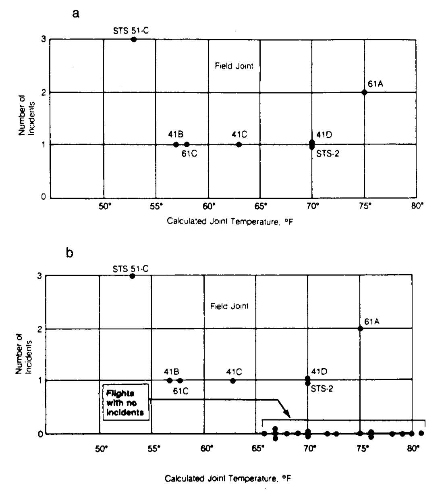
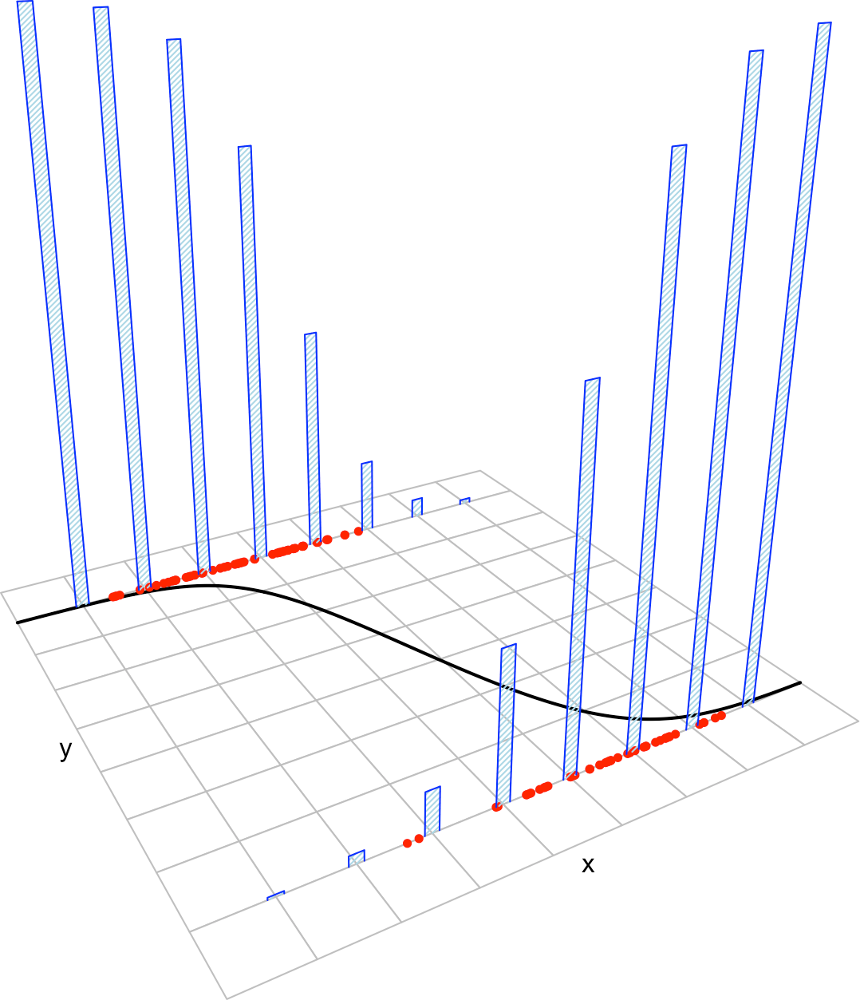

# Logistic regression {#log-reg}

As we saw in Chapters \@ref(simp) and \@ref(mult), linear regression assumes that the response variable $Y$ is *continuous*. In this chapter we will see ho *logistic regression* can deal with a *discrete* response $Y$. The simplest case is with $Y$ being a *binary* response, that is, a variable encoding two categories. In general, we assume that we have $X_1,\ldots,X_k$ predictors for explaining $Y$ (*multiple* logistic regression) and cover the peculiarities for $k=1$ as particular cases.

## More `R` basics

In order to implement some of the contents of this chapter we need to cover more `R` basics, mostly related with flexible plotting that is not implemented directly in `R Commander`. The `R` functions we will are also very useful for simplifying some `R Commander` approaches.

In the following sections, **type** -- not copy and paste systematically -- the code in the `'R Script'` panel and send it to the output panel. Remember that you should get the same outputs (which are preceded by `## [1]`).

### Data frames revisited

```{r, echo = TRUE, collapse = TRUE, error = TRUE}
# Let's begin importing the iris dataset
data(iris)

# names gives you the variables in the data frame
names(iris)

# The beginning of the data
head(iris)

# So we can access variables by $ or as in a matrix
iris$Sepal.Length[1:10]
iris[1:10, 1]
iris[3, 1]

# Information on the dimension of the data frame
dim(iris)

# str gives the structure of any object in R
str(iris)

# Recall the species variable: it is a categorical variable (or factor), 
# not a numeric variable
iris$Species[1:10]

# Factors can only take certain values
levels(iris$Species)

# If a file contains a variable with character strings as observations (either 
# encapsulated by quotation marks or not), the variable will become a factor 
# when imported into R

```

```{block, type = 'rmdexercise'}
Do the following:

- Import [`auto.txt`](https://raw.githubusercontent.com/egarpor/SSS2-UC3M/master/datasets/auto.txt) into `R` as the data frame `auto`. Check how the character strings in the file give rise to factor variables.
- Get the dimensions of `auto` and show beginning of the data.
- Retrieve the fifth observation of `horsepower` in two different ways.
- Compute the levels of `name`.
```

### Vector-related functions

```{r, echo = TRUE, collapse = TRUE, error = TRUE}
# The function seq creates sequences of numbers equally separated
seq(0, 1, by = 0.1)
seq(0, 1, length.out = 5)

# You can short the latter argument
seq(0, 1, l = 5)

# Repeat  number
rep(0, 5)

# Reverse a vector
myVec <- c(1:5, -1:3)
rev(myVec)

# Another way
myVec[length(myVec):1]

# Count repetitions in your data
table(iris$Sepal.Length)
table(iris$Species)
```

```{block, type = 'rmdexercise'}
Do the following:

- Create the vector $x=(0.3, 0.6, 0.9, 1.2)$. 
- Create a vector of length 100 ranging from $0$ to $1$ with entries equally separated.
- Compute the amount of zeros and ones in `x <- c(0, 0, 1, 0, 1, 0, 0, 1, 0, 1, 0)`. Check that they are the same as in `rev(x)`.
- Compute the vector $(0.1, 1.1, 2.1, ..., 100.1)$ in four different ways using `seq` and `rev`. Do the same but using `:` instead of `seq`. (Hint: add `0.1`)

```

### Logical conditions and subsetting

```{r, echo = TRUE, collapse = TRUE, error = TRUE}
# Relational operators: x < y, x > y, x <= y, x >= y, x == y, x!= y
# They return TRUE or FALSE

# Smaller than
0 < 1

# Greater than
1 > 1

# Greater or equal to
1 >= 1 # Remember: ">="" and not "=>"" !

# Smaller or equal to
2 <= 1 # Remember: "<="" and not "=<"" !

# Equal
1 == 1 # Tests equality. Remember: "=="" and not "="" !

# Unequal
1 != 0 # Tests iequality

# TRUE is encoded as 1 and FALSE as 0
TRUE + 1 
FALSE + 1 

# In a vector-like fashion
x <- 1:5
y <- c(0, 3, 1, 5, 2)
x < y
x == y
x != y

# Subsetting of vectors
x
x[x >= 2]
x[x < 3]

# Easy way of work with parts of the data
data <- data.frame(x = c(0, 1, 3, 3, 0), y = 1:5)
data

# Data such that x is zero
data0 <- data[data$x == 0, ]
data0

# Data such that x is larger than 2
data2 <- data[data$x > 2, ]
data2

# In an example
iris$Sepal.Width[iris$Sepal.Width > 3]

# Problem - what happened?
data[x > 2, ]

# In an example
summary(iris)
summary(iris[iris$Sepal.Width > 3, ])

# On the factor variable only makes sense == and !=
summary(iris[iris$Species == "setosa", ])

# Subset argument in lm
lm(Sepal.Width ~ Petal.Length, data = iris, subset = Sepal.Width > 3)
lm(Sepal.Width ~ Petal.Length, data = iris, subset = iris$Sepal.Width > 3)
# Both iris$Sepal.Width and Sepal.Width in subset are fine: data = iris 
# tells R to look for Sepal.Width in the iris dataset

# Same thing for the subset field in R Commander's menus

# AND operator &
TRUE & TRUE
TRUE & FALSE
FALSE & FALSE

# OR operator |
TRUE | TRUE
TRUE | FALSE
FALSE | FALSE

# Both operators are useful for checking for ranges of data
y
index1 <- (y <= 3) & (y > 0)
y[index1]
index2 <- (y < 2) | (y > 4)
y[index2]

# In an example
summary(iris[iris$Sepal.Width > 3 & iris$Sepal.Width < 3.5, ])
```
```{block, type = 'rmdexercise'}
Do the following for the `iris` dataset:

- Compute the subset corresponding to `Petal.Length` either smaller than `1.5` or larger than `2`. Save this dataset as `irisPetal`.
- Compute and summarize a linear regression of `Sepal.Width` into `Petal.Width + Petal.Length` for the dataset `irisPetal`. What is the $R^2$? (Solution: `0.101`)
- Check that the previous model is the same as regressing `Sepal.Width` into `Petal.Width + Petal.Length` for the dataset `iris` with the appropriate `subset` expression.
- Compute the variance for `Petal.Width` when `Petal.Width` is smaller or equal that `1.5` and larger than `0.3`. (Solution: `0.1266541`)

```

### Plotting functions

```{r, echo = TRUE, collapse = TRUE, error = TRUE}
# plot is the main function for plotting in R
# It has a different behaviour depending on the kind of object that it receives

# For example, for a regression model, it produces diagnostic plots
mod <- lm(Sepal.Width ~ Sepal.Length, data = iris)
plot(mod, 1)

# How to plot some data
plot(iris$Sepal.Length, iris$Sepal.Width, main = "Sepal.Length vs Sepal.Width")

# Change the axis limits
plot(iris$Sepal.Length, iris$Sepal.Width, xlim = c(0, 10), ylim = c(0, 10))

# How to plot a curve (a parabola)
x <- seq(-1, 1, l = 50)
y <- x^2
plot(x, y)
plot(x, y, main = "A dotted parabola")
plot(x, y, main = "A parabola", type = "l")
plot(x, y, main = "A red and thick parabola", type = "l", col = "red", lwd = 3)

# Plotting a more complicated curve between -pi and pi
x <- seq(-pi, pi, l = 50)
y <- (2 + sin(10 * x)) * x^2
plot(x, y, type = "l") # Kind of rough...

# More detailed plot
x <- seq(-pi, pi, l = 500)
y <- (2 + sin(10 * x)) * x^2
plot(x, y, type = "l")

# Remember that we are joining points for creating a curve!

# For more options in the plot customization see
?plot
?par

# plot is a first level plotting function. That means that whenever is called, 
# it creates a new plot. If we want to add information to an existing plot, we
# have to use a second level plotting function such as points, lines or abline

plot(x, y) # Create a plot
lines(x, x^2, col = "red") # Add lines
points(x, y + 10, col = "blue") # Add points
abline(a = 5, b = 1, col = "orange", lwd = 2) # Add a straight line y = a + b * x
```

### Distributions

The operations on distributions described here are implemented in `R Commander` through the menu `'Distributions'`, but is convenient for you to grasp how are they working.

```{r, echo = TRUE, collapse = TRUE, error = TRUE}
# R allows to sample [r], compute density/probability mass [d], 
# compute distribution function [p] and compute quantiles [q] for several 
# continuous and discrete distributions. The format employed is [rdpq]name, 
# where name stands for:
# - norm -> Normal
# - unif -> Uniform
# - exp -> Exponential
# - t -> Student's t
# - f -> Snedecor's F
# - chisq -> Chi squared
# - pois -> Poisson
# - binom -> Binomial
# More distributions:
?Distributions

# Sampling from a Normal - 100 random points from a N(0, 1)
rnorm(n = 10, mean = 0, sd = 1)

# If you want to have always the same result, set the seed of the random number
# generator
set.seed(45678)
rnorm(n = 10, mean = 0, sd = 1)

# Plotting the density of a N(0, 1) - the Gauss bell
x <- seq(-4, 4, l = 100)
y <- dnorm(x = x, mean = 0, sd = 1)
plot(x, y, type = "l")

# Plotting the distribution function of a N(0, 1)
x <- seq(-4, 4, l = 100)
y <- pnorm(q = x, mean = 0, sd = 1)
plot(x, y, type = "l")

# Computing the 95% quantile for a N(0, 1)
qnorm(p = 0.95, mean = 0, sd = 1)

# All distributions have the same syntax: rname(n,...), dname(x,...), dname(p,...)  
# and qname(p,...), but the parameters in ... change. Look them in ?Distributions
# For example, here is que same for the uniform distribution

# Sampling from a U(0, 1)
set.seed(45678)
runif(n = 10, min = 0, max = 1)

# Plotting the density of a U(0, 1)
x <- seq(-2, 2, l = 100)
y <- dunif(x = x, min = 0, max = 1)
plot(x, y, type = "l")

# Computing the 95% quantile for a U(0, 1)
qunif(p = 0.95, min = 0, max = 1)

# Sampling from a Bi(10, 0.5)
set.seed(45678)
samp <- rbinom(n = 200, size = 10, prob = 0.5)
table(samp) / 200

# Plotting the probability mass of a Bi(10, 0.5)
x <- 0:10
y <- dbinom(x = x, size = 10, prob = 0.5)
plot(x, y, type = "h") # Vertical bars

# Plotting the distribution function of a Bi(10, 0.5)
x <- 0:10
y <- pbinom(q = x, size = 10, prob = 0.5)
plot(x, y, type = "h")

```
```{block, type = 'rmdexercise'}
Do the following:

- Compute the 90%, 95% and 99% quantiles of a $F$ distribution with `df1 = 1` and `df2 = 5`. (Answer: `c(4.060420, 6.607891, 16.258177)`)
- Plot the distribution function of a $U(0,1)$. Does it make sense with its density function?
- Sample 100 points from a Poisson with `lambda = 5`.
- Sample 100 points from a $U(-1,1)$ and compute its mean.
- Plot the density of a $t$ distribution with `df = 1` (use a sequence spanning from `-4` to `4`). Add lines of different colors with the densities for `df = 5`, `df = 10`, `df = 50` and `df = 100`. Do you see any pattern?
```

### Defining functions

```{r, echo = TRUE, collapse = TRUE, error = TRUE}
# A function is a way of encapsulating a block of code so it can be reused easily
# They are useful for simplifying repetitive tasks and organize the analysis
# For example, in Setion 3.7 we had to make use of simpleAnova for computing
# the simple ANOVA table in multiple regression.

# This is a silly function that takes x and y and returns its sum
add <- function(x, y) {
  x + y
}

# Calling add - you need to run the definition of the function first!
add(1, 1)
add(x = 1, y = 2)

# A more complex function: computes a linear model and its posterior summary.
# Saves us a few keystrokes when computing a lm and a summary
lmSummary <- function(formula, data) {
  model <- lm(formula = formula, data = data)
  summary(model)
}

# Usage
lmSummary(Sepal.Length ~ Petal.Width, iris)

# Recall: there is no variable called model in the workspace. 
# The function works on its own workspace!
model

# Add a line to a plot
addLine <- function(x, beta0, beta1) {
  lines(x, beta0 + beta1 * x, lwd = 2, col = 2)
}

# Usage
plot(x, y)
addLine(x, beta0 = 0.1, beta1 = 0)
```


## Examples and applications {#log-reg-applications}

### Case study: *The Challenger disaster* {#log-reg-challenger}

The *Challenger* disaster occurred on the 28th January of 1986, when the NASA Space Shuttle orbiter *Challenger* broke apart and disintegrated at 73 seconds into its flight, leading to the deaths of its seven crew members. The accident deeply shocked the US society, in part due to the attention the mission had received because of the presence of Christa McAuliffe, who would have been the first astronaut-teacher. Because of this, NASA TV broadcasted live the launch to US public schools, which resulted in millions of school children witnessing the accident. The accident had serious consequences for the NASA credibility and resulted in an interruption of 32 months in the shuttle program. The Presidential *Rogers Commission* (formed by astronaut Neil A. Armstrong and Nobel laureate Richard P. Feynman, among others) was created to investigate the disaster.

```{r, video3, echo = FALSE, fig.align = 'center', fig.cap = 'Challenger launch and posterior explosion, as broadcasted live by NBC in 28/01/1986.', screenshot.opts = list(delay = 10), dev = 'png', cache = TRUE}
knitr::include_url("https://www.youtube.com/embed/fSTrmJtHLFU")
```

The Rogers Commission elaborated a report [@Roberts1986] with all the findings. The commission determined that the disintegration began with the **failure of an O-ring seal in the solid rocket motor due to the unusual cold temperatures (-0.6 Celsius degrees)** during the launch. This failure produced a breach of burning gas through the solid rocket motor that compromised the whole shuttle structure, resulting in its disintegration due to the extreme aerodynamic forces. The **problematic with O-rings was something known**: the night before the launch, there was a three-hour teleconference between motor engineers and NASA management, discussing the effect of low temperature forecasted for the launch on the O-ring performance. The conclusion, influenced by Figure \@ref(fig:rogerts)a, was:

> "Temperature data [are] not conclusive on predicting primary O-ring blowby."

```{r, rogerts, echo = FALSE, out.width = '90%', fig.align = 'center', fig.cap = 'Number of incidents in the O-rings (fied joints) versus temperatures. Panel *a* includes only flights with incidents. Panel *b* contains all flights (with and without incidents).', fig.show = 'hold'}

```

The Rogers Commission noted a major flaw in Figure \@ref(fig:rogerts)a: the **flights with zero incidents were excluded** from the plot because *it was felt* that **these flights did not contribute any information about the temperature effect** (Figure \@ref(fig:rogerts)b). The Rogers Commission concluded:

> "A careful analysis of the flight history of O-ring performance would have revealed the correlation of O-ring damage in low temperature".

The purpose of this case study, inspired by @Dalal1989, is to quantify what was the influence of the temperature in the probability of having at least one incident related with the O-rings. Specifically, we want to address the following questions:

- Q1. *Is the temperature associated with O-ring incidents?*
- Q2. *In which way was the temperature affecting the probability of O-ring incidents?*
- Q3. *What was the predicted probability of an incidient in an O-ring for the temperature of the launch day?*

To try to answer these questions we have the `challenger` dataset ([download](https://raw.githubusercontent.com/egarpor/SSS2-UC3M/master/datasets/challenger.txt)). The dataset contains (shown in Table \@ref(tab:challengertable)) information regarding the state of the solid rocket boosters after launch^[After the shuttle exits the atmosphere, the solid rocket boosters separate and descend to land using a parachute where they are carefully analysed.] for 23 flights. Each row has, among others, the following variables:

- `fail.field`, `fail.nozzle`: binary variables indicating whether there was an incident with the O-rings in the field joints or in the nozzles of the solid rocket boosters. `1` codifies an incident and `0` its absence. On the analysis, we focus on the O-rings of the field joint as being the most determinants for the accident.
- `temp`: temperature in the day of launch. Measured in Celsius degrees.
- `pres.field`,	`pres.nozzle`: leak-check pressure tests of the O-rings. These tests assured that the rings would seal the joint.

```{r, challengertable, echo = FALSE, out.width = '90%', fig.align = 'center'}
challenger <- read.table(file = "datasets/challenger.txt", header = TRUE, sep = "\t")
knitr::kable(
  challenger[, c(1, 2, 5:7)],
  booktabs = TRUE,
  longtable = TRUE,
  caption = 'The `challenger` dataset.'
)
```

Let's begin the analysis by replicating Figures \@ref(fig:rogerts)a and \@ref(fig:rogerts)b and checking that linear regression is not the right tool for answering Q1--Q3. For that, we make two scatterplots of `nfails.field` (number of total incidents in the field joints) versus `temp`, the first one excluding the launches without incidents (`subset = nfails.field > 0`) and the second one for all the data. Doing it through `R Commander` as we saw in Chapter \@ref(simp), you should get something similar to:
```{r, echo=FALSE,message=FALSE,warning=FALSE}
library(car)
```
```{r, collapse=TRUE}
scatterplot(nfails.field ~ temp, reg.line = lm, smooth = FALSE, spread = FALSE, 
            boxplots = FALSE, data = challenger, subset = nfails.field > 0)
scatterplot(nfails.field ~ temp, reg.line = lm, smooth = FALSE, spread = FALSE, 
            boxplots = FALSE, data = challenger)
```

There is a fundamental problem in using linear regression for this data: **the response is not continuous**. As a consequence, there is no linearity and the errors around the mean are not normal (indeed, they are strongly non normal). Let's check this with the corresponding diagnostic plots:
```{r, collapse=TRUE}
mod <- lm(nfails.field ~ temp, data = challenger)
par(mfrow = 1:2)
plot(mod, 1)
plot(mod, 2)
```

Albeit linear regression is not the adequate tool for this data, it is able to detect the obvious difference between the two plots:

1. **The trend for launches with incidents is flat, hence suggesting there is no dependence on the temperature** (Figure \@ref(fig:rogerts)a). This was one of the arguments behind NASA's decision of launching the rocket at a temperature of -0.6 degrees.
2. However, **the trend for *all* launches indicates a clear negative dependence between temperature and number of incidents!** (Figure \@ref(fig:rogerts)b). Think about it in this way: the minimum temperature for a launch without incidents ever recorded was above 18 degrees, and the Challenger was launched at -0.6 without clearly knowing the effects of such low temperatures.

Instead of trying to predict the number of incidents, we will concentrate on modelling the *probability of expecting at least one incident given the temperature*, a simpler but also revealing approach. In other words, we look to estimate the following curve:
$$
\pi(x)=\mathbb{P}(\text{incident}=1|\text{temperature}=x)
$$
from `fail.field` and `temp`. This probability can not be properly modeled as a linear function like $\beta_0+\beta_1x$, since inevitably will fall outside $[0,1]$ for some value of $x$ (some will have negative probabilities or probabilities larger than one). The technique that solves this problem is the **logistic regression**. The idea behind is quite simple: transform a linear model $\beta_0+\beta_1x$ - which is aimed for a response in $\mathbb{R}$ - so that it yields a value in $[0,1]$. This is achieved by the *logit function* 
\begin{align}
\text{logit}(t)=\frac{e^t}{1+e^t}.(\#eq:log)
\end{align}
The *logistic function* is the inverse of the logit function, $\text{logit}^{-1}(p)=\log\frac{p}{1-p}$, and is also called the *link function* between $[0,1]$ and $\mathbb{R}$. The logistic model in this case is
$$
\mathbb{P}(\text{incident}=1|\text{temperature}=x)=\text{logit}(\beta_0+\beta_1x)=\frac{e^{\beta_0+\beta_1x}}{1+e^{\beta_0+\beta_1x}},
$$
with $\beta_0$ and $\beta_1$ unknown. Let's fit the model to the data by estimating $\beta_0$ and $\beta_1$.

In order to fit a logistic regression to the data, go to `'Statistics' -> 'Fit models' -> 'Generalized linear model...'`. A window like Figure \@ref(fig:glm) will pop-up, which you should fill as indicated.

```{r, glm, echo = FALSE, out.width = '90%', fig.align = 'center', fig.cap = 'Window for performing logistic regression.'}
knitr::include_graphics("images/screenshots/glm.png")
```
A code like this will be generated:
```{r, collapse=TRUE}
nasa <- glm(fail.field ~ temp, family = "binomial", data = challenger)
summary(nasa)
exp(coef(nasa)) # Exponentiated coefficients ("odds ratios")
```
The summary of the logistic model is notably different from the linear regression, as the methodology behind is quite different. Nevertheless, we have tests for the significance of each coefficient. Here we obtain that `temp` is significantly different from zero, at least at a level $\alpha=0.05$. Therefore we can conclude that **the temperature is indeed affecting the probability of an incident with the O-rings** (answers Q1). 

The precise interpretation of the coefficients will be given in the next section. For now, the coefficient of `temp`, $\hat\beta_1$, can be regarded the "correlation between the temperature and the probability of having at least one incident". These correlation, as evidenced by the sign of $\hat\beta_1$, is negative. Let's plot the fitted logistic curve to see that indeed the probability of incident and temperature are negatively correlated:
```{r, collapse=TRUE}
# Plot data
plot(challenger$temp, challenger$fail.field, xlim = c(-1, 30), xlab = "Temperature", 
     ylab = "Incident probability")

# Draw the fitted logistic curve
x <- seq(-1, 30, l = 100)
y <- exp(7.5837 - 0.4166 * x)
y <- y / (1 + y)
lines(x, y, col = 2, lwd = 2)

# The Challenger
points(-0.6, 1, pch = 16)
text(-0.6, 1, labels = "Challenger", pos = 4)
```
At the sight of this curve and the summary of the model we can conclude that **the temperature was increasing the probability of an O-ring incident** (Q2). Indeed, the confidence intervals for the coefficients show a significative negative correlation at level $\alpha=0.05$:
```{r,collapse=TRUE,message=FALSE}
confint(nasa, level = 0.95)
```
Finally, **the probability of having at least one incident with the O-rings in the launch day was $0.9996$ according to the fitted logistic model** (Q3). This is easily obtained:
```{r,collapse=TRUE}
predict(nasa, newdata = data.frame(temp = -0.6), type = "response")
```
Be aware that `type = "response"` has a different meaning in logistic regression. As you can see it does not return a CI for the prediction as in linear models. Instead, `type = "response"` means that the *probability* should be returned, instead of the value of the link function, which is returned with `type = "link"` (the default). 

Recall that there is a serious problem of **extrapolation** in the prediction, which makes it less precise (or more variable). But this extrapolation, together with the evidences raised by a simple analysis like we did, should have been strong arguments for postponing the launch.

To conclude this section, we refer to a funny and comprehensive exposition by Juan Cuesta (University of Cantabria) on the flawed statistical analysis that contributed to the Challenger disaster.
```{r, video4, echo = FALSE, fig.align = 'center', fig.cap = 'The Challenger disaster and other elegant applications of statistics in complex problems.', screenshot.opts = list(delay = 10), dev = 'png', cache = TRUE}
knitr::include_url("https://www.youtube.com/embed/MOeDbQlF5Tw?start=552")
```

<!--

## Model formulation and estimation {#log-reg-model-estimation}

```{r, maximumlikelihood, echo = FALSE, fig.cap = 'The effect of the kind of distance in the error criterion. The choices of intercept and slope that minimize the sum of squared distances for a kind of distance are not the optimal for a different kind of distance.', screenshot.opts = list(delay = 10), dev = 'png', cache = TRUE, fig.align = 'center', out.width = '90%'}
knitr::include_app('https://egarpor.shinyapps.io/log-maximum-likelihood/', height = '900px')
```

## Assumptions {#log-reg-assumptions}

Some probabilistic assumptions are required for performing inference on the model parameters $\boldsymbol\beta$ from the sample $(\mathbf{X}_1, Y_1),\ldots,(\mathbf{X}_n, Y_n)$. The are somehow simpler than the ones for linear regression.

```{r, logisticmodel, echo = FALSE, out.width = '90%', fig.align = 'center', fig.cap = 'The key concepts of the multiple linear model when $k=2$. The space between the yellow planes denotes where the 95% of the data is, according to the model.'}

```

The assumptions of the multiple linear model are an extension of the simple linear model:

i. **Linearity in the log-odds**: $\mathrm{logit}(\pi(\mathbf{x},\boldsymbol\beta))=\beta_0+\beta_1x_1+\ldots+\beta_kx_k$.
ii. **Binomial**: $Y_1,\ldots,Y_n$ are binary variables.
iii. **Independence**: $Y_1,\ldots,Y_n$ are independent.

A good one-line summary of the logistic model is the following (independence is assumed)
\begin{align}
Y|\mathbf{X}=\mathbf{x}\sim\mathrm{Ber}(\pi(\mathbf{x},\boldsymbol{\beta})),\quad \pi(\mathbf{x},\boldsymbol{\beta})=\frac{e^{\beta_0+\beta_1x_1+\ldots+\beta_kx_k}}{1+e^{\beta_0+\beta_1x_1+\ldots+\beta_kx_k}}(\#eq:condber)
\end{align}


## Model fit {#log-reg-fit}

## Inference for model parameters {#log-reg-inference}


```{r, lograndomcoefs, echo = FALSE, fig.cap = 'Illustration of the randomness of the fitted coefficients $(\\hat\\beta_0,\\hat\\beta_1)$ and the influence of $n$, $\\sigma^2$ and  $s_x^2$. The sample predictors $x_1,\\ldots,x_n$ are fixed and new responses $Y_1,\\ldots,Y_n$ are generated each time from a linear model $Y=\\beta_0+\\beta_1X+\\varepsilon$.', screenshot.opts = list(delay = 10), dev = 'png', cache = TRUE, fig.align = 'center', out.width = '90%'}
knitr::include_app('https://egarpor.shinyapps.io/log-random/', height = '1000px')
```


## Prediction {#log-reg-prediction}


```{r, logcipred, echo = FALSE, fig.cap = 'Illustration of the CIs for the conditional mean and response. Note how the length of the CIs is influenced by $x$, specially for the conditional mean.', screenshot.opts = list(delay = 10), dev = 'png', cache = TRUE, fig.align = 'center', out.width = '90%'}
knitr::include_app('https://egarpor.shinyapps.io/log-ci-prediction/', height = '1000px')
```

residuals dont have to add zero
odds ratio
map to a linear problem

## Qualitative predictors {#qua}

Qualitative predictors (one level and more than two levels)


-->
